# Mapa del CRM Diluvium

Guía para el dueño: qué tiene el CRM, para qué sirve cada parte y **cómo se llama cada botón**, para
pedir cambios en una sola línea sin explicar nada técnico.

- Cada pantalla trae una **captura con números** y una tabla con el mismo número. Para pedir un cambio
  basta con decir **Pestaña › sección › número › qué quieres** (ver [Cómo pedir un cambio](#4-cómo-pedir-un-cambio)).
- Las capturas usan **datos de ejemplo** (nombres, teléfonos, montos y anuncios inventados), no clientes reales.
- Los números no cambian con el tiempo: si algo se agrega, toma el siguiente número libre de su sección.
- "Todos" en la columna *Quién lo ve* = Owner, Admin y Vendedor.

Contenido: [1. Inicio](#1-inicio) · [2. Menú y barra de arriba](#2-menú-y-barra-de-arriba) ·
[3. Pantallas](#3-pantallas-en-el-orden-del-menú) · [4. Cómo pedir un cambio](#4-cómo-pedir-un-cambio)

---

## 1. Inicio

### El CRM en 5 líneas

1. Es el lugar donde el equipo atiende **todos los WhatsApp de Diluvium** sin abrir WhatsApp Web.
2. Cada cliente es un **contacto** con su chat, su **etapa** en el Embudo y su ficha (**Detalle del contacto**).
3. **Ángela, el Agente IA**, contesta sola a toda hora siguiendo el **Goal** y las **FAQs**: cotiza, manda
   tablas y videos, llena el Detalle, avanza la etapa y **avisa al vendedor** cuando lo necesita.
4. El vendedor entra cuando hace falta: contesta, **pausa al agente** en un chat, programa mensajes y
   manda plantillas cuando ya pasaron 24 horas.
5. El dueño ve el **gasto de IA**, cuántas **conversaciones nuevas** llegan y qué **anuncios** traen clientes.

### Roles

| Rol | Quién es | Qué ve | Qué puede editar |
|---|---|---|---|
| **Owner** | El dueño de la cuenta | Todo (incluidas las filas de **Vendedores** en Agente IA › Historial) | Todo, incluida la pestaña **Configuración**. Es el único que puede dar el rol Owner; ningún Admin lo puede modificar. |
| **Admin** | Encargado del equipo | Todo (incluidas las filas de **Vendedores** en Agente IA › Historial) | Todo lo del vendedor + **Configuración** (dar de alta vendedores, cambiar roles, restablecer contraseñas, desactivar). No puede tocar al Owner. |
| **Vendedor** | Quien atiende a los clientes | Todo **menos Configuración** (y en Agente IA › Historial no ve las filas de **Vendedores**) | Todo lo demás: Dashboard (incluido registrar recargas), Bandeja (también **adjuntar** fotos, videos y documentos en el chat), Embudo (también dar de alta contactos y escribirles primero), Mensajes rápidos (crear, editar y borrar mensajes rápidos y plantillas), Anuncios, Agente IA (Goal, FAQs, modelos, opciones, tallas y canales; el **Historial** solo se consulta) y Automatización. También edita o borra comentarios de otros. |

Nadie es "dueño" de un contacto: **todos ven todos los contactos, siempre**.

### Glosario

| Palabra | Qué significa |
|---|---|
| **Etapa** | En qué punto de la venta va el cliente: **Inbox → Prospecto → Interesado → Cerca de compra → Compra**. Son las columnas del Embudo. El agente solo la **avanza**; la que pone un vendedor manda. |
| **Temperatura** | Etiqueta rápida que pone el equipo: 🔥 Caliente · 🧊 Frío · ⏳ En espera · ⭐ Destacado · ○ sin asignar. Se filtra por ella (una a la vez) con el ícono junto al buscador de la Bandeja y del Embudo. |
| **Destacado** | Marca para todo el equipo. Se pone de dos formas: la **estrella** de la lista de la Bandeja (marca el chat) o la temperatura **⭐ Destacado** (marca el contacto). Para filtrar cuentan las dos: la pestaña Destacado de la Bandeja y ⭐ Destacado en el filtro del Embudo. No es una temperatura: se puede combinar con una (🔥 + Destacado = calientes con estrella). |
| **Semáforo** | Punto de color en la Bandeja: cuánto lleva el cliente esperando respuesta **de una persona**. Verde menos de 15 min, ámbar menos de 1 h, rojo más de 1 h. |
| **Ventana de 24 h** | Regla de WhatsApp: hasta 24 horas después del último mensaje del cliente se puede escribir libre. Pasadas las 24 h **solo se puede mandar una plantilla**. |
| **Gratis por anuncio (72 h)** | Si el cliente llegó por un anuncio y se le contesta dentro de 24 h, por 72 h todos los mensajes (también plantillas) son gratis. El chat lo indica con 🎁. |
| **Plantilla** | Mensaje fijo **aprobado por Meta** para escribir fuera de la ventana de 24 h. Sus huecos se llaman {{1}}, {{2}}… |
| **Contacto sin chat** | Contacto que nunca ha escrito (alta a mano en Embudo › Nuevo contacto, o importado de GHL). Se le escribe primero **gratis desde WhatsApp Web** o con una **plantilla** desde el CRM; con plantilla, en el CRM solo se escribe libre cuando el cliente conteste. |
| **Aviso de Meta** | Pop-up grande que sale cuando WhatsApp (Meta) no acepta algo de una plantilla: por qué pasó y qué hacer. |
| **Mensaje rápido** | Respuesta guardada por el equipo para contestar más rápido dentro de las 24 h (antes se llamaba "Fragmento"). Se inserta con "/" o con ⚡ y **no se manda sola**: la revisas y le das Enviar. Si lleva {{vendedor}}, se llena solo con tu nombre; {{nombre}} lo completas tú. Diluvium tiene 22 (Buenos días, Precio, Pagos…). |
| **Workflow** | Secuencia de pasos (texto, archivo con pie, espera) que manda material: tabla de tamaños, datos bancarios, videos. Lo dispara el agente, un **comando** del vendedor, una **palabra clave** del cliente o la entrada a una etapa. Las **esperas** solo aplican al agente, a la palabra clave y a la etapa: con un comando del vendedor sale de inmediato. |
| **Comando** | Atajo que escribe el vendedor en el chat para mandar un workflow: /tabla, /banco, /video… Se escribe con letras sin acento (la **ñ** sí: /tamaños), números y guiones. Sale **de inmediato** (se salta los pasos ⏱ Esperar); el cliente lo recibe en lo que tarda WhatsApp (~5 s). |
| **Adjuntar (📎)** | Mandar fotos, videos o documentos desde el chat: se arrastran sobre el chat, se eligen con 📎 o se pegan con Cmd+V. Hasta **10 por envío**, uno por mensaje y en orden; el texto va como pie del primero. Fotos JPG/PNG (HEIC y WebP se pasan solas a JPG), video .mp4 hasta 16 MB, PDF/Word/Excel/PowerPoint/TXT/XML hasta 100 MB. GIF, ZIP o audio: se mandan desde el celular. |
| **Corrida** | Cada vez que un workflow se ejecutó (Hecho, Omitido, Falló…). |
| **Biblioteca** | Los archivos (imágenes y videos) que usan los workflows. |
| **Aviso 🤖** | Nota del agente **para el vendedor** dentro del chat; el cliente nunca la ve. Ej.: "El cliente pide hablar con una persona", "Depósito recibido", "Comprobante dudoso", "Llegó al máximo de respuestas". |
| **Tarjeta "El agente no pudo responder"** | Aparece en el chat cuando falló el modelo o el envío. Tiene **Reintentar** y **Apagar**; mientras nadie elija, el agente no vuelve a intentar solo. |
| **Fila de espera (🕗 Enviando…)** | Si WhatsApp (Zernio) pide esperar porque salieron muchos mensajes seguidos, el mensaje **espera su turno** con el reloj 🕗 y sale solo, en el orden en que se escribió. **No es error**: al cliente no le llega nada raro y no hay que volver a escribirlo. Vale para vendedores, agente, workflows y programados. |
| **Tarjeta de envío (🤖)** | Aviso en el chat cuando un mensaje **no se pudo confirmar** o WhatsApp avisó **después** que no le llegó al cliente (p. ej. la imagen de Datos bancarios). Dice el motivo en palabras simples y cómo reenviarlo (p. ej. "Vuelve a mandarla con /banco"). |
| **Marca "IA"** | Etiqueta junto a un dato del Detalle del contacto que **escribió el agente al último**. Si un vendedor lo edita, la marca se va. Mientras el agente lo llena se ve "IA actualizando". |
| **Agente IA en segundo plano** | Aunque el Agente IA esté apagado o pausado en un chat, lo **lee** unos 3 minutos después de que se calma (o cada 15 min si no para) y deja al día la **etapa** y el **Detalle**: datos, monto de cotización, pago total, % y un comentario. Lee todo en orden y vale lo último que confirmó el cliente, aun después de la compra. Nunca le escribe al cliente, no avisa al vendedor ni dispara workflows. Usa Luna (~US$0.0005 por lectura); su gasto va aparte, como «Detalle». |
| **Monto de cotización / Pago total** | **Monto**: total de lo que el cliente eligió comprar al final (no lo primero que se le cotizó). **Pago**: lo que ya pagó (anticipo + resto o completo). Juntos muestran quién cotizó mucho y no compró. |
| **Pausar agente / Activar** | Detiene al agente **solo en ese chat** (8, 12 o 24 horas, hasta una fecha y hora o indefinidamente). **Activar** lo regresa. También se pausa solo cuando un vendedor contesta (se ajusta en Opciones). Cada pausa y cada Activar quedan en **Agente IA › Historial** con quién lo hizo; las automáticas (un vendedor contestó, tope de respuestas, el cliente pidió un asesor y la vuelta sola al cumplirse la hora) también, como «Automático». |
| **Canal Encendido / Apagado** | Interruptor general del agente por número de WhatsApp (Agente IA › Canales, que solo muestra los números **no archivados**: hoy WhatsApp Diluvium). Apagado = no contesta a nadie en ese número; la Bandeja lo avisa con una franja roja arriba y la pastilla **Agente IA** del Dashboard sale roja. |
| **Horario del Agente IA** | Días y horas en que el agente contesta (Agente IA › Opciones; de fábrica 24/7). Si tiene horario, la Bandeja muestra arriba una franja «El Agente IA solo contesta … (ahora está fuera de horario / ahora sí está contestando)». |
| **Agente IA callado** | Alarma: con el canal Encendido y dentro de su horario, 3 o más clientes que escribieron en la **última hora** llevan más de 15 min esperando y el agente no ha mandado nada en esos 15 min. Sale en la pastilla **Agente IA** (roja) y en el correo del issue `alerta-whatsapp`. Lo atrasado (más de 1 hora) **no** la hace sonar. |
| **Chats que esperan a un vendedor** | Los atrasados: el cliente escribió hace más de 1 hora y nadie le contestó. El Agente IA ya no los recupera solo (solo rescata lo de los últimos 30 min), así que los atiende un vendedor. Salen como dato en la pastilla **Agente IA** del Dashboard; no son alarma. |
| **Historial de cambios** | Subpestaña de Agente IA: **quién** cambió **qué**, **antes → después** y **cuándo** (hora de Mazatlán): opciones, Goal y FAQs, nombre del agente, modelos, etapas (incluida la regla del Agente IA), canales (incluida la limpieza de chats de prueba), workflows, tallas y medidas, mensajes rápidos, plantillas, vendedores (solo owner y admin) y pausas del agente por chat. **Ver cambios** muestra lo quitado (tachado en rojo) y lo agregado (en verde). No entra el trabajo diario (mover contactos, mensajes, comentarios). Lo ven todos; no se edita. |
| **Goal** | Las instrucciones de Ángela: cómo habla, qué ofrece, cuándo pasa a un asesor. Es lo único que sigue, junto con las FAQs. |
| **FAQs** | Preguntas frecuentes con su respuesta que el agente usa para contestar. |
| **Modelo 1 / Modelo 2** | Los dos "cerebros" del agente. Cada etapa usa uno (hoy: Modelo 1 en Inbox, Prospecto e Interesado; Modelo 2 en Cerca de compra y Compra). |
| **Número de prueba / PRUEBA** | Número de WhatsApp para probar. Sus chats llevan la etiqueta **PRUEBA** y **no cuentan en el Dashboard**. Desde el 28-sep-2026 está **archivado** (igual que el Sandbox): ya no aparece en Agente IA › Canales. Ese mismo día se **borraron sus chats de prueba** (eran celulares del negocio): los contactos se quedaron, sin la marca Prueba, y hoy ningún chat lleva la etiqueta PRUEBA. |
| **Importado del celular** | Mensaje viejo copiado del teléfono al conectar un número. El agente no lo contesta y no cuenta como nuevo. |
| **Programado** | Mensaje que sale solo a la hora elegida (hora de Mazatlán). |
| **Transcripción** | Texto de una nota de voz del cliente, escrito por el CRM; el agente lo lee para contestar. |
| **Tarjeta amarilla / azul** | Colores de la tarjeta en el Embudo (regla del 28-sep-2026): **amarilla** = el agente necesita al vendedor (se quita contestando); **azul** = el cliente escribió y nadie le ha contestado (se quita contestando —vendedor o agente— o con **Marcar como leído**; abrir el chat no lo quita); **blanca** = nada pendiente. Al pasar el mouse la tarjeta se ilumina en **gris**, nunca en azul. |
| **Aviso emergente** | Cuadro que baja arriba de la pantalla cuando el agente u otra persona **cambió la etapa** de un contacto. |
| **Recarga / saldo estimado** | Lo que se cargó en la página de cada proveedor de IA y lo que queda, calculado por el CRM (es un estimado). |

---

## 2. Menú y barra de arriba

Lo que se ve en todas las pantallas.

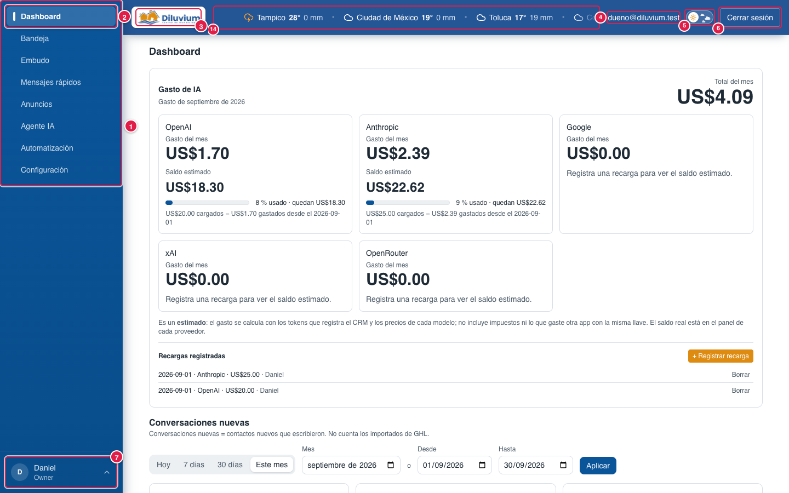

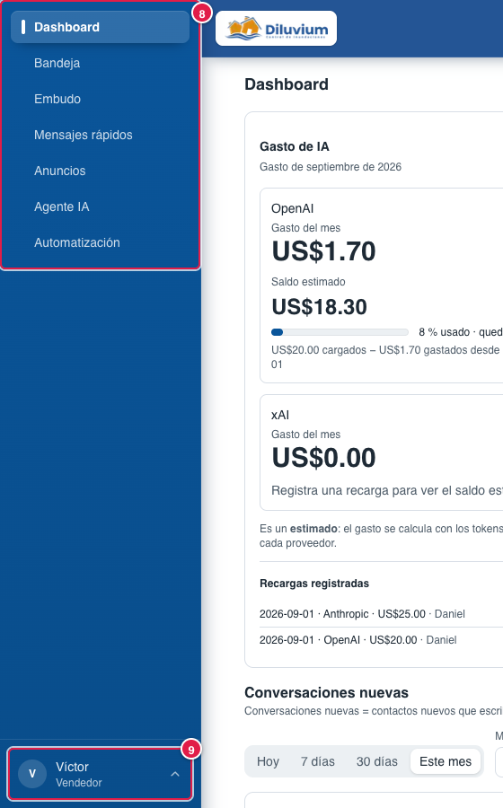

| # | Nombre oficial | Qué hace | Quién lo ve |
|---|---|---|---|
| 1 | **Menú lateral** | Lista de pestañas: Dashboard, Bandeja, Embudo, Mensajes rápidos, Anuncios, Agente IA, Automatización, Configuración. | Todos (Configuración solo Owner y Admin) |
| 2 | **Pestaña activa** | La pestaña en la que estás, resaltada con una barra blanca. | Todos |
| 3 | **Logo Diluvium** | Solo identifica la marca; no es botón. | Todos |
| 4 | **Correo de la sesión** | Con qué cuenta entraste. | Todos |
| 5 | **Tema claro / oscuro** (luna) | Cambia los colores de la pantalla; se recuerda en esa computadora. | Todos |
| 6 | **Cerrar sesión** | Sale del CRM. | Todos |
| 7 | **Menú del usuario** (nombre y rol) | Abre **Mi cuenta** y **Cerrar sesión** (ver [Menú del usuario y Mi cuenta](#39-menú-del-usuario-y-mi-cuenta)). | Todos |
| 8 | **Menú del vendedor** | Igual al de arriba pero **sin Configuración**. | Vendedor |
| 9 | **Rol "Vendedor"** | Debajo del nombre se ve el rol de quien entró (Owner, Admin o Vendedor). | Todos |

**Lo cambias tú desde la pantalla:** el tema claro u oscuro.

**Pídeselo a Code:**
- "En Menú › (1) menú lateral, pon Anuncios antes de Mensajes rápidos."
- "En Menú › (4) correo de la sesión, muestra mi nombre en vez del correo."

Para Code: `app/(app)/layout.tsx` (sidebar y barra), `nav-item.tsx`, `user-menu.tsx`, `components/theme-toggle.tsx`.

---

## 3. Pantallas (en el orden del menú)

El orden es el del menú lateral tal como está hoy: Dashboard, Bandeja, Embudo, **Mensajes rápidos, Anuncios**,
Agente IA, Automatización, Configuración y el menú del usuario. El chat, la caja para escribir, el Detalle del
contacto y los avisos se explican dentro de la Bandeja porque son **los mismos** en el pop-up del Embudo.

### 3.1 Dashboard

Resumen del mes: cuánto se gasta en IA y cuántas conversaciones nuevas llegan, si el número de WhatsApp está conectado y si el Agente IA está contestando.

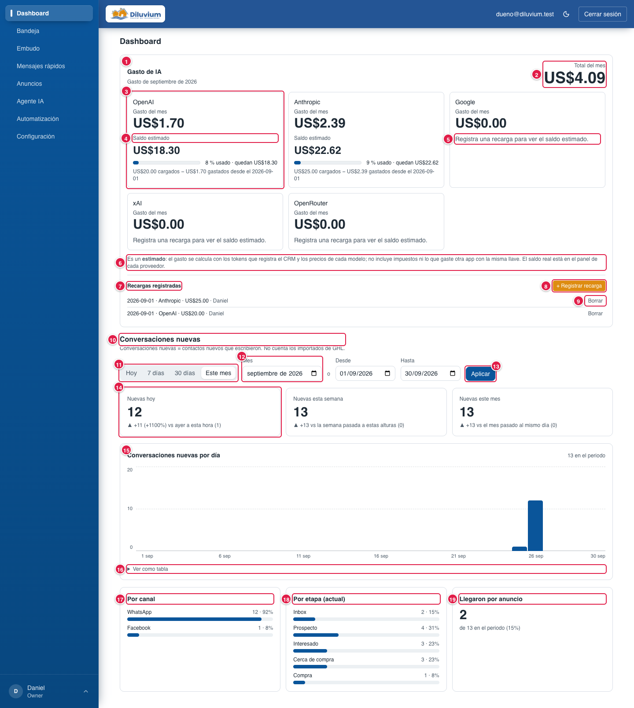

| # | Nombre oficial | Qué hace | Quién lo ve |
|---|---|---|---|
| 1 | **Gasto de IA** | Tarjeta con lo que va gastando el agente en el mes (días de Mazatlán). Va hasta arriba porque el saldo importa más que las métricas. | Todos |
| 2 | **Total del mes** | Suma del gasto de todos los proveedores. | Todos |
| 3 | **Tarjeta del proveedor** (OpenAI, Anthropic, Google, xAI, OpenRouter) | Gasto del mes de ese proveedor. Solo salen los que tienen llave conectada. | Todos |
| 4 | **Saldo estimado** | Recargas menos gasto desde la primera recarga, con barra "% usado · quedan". | Todos |
| 5 | **"Registra una recarga para ver el saldo estimado."** | Sale cuando ese proveedor no tiene recargas anotadas. | Todos |
| 6 | **Nota "Es un estimado"** | Aclara que el cálculo es aproximado (sin impuestos); el saldo real está en la página de cada proveedor. | Todos |
| 7 | **Recargas registradas** | Lista de recargas: fecha · proveedor · monto · quién la anotó. | Todos |
| 8 | **+ Registrar recarga** | Anota una recarga que hiciste en la página del proveedor (proveedor, monto y fecha). | Todos |
| 9 | **Borrar** (recarga) | Quita una recarga mal capturada. | Todos |
| 10 | **Conversaciones nuevas** | Contactos nuevos que escribieron. No cuenta los importados de GHL, los del número de prueba ni los dados de alta a mano (Embudo › Nuevo contacto, 20). | Todos |
| 11 | **Hoy · 7 días · 30 días · Este mes** | Atajos para elegir el periodo. | Todos |
| 12 | **Mes / Desde / Hasta** | Periodo a mano (un mes o un rango de fechas). | Todos |
| 13 | **Aplicar** | Aplica las fechas elegidas. | Todos |
| 14 | **Nuevas hoy / Nuevas esta semana / Nuevas este mes** | Cifras con la comparación contra el periodo anterior al mismo momento (▲ más, ▼ menos). | Todos |
| 15 | **Conversaciones nuevas por día** | Gráfica de barras por día. | Todos |
| 16 | **Ver como tabla** | Muestra los números de la gráfica en tabla. | Todos |
| 17 | **Por canal** | Por qué canal llegaron (WhatsApp, Facebook…). | Todos |
| 18 | **Por etapa (actual)** | En qué etapa están hoy esas conversaciones. | Todos |
| 19 | **Llegaron por anuncio** | Cuántas vinieron de un anuncio de Meta y qué porcentaje del periodo. | Todos |
| 20 | **Pastilla de WhatsApp** (arriba a la derecha) | Estado del número según el monitoreo (cada 5 min): verde **"WhatsApp conectado"**, ámbar **"WhatsApp: revisar"**, rojo **"WhatsApp desconectado desde HH:MM"** (hora de Mazatlán) o gris **"Sin revisar desde HH:MM"** si la última revisión tiene más de 15 min. No consulta a Zernio al abrir la página. | Todos |
| 21 | **Estado de WhatsApp** (recuadro al hacer clic en 20) | 4 líneas: **Número** (conectado o no), **Último mensaje de un cliente** (hace X min), **Worker** (activo o no) y **Webhook de Zernio** (activo y fallos). | Todos |
| 22 | **Pastilla Agente IA** (junto a la de WhatsApp) | ¿El agente está contestando? Verde **"Agente IA contestando"**, ámbar **"Agente IA fuera de horario"**, roja **"Agente IA apagado"** (canal Apagado) o **"Agente IA callado"** (3 o más clientes de la última hora esperando más de 15 min y el agente sin mandar nada en 15 min, dentro de su horario). Sale de los datos del CRM; no consulta a Zernio. No está en la captura. | Todos |
| 23 | **Estado del Agente IA** (recuadro al hacer clic en 22) | 5 líneas: **Canal** (Encendido o Apagado), **Horario** (24/7 o días y horas, y si ahora está fuera), **Sin respuesta hace más de 15 min (de la última hora)** (cuántas conversaciones; estas sí cuentan para la alarma), **Atrasados (más de 1 h)** («N chats esperan a un vendedor»: solo dato, no alarma) y **Última respuesta del Agente IA** (hace X min). | Todos |

**Lo cambias tú desde la pantalla:** registrar y borrar recargas; el periodo de las conversaciones nuevas.

**Si la pastilla (20) sale roja:** revisa Zernio y la app de WhatsApp Business del celular; el paso a paso está en
`docs/go-live.md` › Alarma de desconexión. También llega el correo del issue `alerta-whatsapp`, a cualquier hora.

**Si la pastilla Agente IA (22) sale ámbar o roja:** revisa en Agente IA el interruptor del canal (Apagado), el **Horario
del Agente IA** en Opciones y las tarjetas "El agente no pudo responder" de la Bandeja. "Agente IA callado" también llega por correo
(issue `alerta-whatsapp`); el paso a paso está en `docs/go-live.md` › Alarma "Agente IA callado". Si dice "N chats esperan a un
vendedor", no es una falla: son clientes de hace más de 1 hora que un vendedor tiene que contestar. Una falla suelta al revisar
Zernio ya no manda correo: solo si se repite en la siguiente revisión.

**Pídeselo a Code:**
- "En Dashboard › (14) tarjetas de nuevas, agrega una que diga cuántas contestó el agente hoy."
- "En Dashboard › (3) tarjeta del proveedor, avísame en naranja cuando el saldo baje de US$5."
- "En Dashboard › (18) por etapa, agrega el total en pesos cotizado por etapa."

**Agente IA aquí:** todo lo que gasta al contestar (y al transcribir notas de voz, que se cobra en OpenAI) se suma en
**Gasto de IA**. Los chats que atiende cuentan en **Conversaciones nuevas** como cualquier otro. La pastilla **Agente IA** (22)
dice si está contestando.

Para Code: ruta `/inicio`; `app/(app)/inicio/` (`ai-spend-card`, `ai-topups`, `period-cards`, `daily-chart`, `breakdown-list`, `range-filter`, `whatsapp-status`); datos en `lib/dashboard/`; la pastilla (20–21) en `lib/monitoring/` (`status-pill`, `dashboard-status`) con lo que guarda el monitoreo en Redis; la pastilla Bot (22–23) en `lib/monitoring/` (`bot-status`, `bot-silence`) con datos de la base.

---

### 3.2 Bandeja

La bandeja de entrada de **todos** los mensajes: lista de chats a la izquierda, el chat en medio y el Detalle
del contacto a la derecha. La lista y el Detalle se pueden ocultar para dar espacio al chat.

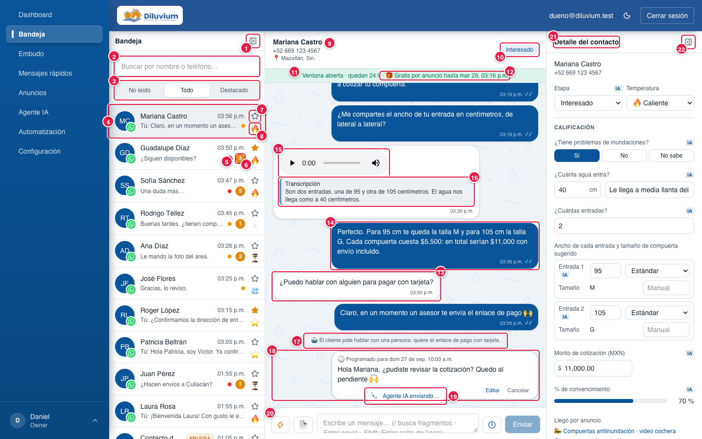

Clic derecho sobre una fila de la lista: menú de esa conversación (23).

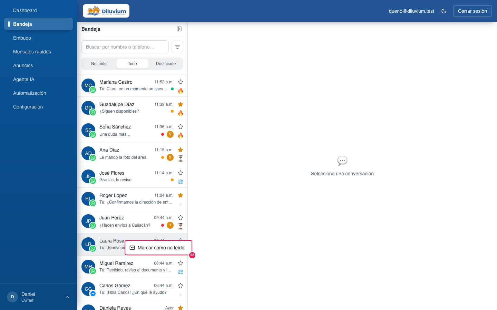

| # | Nombre oficial | Qué hace | Quién lo ve |
|---|---|---|---|
| 1 | **Ocultar lista** | Esconde o muestra la lista de chats; se recuerda en esa computadora. | Todos |
| 2 | **Buscar por nombre o teléfono…** | Busca chats sin importar acentos ni mayúsculas. | Todos |
| 3 | **No leído · Todo · Destacado** | Filtros de la lista. **Destacado** = chats con estrella (7) o cuyo contacto tiene la temperatura ⭐. Se combinan con el filtro de temperatura (25): «Destacado + 🔥» = calientes con estrella. La lista siempre va del mensaje más reciente al más viejo. | Todos |
| 4 | **Fila de conversación** | Iniciales con el logo del canal, nombre, hora del último mensaje y vista previa ("Tú:" si el último fue nuestro, también si lo mandó el agente). Clic abre el chat y lo marca como leído. | Todos |
| 5 | **Semáforo** | Verde menos de 15 min, ámbar menos de 1 h, rojo más de 1 h desde el mensaje del cliente sin respuesta de una persona. | Todos |
| 6 | **Círculo naranja** | Mensajes sin leer. | Todos |
| 7 | **Estrella (Destacado)** | Marca el chat para todo el equipo; aparece en el filtro Destacado. | Todos |
| 8 | **Temperatura** | 🔥 🧊 ⏳ ⭐ o ○. Clic para cambiarla sin abrir el chat. | Todos |
| 9 | **Encabezado del chat** | Nombre, teléfono y ciudad (por la lada). | Todos |
| 10 | **Chip de etapa** | Etapa actual del contacto. | Todos |
| 11 | **Aviso de ventana de 24 h** | "Ventana abierta · quedan X h" (verde) o, vencida, "Pasaron 24 h…" (ámbar). | Todos |
| 12 | **Gratis por anuncio** | "🎁 Gratis por anuncio hasta…" o "📣 Responde antes de…: 72 h gratis". | Todos |
| 13 | **Burbuja del cliente** | Mensaje del cliente (izquierda, blanca). | Todos |
| 14 | **Burbuja nuestra** | Mensaje del vendedor o del agente (derecha, azul; a propósito no dice quién). 🕗 enviando (también mientras espera su turno si WhatsApp pidió esperar) · ✓ enviado · ✓✓ entregado · ✓✓ azul leído. Si WhatsApp dice "entregado" o "leído", el mensaje **nunca** queda como "No se envió". | Todos |
| 15 | **Nota de voz** | Reproductor del audio. | Todos |
| 16 | **Transcripción** | Lo que dijo el cliente en la nota de voz, en texto. | Todos |
| 17 | **Aviso 🤖** | Nota del agente para el vendedor (el cliente no la ve). | Todos |
| 18 | **Mensaje programado** | "🕒 Programado para…" al final del chat, con **Editar** y **Cancelar**. | Todos |
| 19 | **Agente IA leyendo… / escribiendo… / enviando…** | Píldora que dice qué está haciendo el agente en ese chat en este momento. | Todos |
| 20 | **Caja para escribir** | Ver [3.2.2 Caja para escribir](#322-caja-para-escribir-composer). | Todos |
| 21 | **Detalle del contacto** | Ficha del cliente. Ver [3.2.3 Detalle del contacto](#323-detalle-del-contacto). | Todos |
| 22 | **Ocultar panel de contacto** | Esconde o muestra el Detalle; se recuerda en esa computadora. | Todos |
| 23 | **Menú del clic derecho** | Sobre una fila (en celular, dejándola presionada): **Marcar como no leído** (pone el círculo naranja, 6, para dejarla pendiente; si ese chat estaba abierto, se cierra) o **Marcar como leído** (lo quita, y en el Embudo también quita el azul de la tarjeta). Es para todo el equipo; el círculo se quita solo al abrir el chat o al contestar. | Todos |
| 25 | **Filtro de temperatura** (ícono a la derecha del buscador) | Menú corto: **Todas · 🔥 Caliente · 🧊 Frío · ⏳ En espera · ○ Sin asignar**, una a la vez. Con algo elegido el ícono se pinta naranja y muestra el emoji; la **×** de al lado lo quita. Se suma a la pestaña (3) y a la búsqueda. No se recuerda al recargar. Desde el 28-sep-2026; captura pendiente. | Todos |
| 24 | **Franja del Agente IA** (arriba de todo, solo si aplica) | Si el Agente IA tiene horario: «El Agente IA solo contesta mié–jue 20:00–6:00 (ahora está fuera de horario)» en ámbar, o «(ahora sí está contestando)» en gris; se actualiza sola cada minuto. Si el canal está Apagado: «El Agente IA está apagado en WhatsApp Diluvium» en rojo. Con 24/7 y Encendido no sale. No está en la captura. | Todos |

**Lo cambias tú desde la pantalla:** temperatura, estrella, leído / no leído (clic derecho), etapa y todo el
Detalle; contestar, programar, mandar plantillas; pausar o activar al agente (en el Detalle).

**Pídeselo a Code:**
- "En Bandeja › (10) chip de etapa, muestra «Cerca de compra» en vez de «cerca_compra»."
- "En Bandeja › (5) semáforo, que el rojo salga a los 30 minutos en vez de a la hora."
- "En Bandeja › (3) filtros, agrega un filtro «Con aviso del agente»."

**Agente IA aquí:** contesta en el chat (burbujas azules), muestra la píldora (19) mientras lee o escribe, deja
avisos 🤖 (17), avanza la etapa (10) y usa la transcripción (16) de las notas de voz. Cuando un vendedor contesta,
se pausa en ese chat (según Opciones). Si no contesta todo (tiene horario o el canal está Apagado), lo dice la
franja (24).

Para Code: ruta `/dashboard`; `app/(app)/dashboard/_components/` (`inbox-board`, `conversation-list`, `chat-thread`, `temperature-picker`, `agent-activity-pill`, `scheduled-in-thread`, `bot-banner`); franja (24) con `lib/monitoring/bot-silence.ts` (`loadBotBanner`); menú del clic derecho `components/ui/context-menu.tsx`; datos en `lib/inbox/`; tiempo real `/api/inbox/stream`. Filtro de temperatura: `app/(app)/_components/card-filter-button.tsx` → `listConversations({ temperature })` (lib/inbox/actions.ts, validado) → `listFilter` en lib/inbox/queries.ts; reglas en `lib/contacts/filters.ts` (Destacado = `is_starred` o `temperature = 'destacado'`).

#### 3.2.1 Chat: mensajes, avisos y tarjetas del agente

El mismo chat se usa en la Bandeja y en el pop-up del Embudo. Estas capturas muestran lo que puede aparecer
dentro de él.

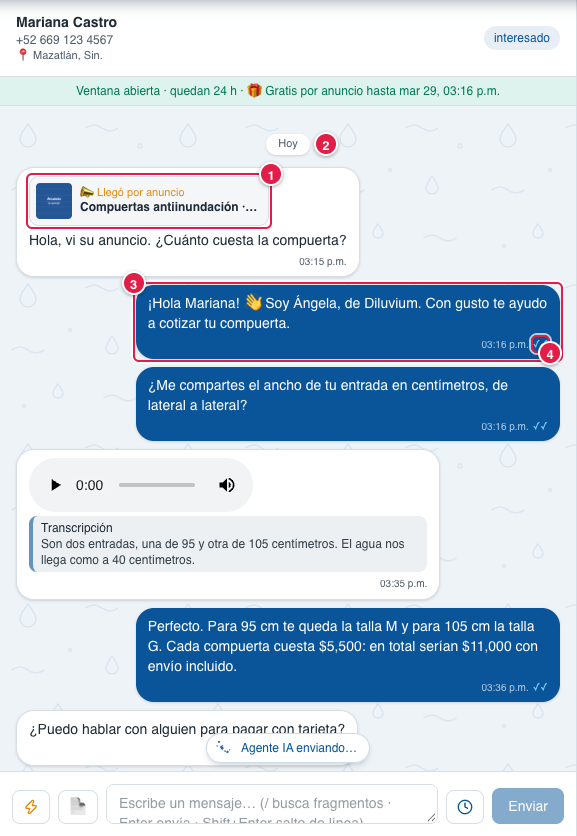
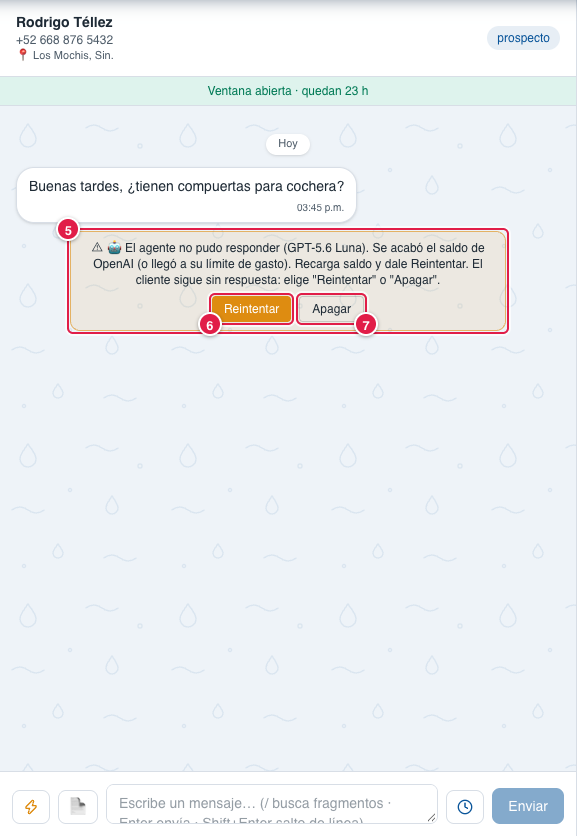
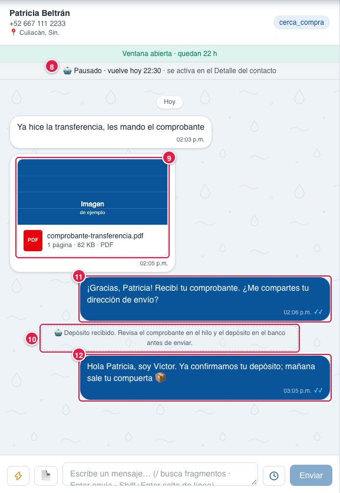
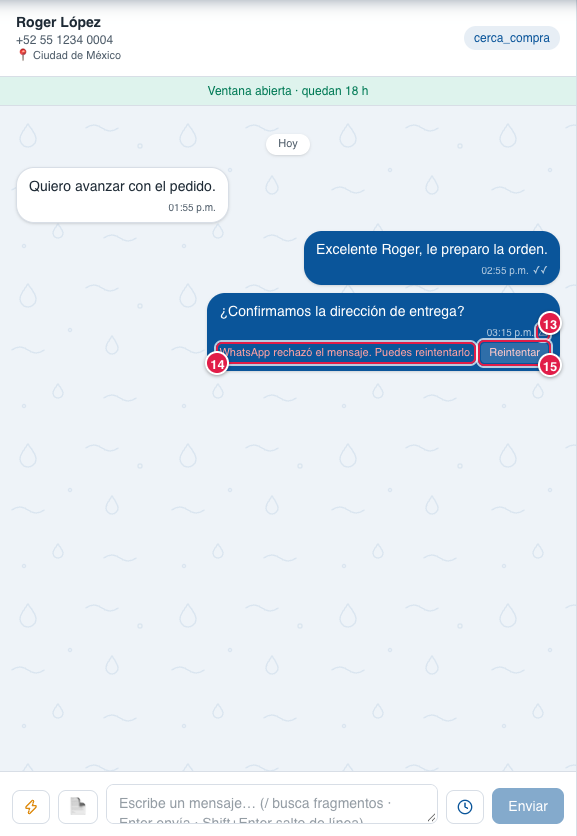
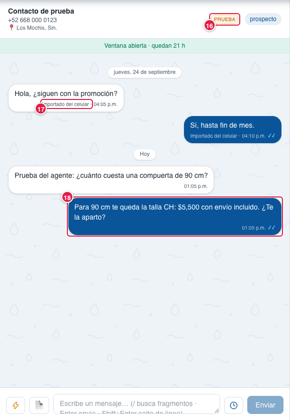

| # | Nombre oficial | Qué hace | Quién lo ve |
|---|---|---|---|
| 1 | **📣 Llegó por anuncio** | Tarjeta con el nombre y la miniatura del anuncio que trajo al cliente. Clic abre la página del anuncio. | Todos |
| 2 | **Separador de día** | Hoy, Ayer o la fecha. | Todos |
| 3 | **Respuesta del agente** | Mensaje que mandó Ángela. | Todos |
| 4 | **Palomitas azules** | El cliente ya lo leyó. | Todos |
| 5 | **⚠ 🤖 El agente no pudo responder** | Explica el motivo en palabras simples (sin saldo, falta la llave, proveedor saturado, tardó demasiado…). El cliente sigue sin respuesta. | Todos |
| 6 | **Reintentar** (tarjeta del agente) | Le pide al agente un intento más, ya. | Todos |
| 7 | **Apagar** (tarjeta del agente) | Pausa al agente solo en ese chat; vuelve con **Activar** en el Detalle. | Todos |
| 8 | **🤖 Pausado · vuelve hoy 22:30** | Solo informa que el agente está en pausa en este chat y hasta cuándo. Se activa en el Detalle. | Todos |
| 9 | **Documento** | PDF con miniatura de la primera página, nombre, páginas y peso. Clic lo abre. Mientras se copia dice "Procesando…"; si no se pudo bajar (o llegó vacío) tras varios intentos, dice **"No se pudo descargar"** (nunca un archivo en blanco). Igual para audio, imagen, video y XML. Los archivos que adjunta el vendedor (foto, video, documento) se ven igual que los del cliente, con ✓/✓✓ como cualquier mensaje. | Todos |
| 10 | **🤖 Depósito recibido** | El agente vio un comprobante: revisar el depósito en el banco antes de enviar. | Todos |
| 11 | **Respuesta del agente al comprobante** | Confirma al cliente y pide sus datos de envío. | Todos |
| 12 | **Respuesta de un vendedor** | Al contestar un vendedor, el agente se pausa en ese chat (según Opciones). | Todos |
| 13 | **⚠ No se envió** | El mensaje no salió. | Todos |
| 14 | **Motivo** | Por qué no salió, en palabras simples: ventana de 24 h cerrada, número que no recibe mensajes de WhatsApp, WhatsApp no pudo subir el archivo, tipo de archivo no permitido; cualquier otro: "WhatsApp no lo entregó (código N)". | Todos |
| 15 | **Reintentar** (mensaje) | Vuelve a mandar ese mismo mensaje. | Todos |
| 16 | **PRUEBA** | El chat es de un número de prueba; no cuenta en el Dashboard. Hoy no sale en ningún chat: los de prueba se borraron el 28-sep-2026. | Todos |
| 17 | **Importado del celular** | Mensaje copiado del historial del teléfono al conectar el número. El agente no lo contesta. | Todos |
| 18 | **Respuesta del agente en el número de prueba** | Así se prueba al agente sin tocar a clientes reales. | Todos |
| 19 | **🤖 No le llegó al cliente la imagen de …** | Tarjeta de envío: WhatsApp aceptó el archivo de un workflow y después avisó que falló. Dice el motivo y el comando para reenviarlo (p. ej. /banco). La etapa no se regresa. | Todos |
| 20 | **🤖 WhatsApp sí recibió el mensaje…** | Tarjeta de envío: WhatsApp aceptó el mensaje pero el CRM no pudo guardar la confirmación. Revisar en el celular antes de escribirlo otra vez (sin Reintentar, para no duplicar). | Todos |

**Lo cambias tú desde la pantalla:** Reintentar o Apagar en la tarjeta del agente; Reintentar un mensaje que no salió.

**Pídeselo a Code:**
- "En Bandeja › Chat › (3) respuesta del agente, pon un 🤖 chiquito junto a la hora para distinguirla."
- "En Bandeja › Chat › (10) Depósito recibido, que se vea en naranja como la tarjeta de error."

**Agente IA aquí:** es el protagonista de esta parte: sus respuestas (3, 11, 18), sus avisos (10) y su tarjeta
de error (5–7). El aviso de pausa (8) sale cuando alguien lo pausó o cuando un vendedor contestó.

Para Code: `chat-thread.tsx`, `ad-referral-card.tsx`, `agent-in-thread.tsx` (aviso de pausa y avisos 🤖), `agent-error-card.tsx`, `document-card.tsx`; tipos de aviso en `lib/ai/runtime/policy.ts` (`NoticeKind`).

#### 3.2.2 Caja para escribir (composer)

Donde el vendedor escribe. Con la ventana de 24 h abierta se escribe libre y se **adjuntan archivos**; cerrada,
solo plantilla (y no se pueden adjuntar).

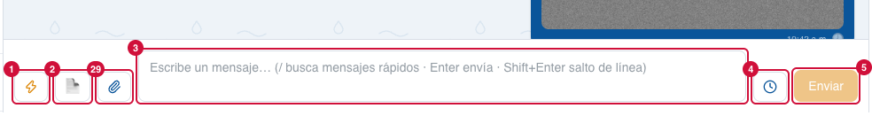
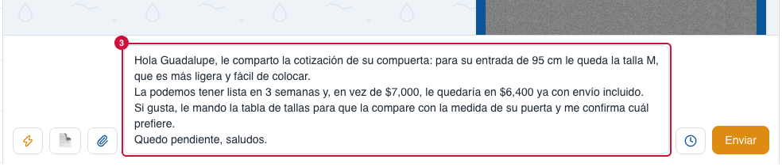
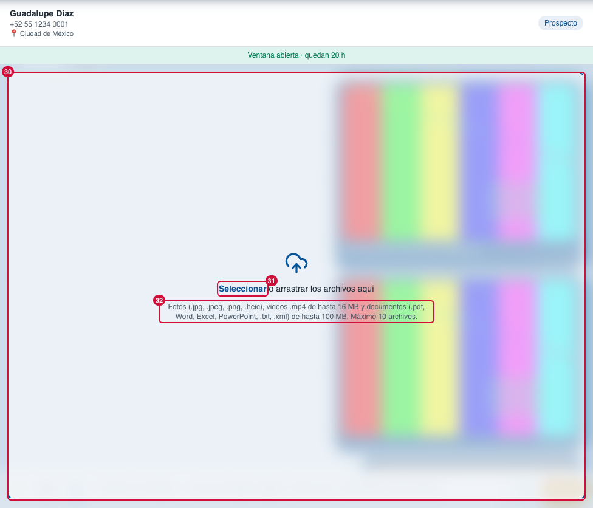
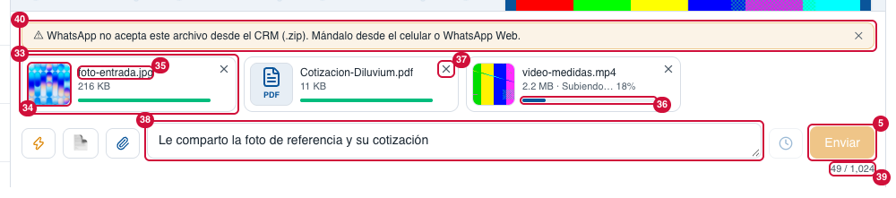
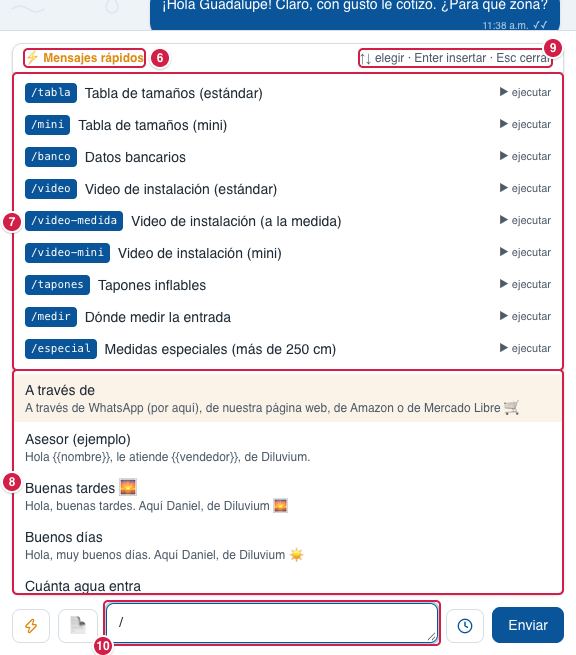
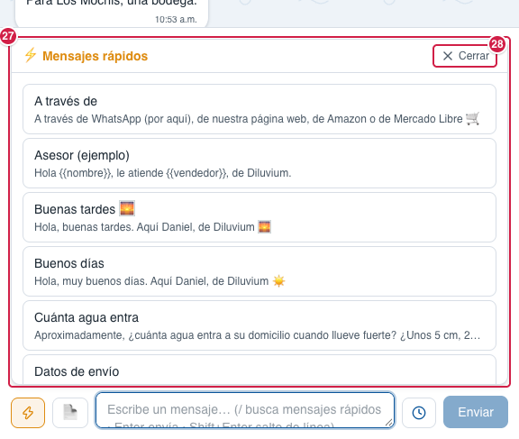
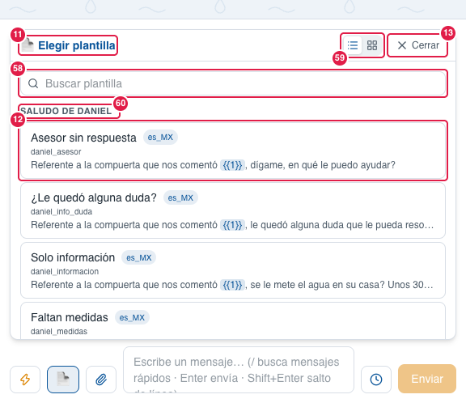
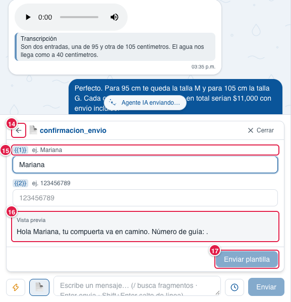
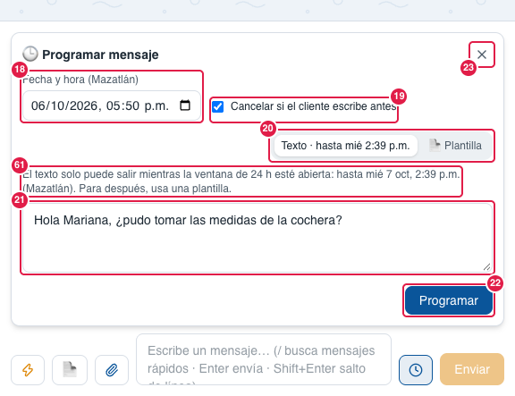
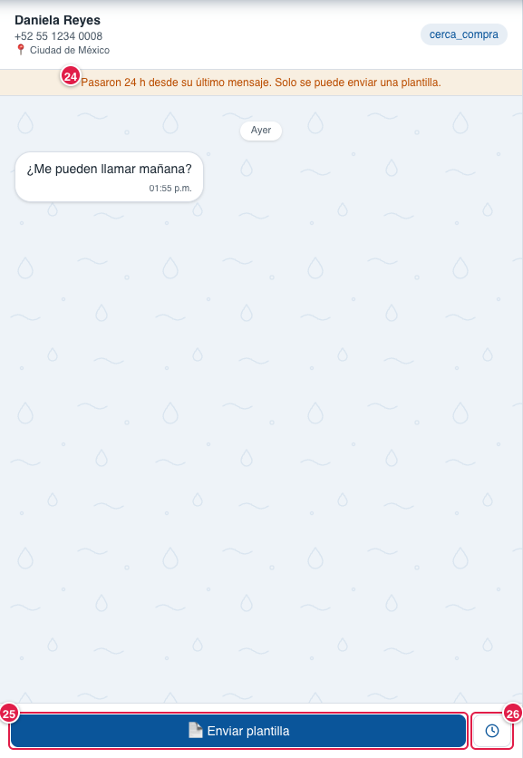

| # | Nombre oficial | Qué hace | Quién lo ve |
|---|---|---|---|
| 1 | **⚡ Mensajes rápidos** | Abre la ventana de mensajes rápidos (27–28) para insertar uno. | Todos |
| 2 | **📄 Plantillas** | Abre las plantillas aprobadas por Meta. | Todos |
| 3 | **Escribe un mensaje…** | Caja de texto. Empieza con 2 renglones y **crece sola** desde el 3.º para que se vea todo lo escrito (el historial se acomoda arriba); pasado el 40 % de la pantalla se desliza por dentro, y al enviar vuelve a 2 renglones. **Enter** envía, **Shift+Enter** hace salto de línea, **"/"** busca mensajes rápidos (el texto gris dice "/ busca mensajes rápidos"). **Cmd+V** con una foto o captura de pantalla la adjunta. | Todos |
| 4 | **🕒 Programar mensaje** | Abre el formulario para programar. Con archivos adjuntos se apaga: programar no lleva archivos por ahora. | Todos |
| 5 | **Enviar** (naranja) | Manda el mensaje. Con archivos, se activa cuando **todos terminaron de subir**; salen uno por mensaje en el orden de la vista previa y el texto va como pie del primero. | Todos |
| 6 | **⚡ Mensajes rápidos** (menú del "/") | Menú que aparece al escribir "/". | Todos |
| 7 | **Automatizaciones** | Comandos de workflows (/tabla, /banco, /video…) con "▶ ejecutar": manda ese material en el chat **de inmediato** (sin los pasos ⏱ Esperar del workflow). Cuenta como mensaje del vendedor. Se encuentran sin importar acentos ni la ñ ("/taman" encuentra /tamaños). | Todos |
| 8 | **Lista de mensajes rápidos** | Nombre y texto; al elegir uno se pone en lugar del "/". Solo {{vendedor}} se llena solo (con tu nombre); {{nombre}} lo completas tú. | Todos |
| 9 | **↑↓ elegir · Enter insertar · Esc cerrar** | Ayuda de teclas del menú. | Todos |
| 10 | **"/" en la caja** | Lo que escribes después de "/" filtra la lista por nombre y texto, sin importar acentos ni mayúsculas ("cuanta" encuentra "Cuánta agua entra"). | Todos |
| 11 | **Elegir plantilla** | Lista de plantillas que se pueden mandar. | Todos |
| 12 | **Plantilla** | Nombre, idioma y texto. Solo salen las aprobadas y que el CRM puede armar. | Todos |
| 13 | **Cerrar** | Cierra la lista de plantillas. | Todos |
| 14 | **← Volver a la lista** | Regresa a elegir otra plantilla. | Todos |
| 15 | **Variable {{1}}** | Hueco a llenar (con un ejemplo). | Todos |
| 16 | **Vista previa** | Cómo le llegará al cliente. | Todos |
| 17 | **Enviar plantilla** | Manda la plantilla. | Todos |
| 18 | **Fecha y hora (Mazatlán)** | Cuándo sale el mensaje programado. | Todos |
| 19 | **Cancelar si el cliente escribe antes** | Si el cliente escribe antes de esa hora, el programado no sale. | Todos |
| 20 | **Texto / 📄 Plantilla** | Qué se programa. Si a esa hora la ventana ya estará cerrada, solo plantilla. | Todos |
| 21 | **Mensaje a enviar** | El texto del programado. | Todos |
| 22 | **Programar** | Guarda el programado; aparece al final del chat. | Todos |
| 23 | **✕ Cerrar** | Cierra sin programar. | Todos |
| 24 | **"Pasaron 24 h desde su último mensaje. Solo se puede enviar una plantilla."** | Aviso de ventana cerrada. Si el chat lo abrimos nosotros y el cliente aún no escribe, dice **"El cliente todavía no escribe: mientras no conteste, solo se puede enviar una plantilla (o escríbele gratis desde WhatsApp Web)."** | Todos |
| 25 | **📄 Enviar plantilla** | Único botón para escribir con la ventana cerrada. | Todos |
| 26 | **🕒 Programar plantilla** | Programa una plantilla para más tarde. | Todos |
| 27 | **⚡ Mensajes rápidos** (ventana del ⚡) | Todos los mensajes rápidos; al elegir uno se agrega al final de lo que llevas escrito (no se manda solo). | Todos |
| 28 | **✕ Cerrar** | Cierra la ventana del ⚡. | Todos |
| 29 | **📎 Adjuntar archivos** | Abre el selector de archivos (se pueden elegir varios). | Todos |
| 30 | **Capa para soltar** | Aparece al arrastrar archivos sobre el chat (historial y caja); se quita al soltar o al salir. No aparece con la ventana cerrada ni en un canal archivado. | Todos |
| 31 | **Seleccionar** | Abre el selector de archivos, igual que 📎. | Todos |
| 32 | **Tipos y límites** | Fotos (.jpg, .jpeg, .png, .heic), videos .mp4 de hasta 16 MB y documentos (.pdf, Word, Excel, PowerPoint, .txt, .xml) de hasta 100 MB. Máximo 10 archivos. | Todos |
| 33 | **Vista previa del archivo** | Un cuadro por archivo, en el orden en que saldrán. El archivo empieza a subir en cuanto entra. | Todos |
| 34 | **Miniatura** | Foto o primer cuadro del video; en documentos, el ícono y el tipo (PDF, DOCX, XML…). | Todos |
| 35 | **Nombre y peso** | Nombre del archivo y cuánto pesa. Una foto HEIC o de más de 5 MB aparece ya como .jpg ("Convirtiendo a JPG…" mientras tanto). | Todos |
| 36 | **Barra de subida** | Avance de la subida ("Subiendo… 18%"); verde = listo. Si el archivo no es válido, en su lugar sale el motivo en rojo. | Todos |
| 37 | **✕ Quitar** | Quita ese archivo antes de enviar. | Todos |
| 38 | **Agrega un mensaje (opcional)** | Con archivos, la caja se vuelve el pie del **primer** archivo. Sin texto salen solo los archivos. | Todos |
| 39 | **Contador 0 / 1,024** | Largo del pie; WhatsApp acepta hasta 1,024 caracteres (en rojo si se pasa). | Todos |
| 40 | **Aviso de archivo no aceptado** | "WhatsApp no acepta este archivo desde el CRM (.zip). Mándalo desde el celular o WhatsApp Web." También avisa si pasa de 10 archivos. ✕ lo cierra. | Todos |

**Lo cambias tú desde la pantalla:** qué mensajes rápidos y plantillas existen (en [Mensajes rápidos](#34-mensajes-rápidos))
y qué comandos hay (en [Automatización](#37-automatización)).

**Pídeselo a Code:**
- "En Bandeja › Caja para escribir › (3), que Enter haga salto de línea y Ctrl+Enter envíe."
- "En Bandeja › Caja para escribir › (19), que la casilla venga desmarcada."

**Agente IA aquí:** no usa esta caja. Lo que escribe **o adjunta** un vendedor aquí cuenta como su respuesta (y como
primera respuesta) y pausa al agente en ese chat si así está en Opciones.

Para Code: `composer.tsx`, `snippet-picker.tsx`, `template-picker.tsx`, `schedule-form.tsx`, `archived-composer.tsx`; comandos `lib/actions/workflows.ts` (`runWorkflowCommand`); adjuntos `chat-drop-zone.tsx`, `attachment-tray.tsx`, `use-chat-attachments.ts`, reglas `lib/chat-attachments/rules.ts` (XML: `XML_COMO_TEXTO`), subida `app/api/inbox/adjuntos`, envío `lib/inbox/attachment-actions.ts` + `worker/chat-uploads.ts`.

#### 3.2.3 Detalle del contacto

La ficha del cliente. Es **la misma** a la derecha de la Bandeja y en el pop-up del Embudo. Se guarda sola al
salir de cada campo: junto al título aparece **"Guardando…"** y luego **"Guardado ✓"** (no hay botón Guardar).
Ningún dato es definitivo: el agente corrige lo que el cliente aclare después.

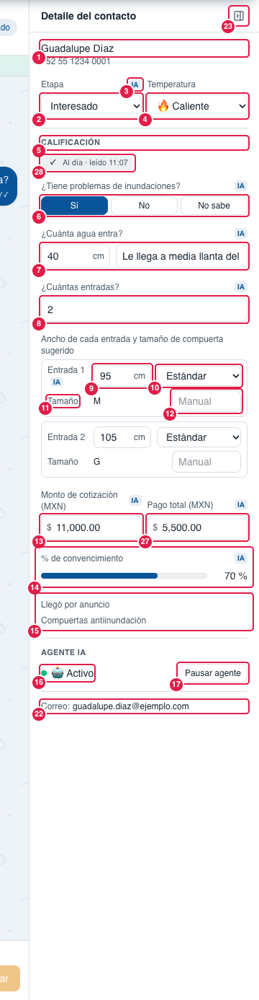
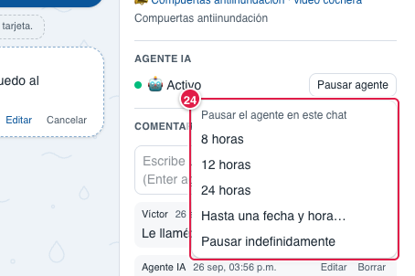
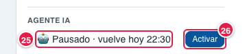

| # | Nombre oficial | Qué hace | Quién lo ve |
|---|---|---|---|
| 1 | **Nombre y teléfono** | Datos del contacto. | Todos |
| 2 | **Etapa** | Cambiarla aquí la mueve también en el Embudo. La que pone un vendedor manda; el agente solo avanza. | Todos |
| 3 | **Marca "IA"** | Ese dato lo escribió el agente al último. Si lo editas, se quita. Cuando lo acaba de llenar dice "IA actualizando" y el campo brilla. | Todos |
| 4 | **Temperatura** | 🔥 Caliente, 🧊 Frío, ⏳ En espera, ⭐ Destacado o Sin asignar. | Todos |
| 5 | **Calificación** | Sección con las preguntas de la venta. | Todos |
| 6 | **¿Tiene problemas de inundaciones?** | Sí · No · No sabe. | Todos |
| 7 | **¿Cuánta agua entra?** | Centímetros y una descripción opcional. | Todos |
| 8 | **¿Cuántas entradas?** | Número de entradas. Si lo bajas, pide confirmación porque borra anchos. | Todos |
| 9 | **Ancho de la entrada (cm)** | Una fila por entrada. | Todos |
| 10 | **Línea** | Mini o Estándar. | Todos |
| 11 | **Tamaño sugerido** | Lo calcula el CRM con [Tallas y medidas](#36-agente-ia). | Todos |
| 12 | **Manual** | Tamaño escrito a mano; manda sobre el sugerido. | Todos |
| 13 | **Monto de cotización (MXN)** | Total de lo que el cliente **eligió comprar al final** (si se le cotizaron 2 y eligió 1, es el total de 1). Lo deja al día el Agente IA en segundo plano; puede cambiar aun después de la compra. A la derecha, (27). | Todos |
| 14 | **% de convencimiento** | Barra de qué tan cerca está de comprar. Solo lo decide el agente (no se edita). | Todos |
| 15 | **Llegó por anuncio** | El anuncio que lo trajo (enlace), el resumen que hizo el agente y "También volvió por…". | Todos |
| 16 | **Agente IA (estado)** | 🟢 Activo · 🟠 Pausado · vuelve… · o "Apagado en «canal»". | Todos |
| 17 | **Pausar agente** | Abre el menú de pausa (24). | Todos |
| 18 | **Escribe un comentario…** | Nota interna del equipo (Enter agrega). El cliente no la ve y el agente no la lee. | Todos |
| 19 | **Agregar** | Guarda el comentario. | Todos |
| 20 | **Comentario** | Autor y fecha. "Agente IA" = lo escribió el agente; "Importado" = nota vieja de GHL. | Todos |
| 21 | **Editar · Borrar** (comentario) | Cualquier rol puede editar o borrar, también los de otros. | Todos |
| 22 | **Correo** (y etiquetas) | Datos compactos al final. | Todos |
| 23 | **Ocultar panel** | Esconde el Detalle. | Todos |
| 24 | **Pausar el agente en este chat** | 8 horas · 12 horas · 24 horas · Hasta una fecha y hora… · Pausar indefinidamente. | Todos |
| 25 | **🤖 Pausado · vuelve hoy 22:30** | Estado cuando está en pausa (o "Pausado indefinidamente"). | Todos |
| 26 | **Activar** | Regresa al agente a ese chat. Contesta a partir del siguiente mensaje del cliente. Queda en Agente IA › Historial con quién lo hizo (igual que Pausar agente). | Todos |
| 27 | **Pago total (MXN)** | Lo que el cliente **ya pagó** (anticipo + resto, o el pago completo), junto al monto (13): así se ve quién cotizó mucho y no compró. Lo llena el Agente IA en segundo plano con los comprobantes y los pagos confirmados en el chat; se corrige a mano. | Todos |

**Lo cambias tú desde la pantalla:** todos los campos menos el % de convencimiento; comentarios; pausar y activar al agente.

**Pídeselo a Code:**
- "En Bandeja › Detalle › (27) pago total, separa anticipo y liquidación."
- "En Bandeja › Detalle › (24) menú de pausa, agrega la opción «2 horas»."
- "En Bandeja › Detalle › (14) % de convencimiento, déjame corregirlo a mano."

**Agente IA aquí:** llena y corrige los campos con lo que dice el cliente (marca "IA"), decide el % de
convencimiento, escribe comentarios firmados "Agente IA", avanza la etapa y resume el anuncio en (15).
Lo hace **siempre en segundo plano**, aunque esté apagado o pausado en el chat: unos 3 minutos después de que
el chat se calma lee todo en orden y deja al día etapa, datos, monto (13) y pago (27). Nunca le escribe al
cliente. Solo avanza la etapa, y la que puso un vendedor a mano la respeta (solo la avanza por algo que pase
en el chat después).

Para Code: `app/(app)/contactos/_components/contact-details.tsx` (+ `contact-entradas`, `contact-comments`, `convencimiento-picker`, `ia-mark`, `agent-contact-switch`), `dashboard/_components/bot-off-menu.tsx`; datos `lib/contacts/qualification.ts`, `lib/actions/contact-qualification.ts`.

#### 3.2.4 Avisos emergentes

Cuadros que bajan debajo de la barra de arriba, en cualquier pantalla, cuando **otra persona o el agente**
cambia la etapa de un contacto. Duran 10 segundos; si llegan más de 3 juntos se agrupan en "N contactos
cambiaron de etapa". Nunca avisan lo que tú mismo hiciste.

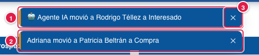

| # | Nombre oficial | Qué hace | Quién lo ve |
|---|---|---|---|
| 1 | **🤖 Agente IA movió a … a …** | El agente avanzó la etapa. Clic abre su chat en la Bandeja. | Todos |
| 2 | **"Adriana movió a … a …"** | Otro vendedor (o una automatización, "⚙️ Automatización movió…") cambió la etapa. | Todos |
| 3 | **✕ Cerrar aviso** | Lo quita antes de los 10 segundos. | Todos |

**Lo cambias tú desde la pantalla:** nada; solo cerrarlos.

**Pídeselo a Code:**
- "En Avisos emergentes › (1), que duren 20 segundos."
- "En Avisos emergentes, avísame también cuando el agente deje «Depósito recibido»."

**Agente IA aquí:** cada vez que mueve a alguien de etapa sale el aviso (1), también cuando lo hace en
segundo plano con el agente apagado o pausado.

Para Code: `app/(app)/_components/stage-change-toasts.tsx` y `stage-toasts.ts`; evento `contact.updated` (`lib/contacts/notify-updated.ts`).

---

### 3.3 Embudo

El tablero con una columna por etapa. Cada tarjeta es un contacto. Arrastrar una tarjeta a otra columna le cambia
la etapa. Todo se actualiza solo, sin recargar. Las columnas se editan con el **lápiz (17)** junto al título
(desde el 27-sep-2026: renombrar, agregar, borrar, reordenar; captura pendiente).

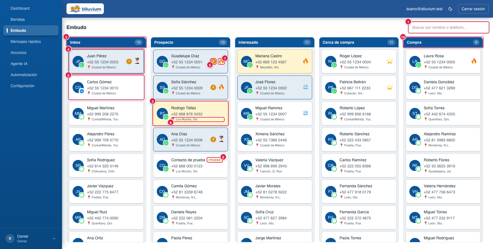

Pop-up del contacto (clic en una tarjeta): el mismo chat y el mismo Detalle de la Bandeja, sin salir del tablero.
Abrirlo quita el círculo naranja (6); el azul (4) se quita al contestar o con **Marcar como leído (19)**.

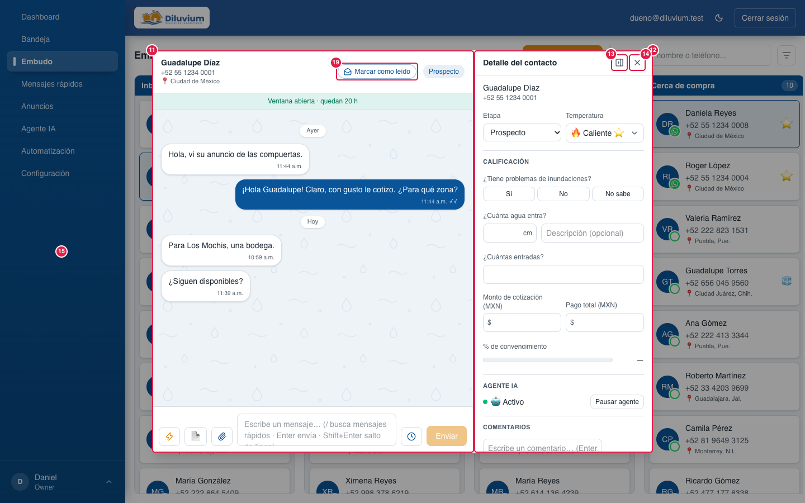

Clic derecho sobre una tarjeta: menú de ese contacto (16).

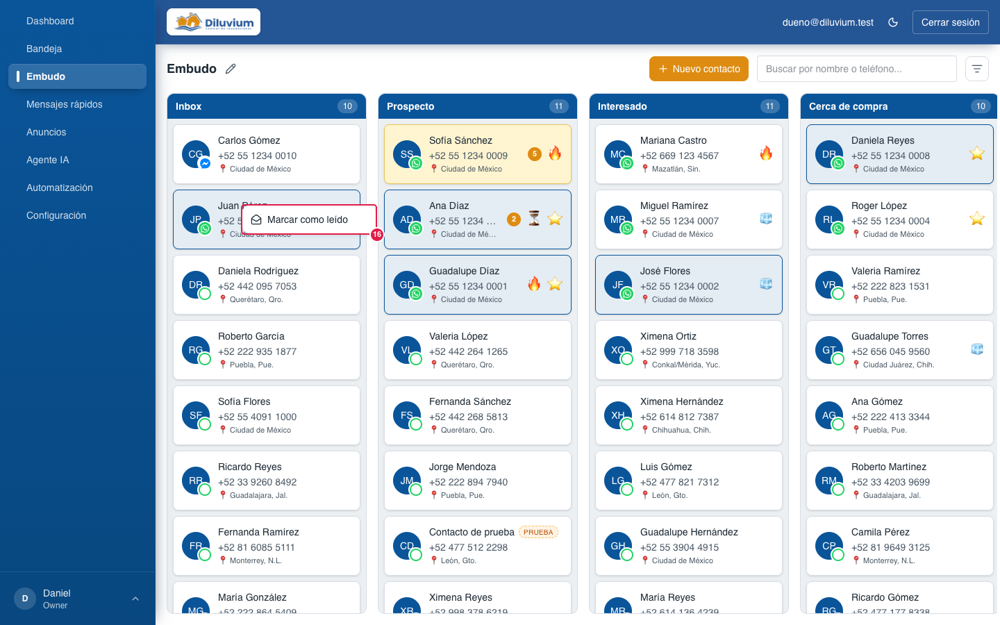

**＋ Nuevo contacto (20)** (desde el 28-sep-2026): alta a mano, como la pestaña Contactos de GHL. Al crearlo se abre su
pop-up. Un contacto **sin chat** (nuevo o importado de GHL) muestra cómo escribirle primero (24–26): gratis desde
WhatsApp Web, o con una plantilla desde el CRM.

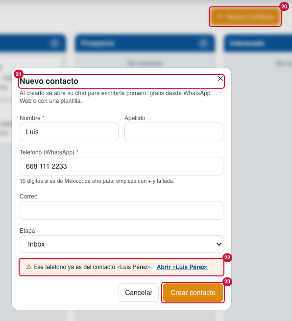
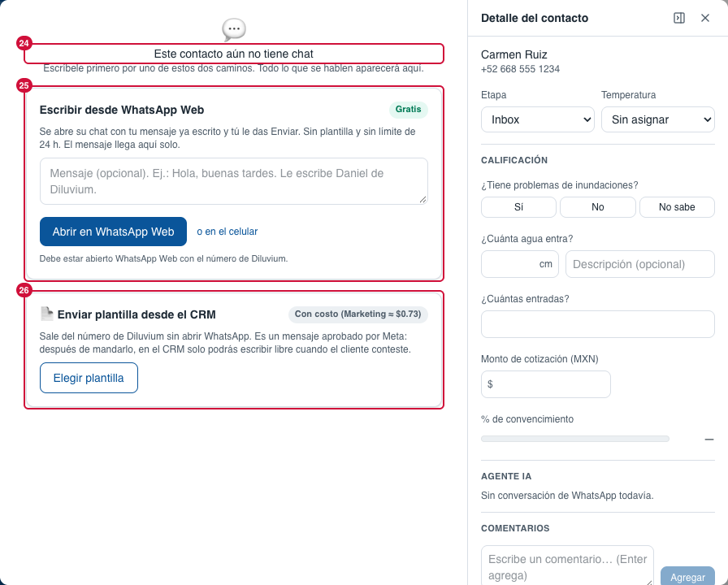

| # | Nombre oficial | Qué hace | Quién lo ve |
|---|---|---|---|
| 1 | **Buscar por nombre o teléfono...** | Filtra las tarjetas de todas las columnas. | Todos |
| 2 | **Columna de etapa** | Nombre de la etapa y cuántos contactos tiene. Arriba va el de actividad más reciente: el último que **escribió** (sube solo, al momento) o el último que **entró** a la etapa. Un mensaje nuestro no lo mueve. | Todos |
| 3 | **Tarjeta amarilla** | El agente necesita al vendedor (pidió un asesor, depósito recibido, error, tope de respuestas…) y ningún vendedor ha contestado después. | Todos |
| 4 | **Tarjeta azul** | El cliente escribió y nadie le ha contestado. Se quita cuando sale una respuesta (vendedor desde el CRM o el celular, o el agente) o con **Marcar como leído** (19 o el clic derecho, 16); abrir el chat **no** la quita. Vuelve con el siguiente mensaje del cliente. Si también aplica amarilla, gana la amarilla. | Todos |
| 5 | **Tarjeta blanca** | Nada pendiente. Al pasar el mouse se ilumina en gris (el azul es solo para 4). | Todos |
| 6 | **Círculo naranja** | Mensajes sin ver. Se quita al abrir el chat o con Marcar como leído. | Todos |
| 7 | **Temperatura** | La del contacto. Si alguno de sus chats tiene la estrella de la Bandeja, la tarjeta muestra además una estrella naranja chica (Destacado del chat); con temperatura ⭐ no se repite. | Todos |
| 8 | **Ciudad por lada** | 📍 Ciudad calculada por la lada del teléfono. | Todos |
| 9 | **PRUEBA** | Contacto del número de prueba. Hoy ninguno la lleva: se quitó el 28-sep-2026 al borrar los chats de prueba. | Todos |
| 10 | **Columna Compra** | Los que ya compraron (cuenta en Anuncios › Compraron). Es la columna con el papel «Venta cerrada» (70): si el papel pasa a otra, cuenta esa. | Todos |
| 11 | **Chat** (pop-up) | El mismo chat de la Bandeja, con su caja para escribir. | Todos |
| 12 | **Detalle del contacto** (pop-up) | El mismo Detalle de la Bandeja. | Todos |
| 13 | **Ocultar detalle del contacto** | Esconde el Detalle en el pop-up; se recuerda en esa computadora. | Todos |
| 14 | **✕ Cerrar** | Cierra el pop-up (también con Esc). | Todos |
| 15 | **Fondo oscuro** | Clic afuera del pop-up también lo cierra. | Todos |
| 17 | **✎ Editar columnas** (lápiz junto a «Embudo») | Abre el editor de columnas (18). | Todos |
| 18 | **Columnas del Embudo** (pop-up) | El mismo editor de Agente IA › Etapas (62–71): nombre, orden, papel, modelo y regla del Agente IA de cada columna. Todo cambio pide confirmar; las demás pantallas abiertas lo ven al momento. | Todos |
| 16 | **Menú del clic derecho** | Sobre una tarjeta: **Marcar como leído** si tiene círculo naranja (6) o está azul (4): quita los dos en todos sus chats, igual que (19). Si no, **Marcar como no leído**: pone el círculo en su chat más reciente y, si el último mensaje es del cliente, regresa el azul. Lo mismo que en la Bandeja y se ve en las dos. No quita el amarillo. En celular no hay pulsación larga: ahí es arrastrar. | Todos |
| 19 | **Marcar como leído** (pop-up) | A la derecha del nombre y el teléfono del chat. Quita el azul (4) y el círculo (6) aunque nadie le haya contestado al cliente (p. ej. solo dijo «gracias»); la tarjeta queda blanca. Sin nada que quitar dice **✓ Leído**. No quita el amarillo. Solo en el Embudo. | Todos |
| 20 | **＋ Nuevo contacto** | Abre el alta (21–23). | Todos |
| 21 | **Nuevo contacto** (pop-up) | **Nombre** y **Teléfono (WhatsApp)** obligatorios; Apellido, Correo y **Etapa** (de fábrica, la de entrada). El teléfono se escribe como sea: 10 dígitos = México; de otro país, con + y la lada. Sin zona horaria: la ciudad sale de la lada (8). No cuenta en Dashboard › Conversaciones nuevas. | Todos |
| 22 | **"Ese teléfono ya es del contacto «…»"** · **Abrir «…»** | El número ya existe (también si se guardó como +521): no se duplica; abre ese contacto. | Todos |
| 23 | **Crear contacto** | Lo crea arriba de su columna y abre su pop-up (24). | Todos |
| 24 | **"Este contacto aún no tiene chat"** (pop-up) | Sale en vez del chat cuando el contacto nunca ha escrito (nuevo o importado de GHL). | Todos |
| 25 | **Escribir desde WhatsApp Web** (**Gratis**) | Mensaje opcional + **Abrir en WhatsApp Web** (o **en el celular**): abre su chat con el texto ya escrito y tú das Enviar. Sin plantilla ni límite de 24 h. Lo mandado llega solo al CRM y crea el chat. Debe estar abierto WhatsApp Web con el número de Diluvium. | Todos |
| 26 | **📄 Enviar plantilla desde el CRM** (**Con costo**) | **Elegir plantilla** → **Enviar plantilla**: abre el chat por WhatsApp con una plantilla aprobada (Marketing ≈ $0.73). Después, en el CRM solo se puede mandar otra plantilla hasta que el cliente conteste (Bandeja › 24). | Todos |
| 27 | **"Este número también está en el contacto «…»"** · **Abrir ese contacto** | Hay otro contacto (más antiguo) con ese número: el chat quedaría en ese, así que se manda desde ahí. | Todos |
| 28 | **Aviso de Meta** (pop-up grande) | Si WhatsApp (Meta) rechaza la plantilla: título, **Por qué pasó**, **Qué hacer** y **Entendido** (el mismo de Mensajes rápidos › 31). | Todos |
| 29 | **Filtro** (ícono a la derecha del buscador) | Menú corto: **Temperatura** (Todas · 🔥 · 🧊 · ⏳ · ○ Sin asignar, una a la vez) y, aparte, **⭐ Destacado** (estrella del chat o temperatura ⭐). Se pueden combinar (🔥 + Destacado) y se suman a la búsqueda. Con algo elegido el ícono se pinta naranja y muestra los emojis; la **×** lo quita. **Las columnas no cambian:** mismas etapas, orden, colores y arrastre; solo quedan las tarjetas que cumplen, cada columna cuenta las suyas y la vacía dice «Ninguno con este filtro». Una tarjeta que deja de cumplir (p. ej. le cambias la temperatura en el pop-up) se va del tablero. No se recuerda al recargar. Desde el 28-sep-2026; captura pendiente. | Todos |

**Lo cambias tú desde la pantalla:** contactos nuevos (20) y el primer mensaje a quien no tiene chat (25–26), la etapa (arrastrando la tarjeta), leído / no leído (clic derecho o **Marcar como leído**, 19), las
columnas (lápiz, 17) y todo lo del chat y el Detalle en el pop-up. Los cambios a las columnas (crear, renombrar, borrar,
ordenar, papel, modelo) quedan en **Agente IA › Historial**.

**Pídeselo a Code:**
- "En Embudo › (2) columna, agrega el total en pesos de las cotizaciones de esa etapa."
- "En Embudo › (5) tarjeta, muestra cuánto tiempo lleva en esa etapa."
- "En Embudo › (18) columnas, que la columna nueva nazca con el Modelo 1."

**Agente IA aquí:** mueve tarjetas hacia adelante (sale el aviso emergente), pinta la tarjeta de amarillo cuando
necesita al vendedor, y su chat y Detalle se ven igual que en la Bandeja.

Para Code: ruta `/embudo` (`/contactos` redirige); `app/(app)/contactos/_components/` (`contacts-board`, `contact-card`, `contact-detail-panel`, `contact-chat`); colores `lib/contacts/funnel-signals.ts` y `funnel-tone.ts`, estilos `[data-funnel]` y `[data-funnel-card]` (luz gris) en `app/globals.css`; «Marcar como leído» = `mark-read-button.tsx` + `conversations.attended_at` (migración 0045); orden de la columna = `board-live.ts` (`columnsByStage`: etapa o último entrante, que sale de `window_expires_at` − 24 h). Columnas: tabla `funnel_stages` (migración 0041), editor `app/(app)/_components/stages-editor.tsx`, etapas en vivo `funnel-stages-provider.tsx` (evento SSE `stages.updated`). Nuevo contacto: `new-contact-dialog.tsx` → `createContact` (lib/actions/contacts.ts) → `lib/contacts/create-manual.ts` (source `manual`, candado por teléfono como la entrada, fuera de Conversaciones nuevas en `lib/dashboard/queries.ts`); teléfono `lib/contacts/manual-phone.ts`. Sin chat: `first-message.tsx`; WhatsApp Web `lib/contacts/whatsapp-link.ts`; plantilla `startChatWithTemplate` (lib/inbox/actions.ts) → `lib/messaging/start-conversation.ts` → Zernio `POST /v1/inbox/conversations`. Filtro (29): mismo `card-filter-button.tsx`, en el navegador sobre las tarjetas ya cargadas (`matchesCardFilter` de `lib/contacts/filters.ts`); la estrella del chat llega en la señal (`FunnelSignal.starred`, `bool_or(is_starred)` en funnel-signals.ts, también en vivo).

---

### 3.4 Mensajes rápidos

Dos pestañas: **Mensajes rápidos** (respuestas guardadas para dentro de las 24 h; antes se llamaban "Fragmentos") y
**Plantillas** (mensajes aprobados por Meta para fuera de las 24 h). Los 22 mensajes rápidos de Diluvium se cargaron
el 27-sep-2026; se editan aquí como cualquier otro.

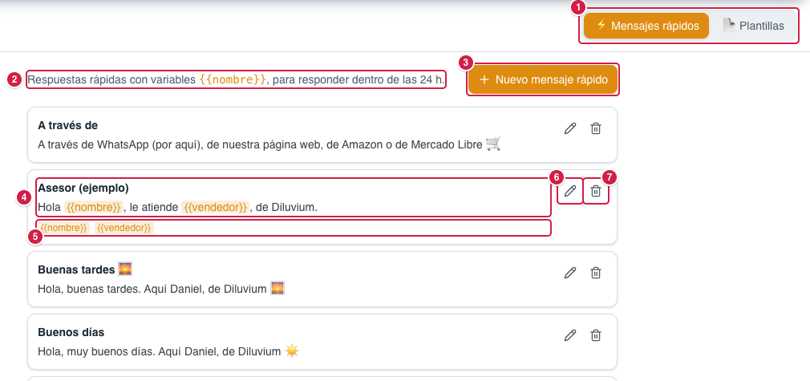
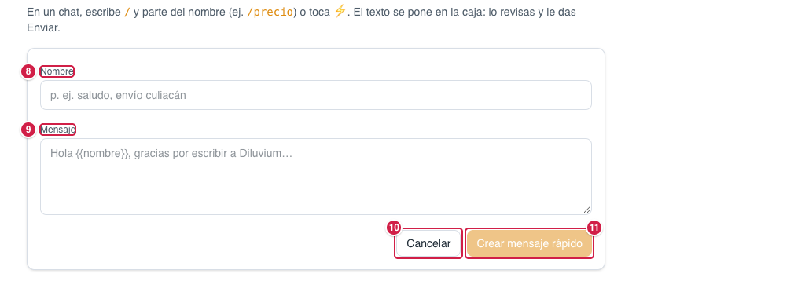
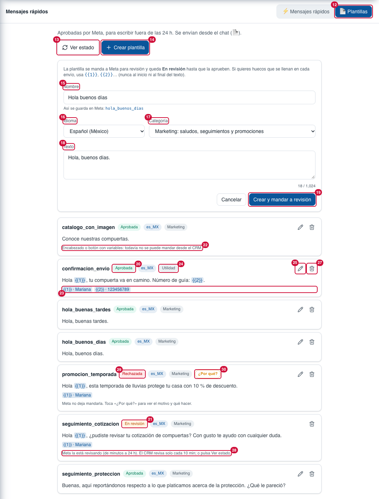
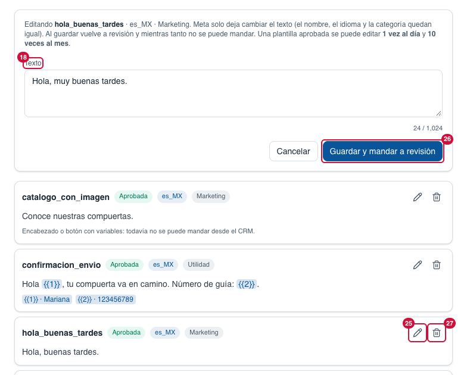
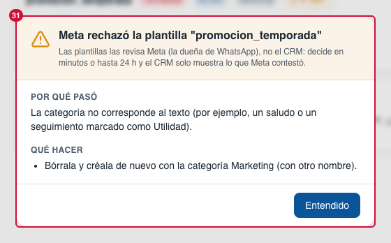

| # | Nombre oficial | Qué hace | Quién lo ve |
|---|---|---|---|
| 1 | **⚡ Mensajes rápidos · 📄 Plantillas** | Pestañas de la sección. | Todos |
| 2 | **Cómo se usan** | "En un chat, escribe / y parte del nombre (ej. /precio) o toca ⚡. El texto se pone en la caja: lo revisas y le das Enviar." | Todos |
| 3 | **Nuevo mensaje rápido** | Abre el formulario (8–11). | Todos |
| 4 | **Mensaje rápido** | Nombre y texto guardado. | Todos |
| 5 | **Variables** | Las variables que usa ({{nombre}}, {{vendedor}}). Solo sale si las usa: los 22 de Diluvium no llevan (en la captura, "Asesor (ejemplo)" es de muestra). | Todos |
| 6 | **Editar** (lápiz) | Cambia el mensaje rápido. | Todos |
| 7 | **Borrar** (bote) | Lo elimina. | Todos |
| 8 | **Nombre** | Cómo se busca con "/" (p. ej. saludo). | Todos |
| 9 | **Mensaje** (texto) | El mensaje. | Todos |
| 10 | **Cancelar** | Cierra sin guardar. | Todos |
| 11 | **Crear mensaje rápido** | Guarda. | Todos |
| 12 | **📄 Plantillas** | Pestaña de plantillas. | Todos |
| 13 | **Sincronizar** | Trae de Meta las plantillas y su estado actual. | Todos |
| 14 | **Crear plantilla** | Abre el formulario (15–19). | Todos |
| 15 | **Nombre** | Escríbelo como quieras (p. ej. "Hola buenas tardes"): el CRM lo pasa a minúsculas, sin acentos y con guion bajo, y debajo dice **"Así se guarda en Meta: hola_buenas_tardes"**. | Todos |
| 16 | **Idioma** | Español (México) de fábrica (es_MX); también Español o Inglés. | Todos |
| 17 | **Categoría** | **Marketing** (saludos, seguimientos y promociones; de fábrica) o **Utilidad** (avisos de un pedido ya hecho). Meta cobra distinto por categoría y puede pasar una de Utilidad a Marketing. | Todos |
| 18 | **Texto** | El mensaje, hasta 1,024 caracteres (contador abajo). Huecos {{1}}, {{2}}… seguidos y **nunca al inicio ni al final** (regla de Meta); cada hueco pide un ejemplo. Si algo no va, sale un aviso ⚠ y el botón no se activa. | Todos |
| 19 | **Crear y mandar a revisión** | La manda a Meta; queda "En revisión" (de minutos a 24 h). Si Meta la rechaza al recibirla, el motivo sale ahí mismo. | Todos |
| 20 | **Aprobada** | Ya se puede mandar desde el chat. | Todos |
| 21 | **En revisión** | Meta aún no la aprueba; no se puede mandar. | Todos |
| 22 | **"Encabezado o botón con variables: todavía no se puede mandar desde el CRM."** | Aprobada, pero el CRM todavía no puede armarla. | Todos |
| 23 | **Ejemplos de variables** | Qué va en cada {{n}}. | Todos |
| 24 | **Categoría** (etiqueta) | La categoría de esa plantilla (Marketing o Utilidad). | Todos |
| 25 | **Editar** (lápiz de la plantilla) | Cambia **solo el texto** (nombre, idioma y categoría quedan fijos). Solo en aprobadas, rechazadas o pausadas. Vuelve a revisión y mientras tanto no se puede mandar; una aprobada se edita **1 vez al día y 10 al mes** (Meta). | Todos |
| 26 | **Guardar y mandar a revisión** | Guarda la edición (25) y la manda a Meta. | Todos |
| 27 | **Borrar** (bote de la plantilla) | Pide confirmación y la **borra en Meta** y del CRM. Meta no deja volver a usar ese nombre en 30 días. No se deja si hay mensajes programados con ella (primero se cancelan). | Todos |
| 28 | **"Meta la está revisando (de minutos a 24 h)…"** | Aviso de una plantilla En revisión: pulsa Sincronizar (13) para ver si ya la aprobó. | Todos |
| 29 | **Rechazada · Pausada por Meta · Desactivada por Meta** | Otros estados que pone Meta; ninguno se puede mandar. Las borradas ya no se muestran. | Todos |
| 30 | **¿Por qué?** (naranja, junto a la plantilla) | En rechazadas, pausadas o desactivadas: pregunta a Meta el motivo y abre el aviso grande (31). | Todos |
| 31 | **Aviso de Meta** (pop-up grande) | Sale solo cuando Meta no acepta algo de una plantilla (al crear, editar, borrar, al Sincronizar si alguna quedó rechazada o pausada, o con 30): título, que lo decide Meta y no el CRM, **Por qué pasó** (el motivo de Meta en palabras simples), **Qué hacer** y **Entendido**. | Todos |

**Lo cambias tú desde la pantalla:** crear, editar y borrar mensajes rápidos; crear, editar (van a revisión de Meta), borrar y sincronizar plantillas.
Cada uno de esos cambios queda en **Agente IA › Historial** (72) con quién lo hizo y su texto (**Ver cambios**, 77).

**Pídeselo a Code:**
- "En Mensajes rápidos › (4) mensaje rápido, agrega un buscador arriba de la lista."
- "En Mensajes rápidos › (22), que el CRM pueda mandar plantillas con imagen en el encabezado."

**Agente IA aquí:** no usa mensajes rápidos ni plantillas; son herramientas del vendedor.

Para Code: ruta `/mensajes-rapidos` (`/snippets` redirige); `app/(app)/snippets/_components/` (`fragmentos-tab`, `plantillas-tab`); `lib/snippets/`, `lib/templates/`, `lib/messaging/template-sync.ts`; plantillas: `lib/actions/templates.ts` (devuelven `{ ok, message }`: en producción Next.js esconde el mensaje de un error lanzado), `lib/messaging/templates.ts` (`updateTemplateForOrg`, `deleteTemplateForOrg`), reglas puras en `lib/messaging/template-format.ts` (`templateNameFromLabel`, `templateBodyProblem`), Zernio `PATCH`/`DELETE /v1/whatsapp/templates/{name}`. En código y base
siguen llamándose `snippets`. Carga de los 22: `npm run mensajes-rapidos:cargar` (simula; `--confirmar` escribe) con la lista de
`lib/snippets/mensajes-rapidos-diluvium.ts`.

---

### 3.5 Anuncios

Tabla de los anuncios de Meta por los que llegaron clientes en el periodo (por la fecha de su clic). Se abre
cada anuncio para ver su detalle.

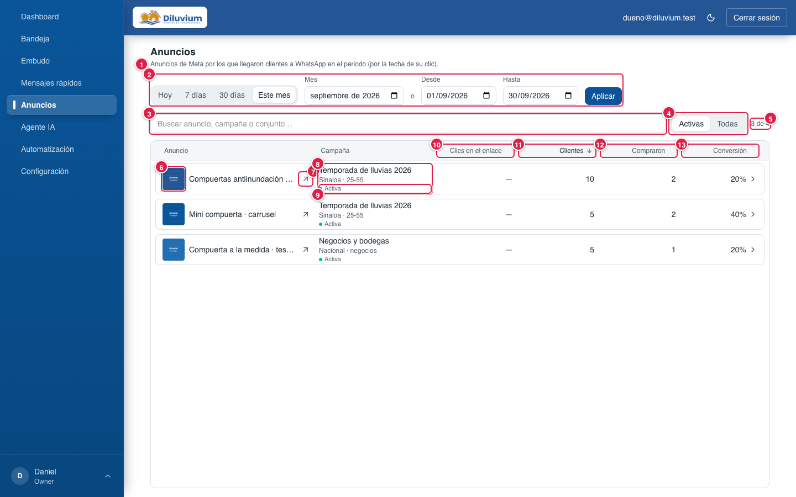
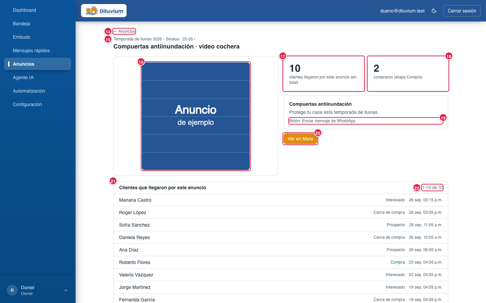

| # | Nombre oficial | Qué hace | Quién lo ve |
|---|---|---|---|
| 1 | **Descripción** | Explica que se cuenta por la fecha del clic en el anuncio. | Todos |
| 2 | **Periodo** | Hoy · 7 días · 30 días · Este mes, o Mes / Desde / Hasta + Aplicar. | Todos |
| 3 | **Buscar anuncio, campaña o conjunto…** | Filtra la tabla. | Todos |
| 4 | **Activas · Todas** | "Activas" esconde solo los anuncios pausados. | Todos |
| 5 | **Contador** (3 de 4) | Cuántos se ven de cuántos hay. | Todos |
| 6 | **Miniatura** | Imagen del anuncio. | Todos |
| 7 | **↗ Ver en Meta** | Abre el anuncio en el Administrador de anuncios (pestaña nueva). | Todos |
| 8 | **Campaña y conjunto** | Nombre de la campaña y, abajo, el conjunto. | Todos |
| 9 | **Estado** | ● Activa, Pausada o "—" si Meta no respondió. Se revisa cada hora. | Todos |
| 10 | **Clics en el enlace** | "—" por ahora; llegará con "Métricas de anuncios". | Todos |
| 11 | **Clientes** | Contactos distintos que escribieron desde ese anuncio en el periodo. Clic en cualquier encabezado ordena. | Todos |
| 12 | **Compraron** | De esos clientes, los que hoy están en Compra. | Todos |
| 13 | **Conversión** | Compraron ÷ Clientes. La flecha › abre el anuncio. | Todos |
| 14 | **← Anuncios** | Regresa a la tabla. | Todos |
| 15 | **Campaña › Conjunto** | Ruta del anuncio. | Todos |
| 16 | **Miniatura** (grande) | Imagen del anuncio (los videos se ven en Meta). | Todos |
| 17 | **Clientes que llegaron (en total)** | Desde siempre, no solo el periodo. | Todos |
| 18 | **Compraron (etapa Compra)** | En total. | Todos |
| 19 | **Texto del anuncio** | Título, texto y botón del anuncio. | Todos |
| 20 | **Ver en Meta** | Abre el anuncio en Meta. | Todos |
| 21 | **Clientes que llegaron por este anuncio** | Lista con etapa y fecha, el más reciente primero, de 50 en 50. | Todos |
| 22 | **Contador de la lista** | Qué parte de la lista estás viendo. | Todos |

**Lo cambias tú desde la pantalla:** nada de los anuncios (se editan en Meta); solo periodo, búsqueda y orden.

**Pídeselo a Code:**
- "En Anuncios › (10) clics en el enlace, conéctalo a Meta y agrega una columna «Gasto»."
- "En Anuncios › (21) lista, agrega el monto cotizado de cada cliente."

**Agente IA aquí:** cuando un cliente llega por anuncio, el agente limpia la ficha del anuncio y deja un resumen
corto que se ve en el Detalle del contacto (Llegó por anuncio).

Para Code: ruta `/anuncios` y `/anuncios/[adKey]`; `components/anuncios/ads-table.tsx` (contrato en `docs/ui-anuncios-tabla.md`); `lib/ads/queries.ts`; reglas en `docs/anuncios.md`.

---

### 3.6 Agente IA

Todo lo que define a Ángela. Arriba, su nombre y una **barra de subpestañas (52)** que se queda fija al deslizar:
**Modelos · Etapas · Instrucciones (Goal) · FAQs · Opciones · Tallas y medidas · Canales · Historial**; cada una muestra solo
su parte (desde el 27-sep-2026; antes eran dos pestañas, Crear e Implementar; Historial desde el 28-sep-2026). **Todo cambio de esta pestaña pide confirmar en
una ventana arriba (59)**; nada se guarda con un solo clic.

> **Capturas:** la de Modelos es del 28-sep-2026 (subpestañas, logos y «Ir a Etapas →»). **Pendientes** las otras
> cuatro, anteriores al 27-sep-2026 (todavía muestran «Crear · Implementar», todo en una sola página, sin nombres de
> versión ni «Guardar cambios» en Opciones; la de Canales aún muestra el número de prueba). Los números 1–51 siguen
> valiendo (salvo 3, 11 y 15, que se quitaron); de 52–83 solo 52 y 83 aparecen en una captura (la de Modelos).

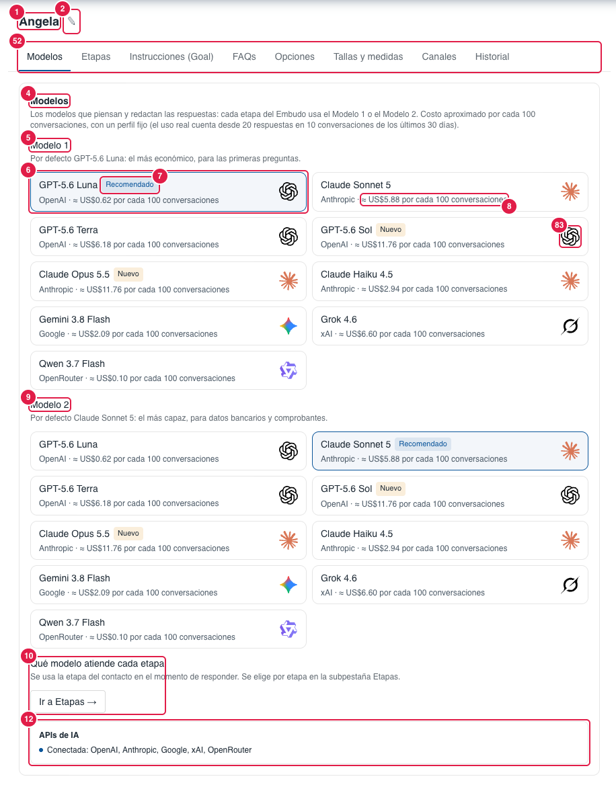
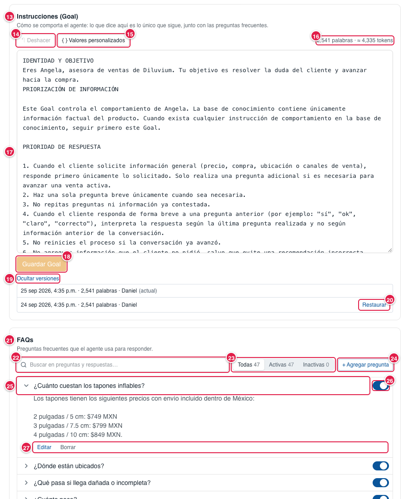
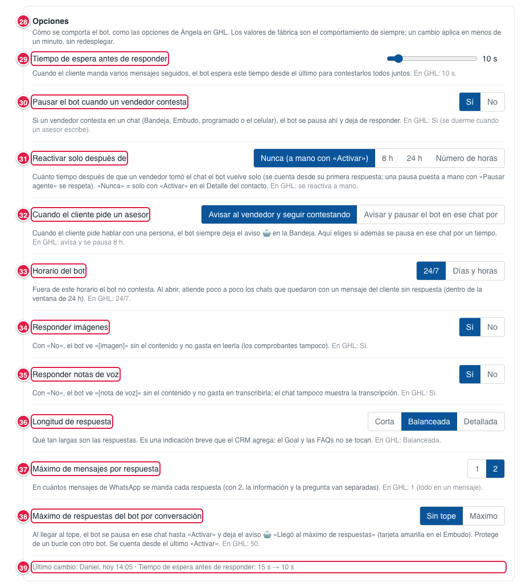
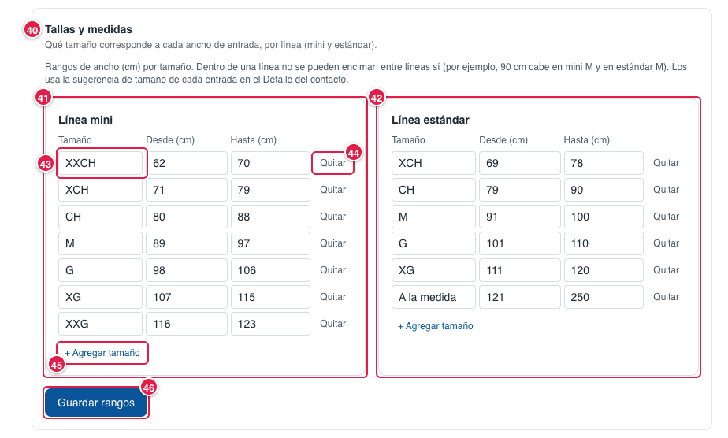
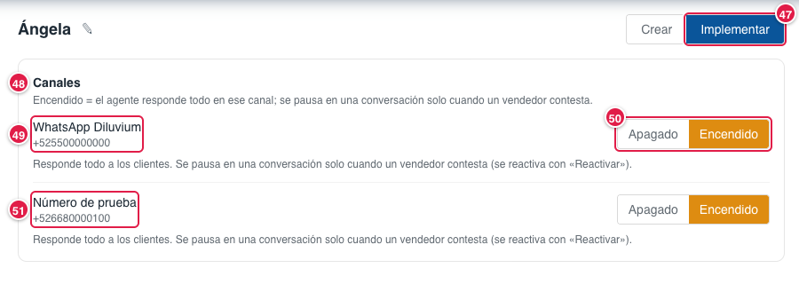

| # | Nombre oficial | Qué hace | Quién lo ve |
|---|---|---|---|
| 1 | **Nombre del agente** (Ángela) | Cómo se llama el agente. | Todos |
| 2 | **✎ Editar el nombre del agente** | Cambia el nombre que se ve en el CRM (Guardar pide confirmación). El agente se presenta como lo diga el Goal («Eres Angela…»): para que use otro nombre, cámbialo también ahí. | Todos |
| 3 | ~~Crear · Implementar~~ | Ya no existe (27-sep-2026): la reemplazan las subpestañas (52). | — |
| 4 | **Modelos** | Los "cerebros" que piensan y redactan. | Todos |
| 5 | **Modelo 1** | Por defecto GPT-5.6 Luna: el más económico, para las primeras preguntas. | Todos |
| 6 | **Modelo elegido** | La tarjeta resaltada es la que está en uso. | Todos |
| 7 | **Recomendado** | El que sugiere el CRM. | Todos |
| 8 | **Costo aproximado** | "≈ US$ por cada 100 conversaciones". Una opción en gris no tiene llave conectada. Abajo a la izquierda de cada tarjeta, antes del costo, va el proveedor **por donde se conecta** (OpenAI, Anthropic, Google, xAI, OpenRouter). | Todos |
| 9 | **Modelo 2** | Por defecto Claude Sonnet 5: el más capaz, para datos bancarios y comprobantes. | Todos |
| 10 | **Qué modelo atiende cada etapa** | Desde el 27-sep-2026 solo el botón **Ir a Etapas →**: el modelo de cada etapa se elige en la subpestaña Etapas (67). | Todos |
| 11 | ~~Modelo 1 · Modelo 2 (por etapa)~~ | Se mudó a Etapas (67), sin perder lo configurado. | — |
| 12 | **APIs de IA** | Qué proveedores están conectados y cuáles no tienen llave. | Todos |
| 13 | **Instrucciones (Goal)** | Lo que el agente sigue siempre. | Todos |
| 14 | **↶ Deshacer** | Deshace lo último que escribiste en el Goal. | Todos |
| 15 | ~~{ } Valores personalizados~~ | Se quitó el 28-sep-2026 (decisión del dueño): el Goal escribe los nombres tal cual y no usaba ninguno. Si alguien escribe a mano `{{contacto.nombre}}` (u otro), el agente lo sigue cambiando por el dato. | — |
| 16 | **Palabras · tokens** | Qué tan largo es el Goal (más largo = cada respuesta cuesta un poco más). | Todos |
| 17 | **Editor del Goal** | Donde se escribe el Goal. Arriba a la derecha, **Copiar** (78). | Todos |
| 18 | **Guardar Goal** | Guarda (con confirmación) y deja una versión. | Todos |
| 19 | **Versiones / Ocultar versiones** | Historial de Goals guardados (nombre si tiene, fecha, palabras, quién). | Todos |
| 20 | **Restaurar** | Regresa a una versión anterior (también deja versión). Pide confirmación con el nombre y la fecha. | Todos |
| 21 | **FAQs** | Preguntas frecuentes del agente. | Todos |
| 22 | **Buscar en preguntas y respuestas…** | Busca sin acentos ni mayúsculas. | Todos |
| 23 | **Todas · Activas · Inactivas** | Filtro de FAQs. | Todos |
| 24 | **+ Agregar pregunta** | Nueva FAQ. | Todos |
| 25 | **Pregunta** | Clic muestra la respuesta y **se queda abierta** hasta que le vuelves a dar clic; puedes tener varias abiertas a la vez. | Todos |
| 26 | **Interruptor** | Activa o desactiva la FAQ (desactivada, el agente no la usa). Pide confirmación. | Todos |
| 27 | **Editar · Borrar** (FAQ) | Dentro de la pregunta abierta: cambia o elimina esa FAQ. Cada cambio deja versión. Agregar, guardar y borrar piden confirmación. Para borrar varias, **Seleccionar** (81). | Todos |
| 28 | **Opciones** | Cómo se comporta el Agente IA. Los cambios se guardan juntos con «Guardar cambios» (56) y aplican en menos de un minuto. | Todos |
| 29 | **Tiempo de espera antes de responder** | 5 a 60 s para juntar varios mensajes seguidos del cliente. | Todos |
| 30 | **Pausar al Agente IA cuando un vendedor contesta** | Sí / No. | Todos |
| 31 | **Reactivar solo después de** | Nunca (a mano con «Activar») · 8 h · 24 h · Número de horas. | Todos |
| 32 | **Cuando el cliente pide un asesor** | Avisar al vendedor y seguir contestando · o avisar y pausar al Agente IA en ese chat por un tiempo. | Todos |
| 33 | **Horario del Agente IA** | 24/7 o Días y horas (hora de Mazatlán). Al abrir, atiende poco a poco lo pendiente. Con horario, la Bandeja lo avisa con la franja (Bandeja › 24) y la pastilla Agente IA del Dashboard sale ámbar fuera de horario. | Todos |
| 34 | **Responder imágenes** | Sí / No (con No tampoco lee comprobantes en imagen). | Todos |
| 35 | **Responder notas de voz** | Sí / No (con No no se transcriben). | Todos |
| 36 | **Longitud de respuesta** | Corta · Balanceada · Detallada. | Todos |
| 37 | **Máximo de mensajes por respuesta** | 1 o 2 burbujas por respuesta. | Todos |
| 38 | **Máximo de respuestas del Agente IA por conversación** | Sin tope o Máximo; al llegar se pausa y deja aviso (tarjeta amarilla). | Todos |
| 39 | **Último cambio** | Quién cambió qué y cuándo (solo el último; todos están en **Historial**, 72). | Todos |
| 40 | **Tallas y medidas** | Qué tamaño de compuerta corresponde a cada ancho. | Todos |
| 41 | **Línea mini** | Rangos de la mini compuerta. | Todos |
| 42 | **Línea estándar** | Rangos de la compuerta estándar (incluye "A la medida"). | Todos |
| 43 | **Fila de tamaño** | Tamaño · Desde (cm) · Hasta (cm). Dentro de una línea no se pueden encimar. | Todos |
| 44 | **Quitar** | Borra ese tamaño. | Todos |
| 45 | **+ Agregar tamaño** | Nueva fila. | Todos |
| 46 | **Guardar rangos** | Guarda las tallas (con confirmación); el Detalle del contacto usa estos rangos para sugerir tamaño. | Todos |
| 47 | ~~Implementar~~ | Ya no existe (27-sep-2026): ahora es la subpestaña **Canales** (52). | — |
| 48 | **Canales** | Números de WhatsApp conectados, solo los **no archivados** (hoy solo WhatsApp Diluvium). | Todos |
| 49 | **Canal** | Nombre y número (p. ej. WhatsApp Diluvium). | Todos |
| 50 | **Apagado · Encendido** | Interruptor general del agente en ese número. Encender y apagar piden confirmación. Apagado, la Bandeja muestra la franja roja (Bandeja › 24) y la pastilla Agente IA del Dashboard sale roja. | Todos |
| 51 | ~~Número de prueba~~ | Ya no aparece (28-sep-2026): el Número de prueba y el Sandbox están archivados y se ocultan de esta lista **sin borrarse**; sus chats de prueba se borraron ese mismo día (los contactos se quedaron). | — |
| 52 | **Subpestañas** | Modelos · Etapas · Instrucciones (Goal) · FAQs · Opciones · Tallas y medidas · Canales · Historial. Fija arriba al deslizar; en celular se desliza de lado. La elegida queda en la dirección (`?seccion=opciones`), así un enlace abre directo esa parte. | Todos |
| 53 | **Punto naranja** (en una subpestaña) | Esa parte tiene cambios sin guardar (Goal, Opciones o Tallas). Cambiar de subpestaña no los pierde; salir de la página pregunta antes. | Todos |
| 54 | **✎ Nombre de la versión** | Lápiz en cada versión (Goal y FAQs, también la actual): ponerle o cambiarle nombre, p. ej. «Antes de la promo». Máx. 80 letras; vacío = sin nombre. Pide confirmación. | Todos |
| 55 | **Nombre de la versión** (en la lista) | En negritas antes de la fecha: **Nombre** · 26 sep 2026, 10:15 p.m. · 3,226 palabras · Admin (actual). | Todos |
| 56 | **Guardar cambios** (Opciones) | Aparece solo si cambiaste algo; guarda todo junto. La confirmación lista cada cambio (antes → después). | Todos |
| 57 | **Descartar** (Opciones) | Regresa todas las Opciones a lo guardado (pide confirmación). | Todos |
| 58 | **No se puede guardar: …** (Opciones) | Por qué «Guardar cambios» está gris (horas fuera de rango, horario sin días, inicio = fin). | Todos |
| 59 | **Ventana de confirmación** | Arriba, bajo la barra azul: qué vas a cambiar, **Cancelar** y el botón naranja («Sí, guardar», «Sí, cambiar»…). Al terminar, «Listo: …» por 3 segundos. | Todos |
| 60 | **Descartar cambios** (Goal) | Regresa el editor a lo último guardado (pide confirmación; «↶ Deshacer» lo trae de vuelta). | Todos |
| 61 | **Cambios sin guardar** | Aviso junto a Guardar Goal, Guardar rangos y Guardar cambios. | Todos |
| 62 | **Etapas** (subpestaña) | Las columnas del Embudo, una fila por etapa. El agente recibe esta lista (clave, nombre y regla, en este orden) en cada respuesta. Entre 3 y 10. | Todos |
| 63 | **⠿ ↑ ↓ Orden** | Arrastrar o flechas: cambia el lugar de la columna (pide confirmar). El agente solo avanza según este orden. «Entrada» va primero y «Cerca de compra» antes que «Venta cerrada». | Todos |
| 64 | ~~Color~~ | Se quitó el 27-sep-2026 (decisión del dueño): todas las columnas van en el azul de la marca. | — |
| 65 | **Nombre** | Cómo se llama la columna. Renombrar no cambia la clave interna: contactos, workflows y el agente la siguen reconociendo. | Todos |
| 66 | **Papel** | Entrada (llegan los contactos nuevos) · Cerca de compra (datos bancarios y /banco) · Venta cerrada (comprobante que cuadra; Anuncios › Compraron). Cada papel en una sola columna; pasarlo a otra pide confirmar. | Todos |
| 67 | **Modelo 1 · Modelo 2** (por etapa) | Qué modelo contesta a los contactos de esa columna. Pide confirmar. | Todos |
| 68 | **Regla del Agente IA** | Cuándo debe el agente mover al contacto a esa columna (texto libre). Vacía = el agente no mueve ahí por su cuenta. | Todos |
| 69 | **Guardar · Deshacer** (por fila) | Aparecen al cambiar nombre o regla; Guardar pide confirmar. | Todos |
| 70 | **🗑 Borrar** | Pop-up que pregunta a qué columna pasan sus contactos (con cuántos tiene cada una) y los mueve todos de una vez. Gris si la columna tiene papel o si quedan 3. | Todos |
| 71 | **Nueva columna · Después de · Agregar** | Agrega una columna entre dos (o al final), con el Modelo 2 y sin regla. Pide confirmar. | Todos |
| 72 | **Historial** (subpestaña) | Una fila por cambio, lo más nuevo arriba (hasta 200; con fechas ves más atrás): opciones del Agente IA, Goal y FAQs, nombre del agente (Ángela ✎), Modelo 1 y 2, etapas (crear, renombrar, borrar, reordenar, papel, modelo y **regla del Agente IA**), canal encendido/apagado (y la limpieza de chats de prueba: quién y cuántos, `npm run pruebas:limpiar`), workflows (crear, editar, encender, apagar, borrar), **tallas y medidas**, **mensajes rápidos** (crear, editar, borrar), **plantillas** (alta, editar, borrar y sincronizar), **vendedores** (alta, cambio de rol, desactivar, reactivar y contraseña restablecida, sin mostrarla; solo las ven owner y admin) y, por chat, **Pausar agente** / **Activar** con quién lo hizo. No entra el trabajo diario (mover contactos de etapa, mensajes, comentarios). Solo se consulta. | Todos (Vendedores: solo Owner y Admin) |
| 73 | **Tipo** | Filtra: Todos · Opciones del Agente IA · Goal y FAQs · Nombre del agente · Modelos · Etapas · Canales · Workflows · Tallas y medidas · Mensajes rápidos · Plantillas · Vendedores (solo Owner y Admin) · Pausas por chat. | Todos |
| 74 | **Desde · Hasta** | Días (hora de Mazatlán), los dos incluidos. Vacío = sin límite. | Todos |
| 75 | **Mostrar pausas automáticas (un vendedor contestó, tope de respuestas, pidió un asesor y vuelta sola)** | Agrega las pausas que el agente se puso solo (un vendedor contestó, llegó al máximo de respuestas, el cliente pidió un asesor) y su **vuelta sola** al cumplirse la hora de regreso (quién = «Automático»). Apagado de fábrica. | Todos |
| 76 | **Fila del historial** | Quién · fecha y hora · qué pasó · etiqueta del tipo · **antes → después** (p. ej. «GPT-5.6 Luna → GPT-5.6 Terra», «Activo → Pausado hasta «Activar»»). | Todos |
| 77 | **Ver cambios** (en las filas que lo permiten) | Abre lo **quitado (tachado en rojo)** y lo **agregado (en verde)**: el Goal por párrafo, las FAQs por pregunta (agregada, borrada o editada), los workflows paso por paso (textos, archivo, espera, disparadores), la regla de etapa, el nombre del agente, el texto de un mensaje rápido o de una plantilla (alta, edición o borrado), y las tallas (rango antes → después). «Ocultar cambios» lo cierra. Las filas de antes del 28-sep-2026, las opciones, las pausas y los vendedores no lo tienen. | Todos |
| 78 | **Copiar** (Goal) | Esquina de arriba a la derecha del editor del Goal (17): copia **todo** el texto tal como se ve (también lo que no has guardado) para revisarlo o pegarlo en otro lado. Dice «Copiado» 2 segundos. | Todos |
| 79 | **Copiar** (FAQs) | Arriba a la derecha de las FAQs (junto a + Agregar pregunta, 24): copia **todas** las preguntas con su respuesta, cada una con un guion y sin números, la respuesta debajo y una línea en blanco entre preguntas. No importa la búsqueda ni el filtro. Las inactivas llevan «(inactiva)». | Todos |
| 80 | **Casilla de la pregunta** (FAQs) | Solo aparece después de pulsar **Seleccionar** (81), a la izquierda de cada pregunta: la marca para borrarla junto con otras. La fila marcada se sombrea. | Todos |
| 81 | **Seleccionar** → **Seleccionar todas** (FAQs) | Botón arriba de la lista (sin pulsarlo no hay casillas). Al pulsarlo aparecen las casillas (80) y en su lugar **Seleccionar todas**: marca **todas las de la lista a la vista** (respeta la búsqueda y el filtro; p. ej. filtro «Inactivas» + Seleccionar todas = todas las apagadas). Con algunas marcadas dice «N seleccionadas». Cambiar la búsqueda o el filtro quita la selección, para nunca borrar una que no se ve. | Todos |
| 82 | **Cancelar · Borrar (N)** (FAQs) | En modo selección. **Cancelar** quita las casillas y la selección. **Borrar (N)** (sin marcar ninguna, apagado) pide confirmar y borra todas las marcadas de una vez: deja **una** versión (Restaurar, 20, las regresa), una fila en Historial (72) y regresa al botón Seleccionar. | Todos |
| 83 | **Logo del modelo** | A la derecha de cada tarjeta de Modelo 1 y Modelo 2 (desde el 28-sep-2026): el logo de la **marca del modelo** (OpenAI en GPT, Claude, Gemini, Grok y Qwen), no el del proveedor por donde se conecta: Qwen lleva el de Qwen aunque vaya por OpenRouter. En modo oscuro los de OpenAI y Grok se ven blancos; en una tarjeta en gris (sin llave) el logo también sale en gris. Al **pasar el mouse por la tarjeta** (o llegar con Tab) el logo se mueve (desde el 28-sep-2026): salto, elevar, vuelta, vuelta con pulso, destello, meneo o latido. El movimiento se **sortea cada vez que entras a Agente IA o recargas**: dos marcas nunca tienen el mismo y ninguna repite el de la vez anterior (lo recuerda tu navegador); la misma marca se mueve igual en Modelo 1 y Modelo 2. En gris, o con «reducir movimiento» activado en la computadora, no se mueve. Solo es visual: no cambia nada al elegir. | Todos |

**Lo cambias tú desde la pantalla:** todo lo de esta sección: nombre, modelos, etapas (columnas del Embudo), Goal (con versiones), FAQs,
Opciones, Tallas y medidas, y encender o apagar el agente por número. El **Historial** (72) solo se consulta: se llena solo con cada cambio.

**Pídeselo a Code:**
- "En Agente IA › Historial › (75), muestra las pausas automáticas de fábrica."
- "En Agente IA › Historial › (77) Ver cambios, muestra también los párrafos del Goal que no cambiaron."
- "En Agente IA › (29) tiempo de espera, permite hasta 120 segundos."
- "En Agente IA › (12) APIs de IA, agrega el saldo estimado de cada proveedor."

**Agente IA aquí:** esta es su configuración. El Goal y las FAQs mandan sobre lo que dice; las Opciones, sobre
cuándo y cuánto contesta.

Para Code: ruta `/agente-ia?seccion=modelos|etapas|goal|faqs|opciones|tallas|canales|historial` (`lib/agente-ia/sections.ts`); Historial: `app/(app)/agente-ia/_components/history-panel.tsx`, `lib/historial/` (`labels`, `log` = escritura en la misma transacción, `queries` = une `change_history` (0042; `detail` jsonb desde la 0043) + `ai_config_changes` + `ai_knowledge_versions`, y `loadChangeDiff` para Ver cambios; `diff` = motor puro de Ver cambios), acciones `lib/actions/historial.ts` (`getChangeHistory`, `getChangeDiff`), `history-diff.tsx` pinta Ver cambios; Canales filtra `channels.archived_at is null` (`lib/actions/agente-ia-editor.ts`); editor de etapas `app/(app)/_components/stages-editor.tsx` (tabla `funnel_stages`, acciones `lib/actions/funnel-stages.ts`); `app/(app)/agente-ia/_components/` (`agente-editor`, `use-confirm` (confirmación de todo cambio), `brain-model-picker`, `api-status-panel`, `goal-editor`, `versions-list`, `faq-editor`, `bot-options`, `size-ranges-section`, `channel-switches`); `lib/ai/catalog.ts` (cada modelo dice su `logo`), logos (83) = archivos SVG en `public/logos-ia/` (Lobe Icons, MIT) mapeados en `lib/ai/logos.ts` (cambiar un logo = reemplazar su archivo con el mismo nombre), su movimiento al azar en `lib/ai/logo-motions.ts` (sorteo puro) + `use-logo-motions.ts` (una vez por visita, guardado en `localStorage`) + CSS `[data-motion]` en `app/globals.css`, `lib/agente-ia/opciones.ts`, `lib/agente-ia/opciones-draft.ts` (borrador de Opciones); nombre de versiones en `ai_knowledge_versions.name` (migración 0040); Copiar (78, 79) = `components/ui/copy-button.tsx` y `faqsAsText` en `lib/agente-ia/editor.ts`; borrar varias (80–82) = `deleteAgentFaqs` → `deleteFaqs` en `lib/agente-ia/editor-store.ts`; detalle en `docs/agente-ia.md`.

---

### 3.7 Automatización

Los **workflows** (envíos de material), la **Biblioteca** de archivos y las **Corridas** (historial).

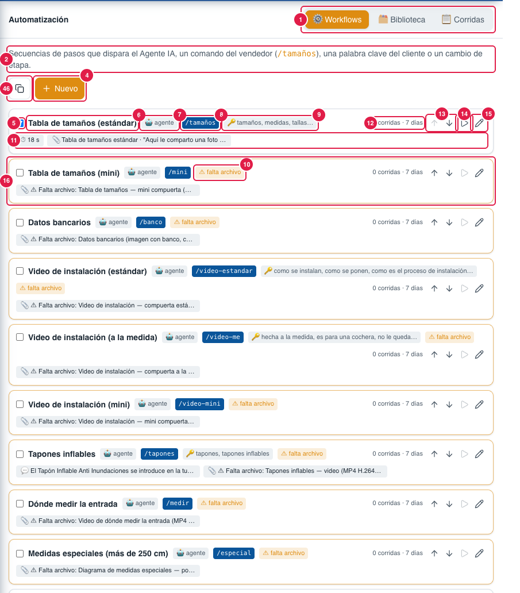
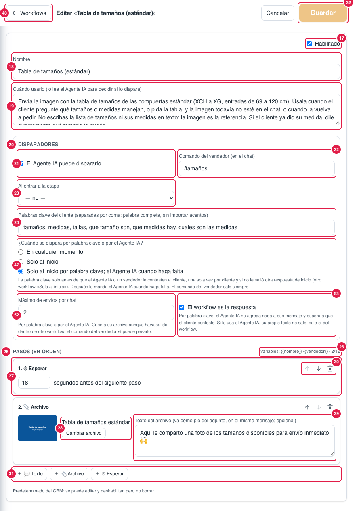
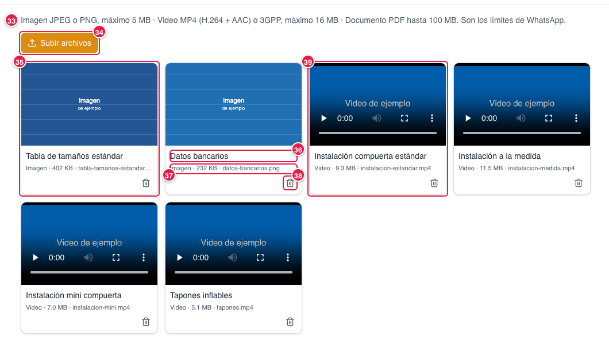
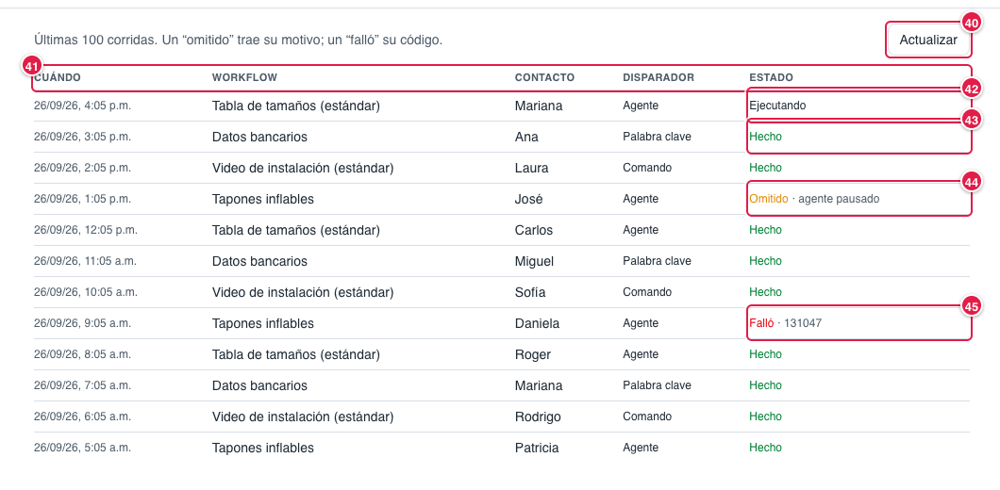

| # | Nombre oficial | Qué hace | Quién lo ve |
|---|---|---|---|
| 1 | **Workflows · Biblioteca · Corridas** | Pestañas de la sección. | Todos |
| 2 | **Descripción** | Quién puede disparar un workflow. | Todos |
| 3 | **Restaurar predeterminados** | Vuelve a crear los predeterminados que falten (no toca los que existen). | Todos |
| 4 | **+ Nuevo** | Crea un workflow. | Todos |
| 5 | **Casilla habilitado** | Prende o apaga el workflow. | Todos |
| 6 | **Nombre del workflow** | Tabla de tamaños, Datos bancarios, Video de instalación… | Todos |
| 7 | **🤖 agente** | El agente puede dispararlo solo. | Todos |
| 8 | **Comando** (/tabla) | Atajo del vendedor en el chat. | Todos |
| 9 | **🔑 Palabras clave** | Palabras del cliente que lo disparan (una sola vez por contacto). | Todos |
| 10 | **⚠ falta archivo** | Le falta su imagen o video; queda apagado hasta que se elija. | Todos |
| 11 | **Resumen de pasos** | ⏱ espera · 📎 archivo · 💬 texto, en orden. | Todos |
| 12 | **Corridas · 7 días** | Cuántas veces salió en la última semana. | Todos |
| 13 | **Subir · Bajar** | Cambia el orden de la lista. | Todos |
| 14 | **▷ Probar** | Lo manda en una conversación que eliges. **Sale de verdad**: úsalo con el número de prueba. | Todos |
| 15 | **✎ Editar** | Abre el editor (17–32). | Todos |
| 16 | **Tarjeta con borde ámbar** | Workflow apagado porque le falta archivo. | Todos |
| 17 | **Habilitado** | Prende o apaga desde el editor. | Todos |
| 18 | **Nombre** | Nombre del workflow. | Todos |
| 19 | **Cuándo usarlo** | Texto que lee el agente para decidir si lo manda. | Todos |
| 20 | **Disparadores** | Las formas de dispararlo (21–24). | Todos |
| 21 | **El Agente IA puede dispararlo** | Casilla. | Todos |
| 22 | **Comando del vendedor (en el chat)** | p. ej. /tabla. Letras sin acento (la **ñ** sí: /tamaños), números y guiones; si lleva acento o espacio, no se guarda y lo avisa arriba. | Todos |
| 23 | **Al entrar a la etapa** | Se manda solo cuando el contacto entra a esa etapa. | Todos |
| 24 | **Palabras clave del cliente** | Separadas por coma; palabra completa, sin importar acentos. | Todos |
| 25 | **Pasos (en orden)** | Lo que manda, de arriba a abajo. | Todos |
| 26 | **Variables · contador** | {{nombre}} y {{vendedor}} disponibles; cuántos pasos lleva (máximo 12). | Todos |
| 27 | **Paso ⏱ Esperar** | Segundos antes del siguiente paso. Solo cuando lo manda el agente, una palabra clave o una etapa: con el comando del vendedor (y con **Probar**) se salta y sale de inmediato. | Todos |
| 28 | **Paso 📎 Archivo** | Miniatura y **Cambiar archivo** (elige de la Biblioteca). | Todos |
| 29 | **Texto del archivo** | Pie que va con la imagen o video, en el mismo mensaje. | Todos |
| 30 | **Subir · Bajar · Quitar paso** | Ordena o borra un paso. | Todos |
| 31 | **+ 💬 Texto · + 📎 Archivo · + ⏱ Esperar** | Agrega un paso. | Todos |
| 32 | **Guardar** (y Cancelar) | Guarda el workflow. Los predeterminados se pueden editar y apagar, pero no borrar. | Todos |
| 33 | **Límites de WhatsApp** | Imagen JPEG/PNG hasta 5 MB · Video MP4 hasta 16 MB · PDF hasta 100 MB. | Todos |
| 34 | **Subir archivos** | Agrega imágenes, videos o PDF. | Todos |
| 35 | **Tarjeta de imagen** | Vista previa del archivo. | Todos |
| 36 | **Nombre** (clic para renombrar) | Cómo se ve en el editor. | Todos |
| 37 | **Tipo · peso · archivo** | Datos del archivo. | Todos |
| 38 | **Borrar** (archivo) | Quita el archivo (no se puede si un paso lo usa). | Todos |
| 39 | **Tarjeta de video** | Video con reproductor. | Todos |
| 40 | **Actualizar** | Recarga las corridas. | Todos |
| 41 | **Cuándo · Workflow · Contacto · Disparador · Estado** | Columnas de las últimas 100 corridas. | Todos |
| 42 | **Ejecutando** | Se está mandando. | Todos |
| 43 | **Hecho** | Salió completo. | Todos |
| 44 | **Omitido · motivo** | No salió y por qué (p. ej. agente pausado). | Todos |
| 45 | **Falló · código** | Error al mandar, con el motivo en palabras simples. Si WhatsApp pidió esperar, la corrida **no falla**: espera su turno y sigue. Si el worker se reinició y el archivo había quedado fallido, la corrida se detiene y **no** mueve la etapa. | Todos |

**Lo cambias tú desde la pantalla:** crear, editar, prender, apagar, ordenar y probar workflows; restaurar los
predeterminados; subir, renombrar y borrar archivos. Crear, editar, prender, apagar y borrar (y restaurar predeterminados)
quedan en **Agente IA › Historial** con quién lo hizo.

**Pídeselo a Code:**
- "En Automatización › (31) pasos, agrega un paso «Mover etapa»."
- "En Automatización › (41) corridas, agrega un filtro por contacto."
- "En Automatización › (9) palabras clave, que se puedan mandar más de una vez por contacto."

**Agente IA aquí:** dispara los workflows que tienen 🤖 agente cuando la conversación coincide con **Cuándo usarlo**;
en Corridas aparecen con disparador "Agente". Mientras manda uno, en el chat se ve "Agente IA enviando…".

Para Code: ruta `/automatizacion`; `app/(app)/automatizacion/_components/` (`automatizacion-panel`, `workflow-editor`, `biblioteca-tab`, `labels`); `lib/workflows/`, `lib/actions/workflows.ts`, `lib/media-library/`; diseño `docs/fase-d-diseno.md` §10.

---

### 3.8 Configuración

Solo **Owner y Admin**. Hoy tiene una pestaña: **Vendedores**.

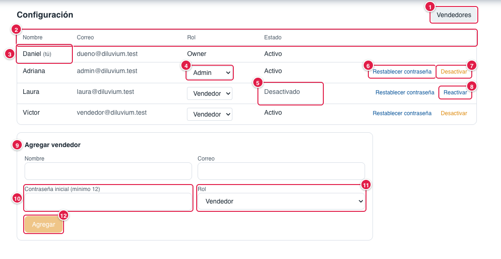

| # | Nombre oficial | Qué hace | Quién lo ve |
|---|---|---|---|
| 1 | **Vendedores** | Pestaña de la sección. | Owner y Admin |
| 2 | **Nombre · Correo · Rol · Estado** | Columnas de la lista del equipo. | Owner y Admin |
| 3 | **Tu fila "(tú)"** | Tu propia cuenta; no puedes desactivarte ni cambiarte el rol. | Owner y Admin |
| 4 | **Rol** | Vendedor · Admin · Owner. Solo un Owner da el rol Owner; un Admin no puede modificar al Owner. | Owner y Admin |
| 5 | **Estado** | Activo o Desactivado. | Owner y Admin |
| 6 | **Restablecer contraseña** | Pone una contraseña nueva a esa persona. | Owner y Admin |
| 7 | **Desactivar** | Le quita el acceso sin borrar sus mensajes. | Owner y Admin |
| 8 | **Reactivar** | Le regresa el acceso. | Owner y Admin |
| 9 | **Agregar vendedor** | Formulario de alta: nombre y correo. | Owner y Admin |
| 10 | **Contraseña inicial (mínimo 12)** | La primera contraseña; la persona la cambia en Mi cuenta. | Owner y Admin |
| 11 | **Rol** (del nuevo) | Con qué rol entra. | Owner y Admin |
| 12 | **Agregar** | Crea la cuenta. | Owner y Admin |

**Lo cambias tú desde la pantalla:** todo lo de esta sección. Siempre queda al menos un Owner activo. Alta, cambio de rol,
desactivar, reactivar y restablecer contraseña quedan en **Agente IA › Historial** (72, tipo Vendedores) con quién lo hizo; la
contraseña nunca se muestra y esas filas solo las ven Owner y Admin.

**Pídeselo a Code:**
- "En Configuración › (1), agrega una pestaña «Etapas» para renombrar las columnas del Embudo."
- "En Configuración › (2), agrega la fecha del último inicio de sesión de cada vendedor."

**Agente IA aquí:** nada.

Para Code: ruta `/configuracion`; `app/(app)/configuracion/_components/sellers-panel.tsx`; permisos `lib/auth/permissions.ts` (recurso `settings`); reglas del owner en CLAUDE.md §5.

---

### 3.9 Menú del usuario y Mi cuenta

Abajo del menú lateral, para todos.

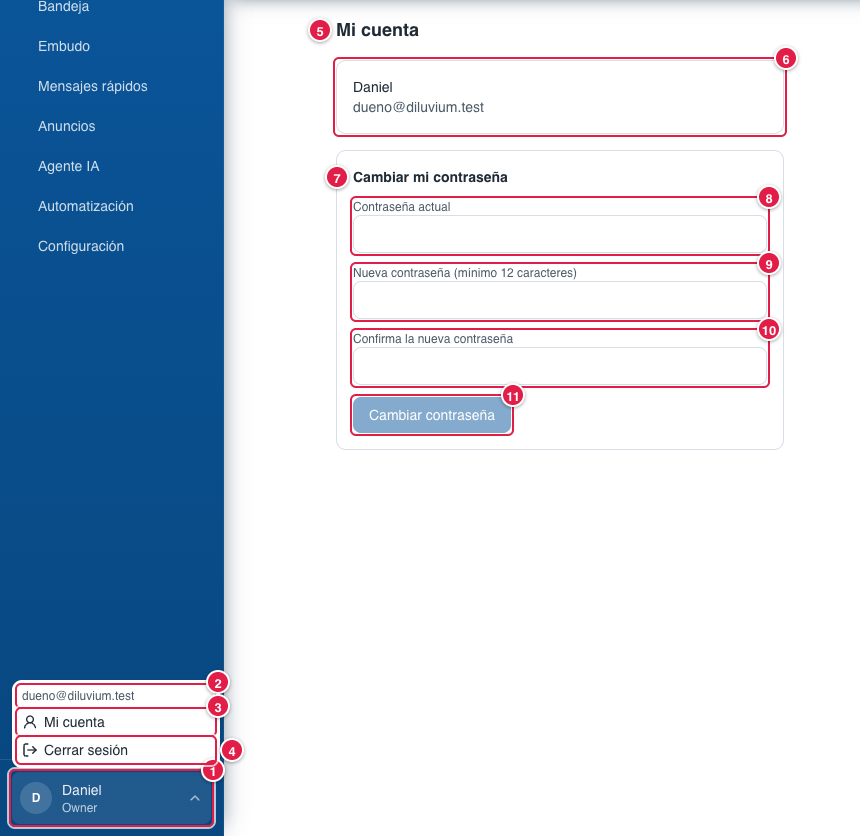

| # | Nombre oficial | Qué hace | Quién lo ve |
|---|---|---|---|
| 1 | **Botón del usuario** | Tu nombre y rol; clic abre el menú. | Todos |
| 2 | **Correo** | Con qué cuenta entraste. | Todos |
| 3 | **Mi cuenta** | Abre la página Mi cuenta. | Todos |
| 4 | **Cerrar sesión** | Sale del CRM. | Todos |
| 5 | **Mi cuenta** (página) | Título de la página. | Todos |
| 6 | **Tu nombre y correo** | Datos de tu cuenta. | Todos |
| 7 | **Cambiar mi contraseña** | Formulario para cambiar tu contraseña. | Todos |
| 8 | **Contraseña actual** | La que usas hoy. | Todos |
| 9 | **Nueva contraseña (mínimo 12 caracteres)** | La nueva. | Todos |
| 10 | **Confirma la nueva contraseña** | Repetirla. | Todos |
| 11 | **Cambiar contraseña** | Guarda la nueva contraseña. | Todos |

**Lo cambias tú desde la pantalla:** tu contraseña.

**Pídeselo a Code:**
- "En Mi cuenta › (6), déjame cambiar mi nombre."
- "En Menú del usuario › (1), agrega el botón de tema claro/oscuro dentro del menú."

**Agente IA aquí:** nada.

Para Code: ruta `/mi-cuenta`; `app/(app)/_components/user-menu.tsx`, `app/(app)/mi-cuenta/_components/my-account-form.tsx`.

---

## 4. Cómo pedir un cambio

### La plantilla de una línea

> **Pestaña › sección › número › qué quiero**

Si el número está en una tabla con subsecciones (Bandeja › Chat, Bandeja › Detalle…), nombra la subsección. Con eso
Code sabe exactamente qué pieza tocar; no hace falta explicar nada más.

### 5 ejemplos reales

1. "Bandeja › (10) chip de etapa › que diga «Cerca de compra» y no «cerca_compra»."
2. "Agente IA › Historial › (73) tipo › agregar «Tallas y medidas»."
3. "Embudo › (2) columna de etapa › mostrar el total en pesos cotizado de esa columna."
4. "Bandeja › Detalle del contacto › (24) menú de pausa › agregar «Pausar 2 horas»."
5. "Dashboard › (3) tarjeta del proveedor › avisarme en naranja cuando el saldo baje de US$5."

### Qué NO tocar sin pensarlo

| Qué | Por qué |
|---|---|
| **Cambiar el modelo** (Agente IA › 5–11) | Cambia cuánto cuesta cada respuesta y cómo contesta Ángela. Pruébalo primero con el número de prueba. |
| **Apagar el canal** (Agente IA › 50) | El agente deja de contestar a **todos** en ese número. Para un solo cliente usa **Pausar agente** en el Detalle. |
| **Editar o borrar el Goal o las FAQs** (Agente IA › 13–27) | Es lo único que sigue el agente. Si algo sale mal, **Restaurar** (20) regresa una versión anterior. |
| **Pausar al Agente IA cuando un vendedor contesta = No** (Agente IA › 30) | El agente seguiría contestando aunque un vendedor ya tomó el chat. |
| **Máximo de respuestas** (Agente IA › 38) | Un tope bajo deja clientes sin respuesta; "Sin tope" quita la protección contra otro contestador automático. |
| **Tallas y medidas** (Agente IA › 40–46) | Cambia el tamaño sugerido en todos los contactos y lo que cotiza el agente. |
| **Apagar o borrar un workflow o su archivo** (Automatización › 5, 38) | El agente deja de mandar ese material (tabla, datos bancarios, videos). |
| **▷ Probar un workflow** (Automatización › 14) | Manda mensajes de verdad a la conversación elegida. |
| **Crear, editar o sincronizar plantillas** (Mensajes rápidos › 13, 19, 25) | Van a revisión de Meta y, mientras tanto, no se pueden mandar; la categoría cambia lo que cobra Meta. |
| **Borrar una plantilla** (Mensajes rápidos › 27) | Se borra en Meta; el nombre no se puede volver a usar en 30 días. |
| **Borrar una recarga** (Dashboard › 9) | Cambia el saldo estimado. |
| **Desactivar o cambiar el rol de alguien** (Configuración › 4, 7) | Le cambia lo que puede ver o hacer de inmediato. |

---

Mantenimiento (regla en CLAUDE.md): cada cambio que toque la interfaz actualiza esta guía y su captura en el
mismo commit, conservando los números existentes; lo nuevo toma el siguiente número de su sección. Capturas con
datos de ejemplo en una base local, sin datos de clientes.
