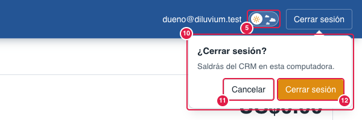
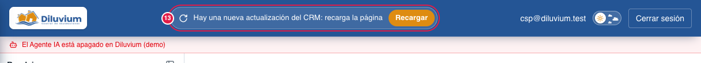

> Parte del [Mapa del CRM](../mapa-crm.md) (índice con todas las secciones). Las capturas están en esta misma carpeta.

## 2. Menú y barra de arriba

Lo que se ve en todas las pantallas.

| # | Nombre oficial | Qué hace | Quién lo ve |
|---|---|---|---|
| 1 | **Menú lateral** | Lista de pestañas: Dashboard, Bandeja, Embudo, Mensajes rápidos, Anuncios, Agente IA, Automatización, **Seguimientos** (desde el 8-oct-2026), Configuración. | Todos (Configuración solo Owner y Admin) |
| 2 | **Pestaña activa** | La pestaña en la que estás, resaltada con una barra blanca. | Todos |
| 3 | **Logo Diluvium** | Solo identifica la marca; no es botón. | Todos |
| 4 | **Correo de la sesión** | Con qué cuenta entraste. | Todos |
| 5 | **Tema claro / oscuro** (píldora) | Interruptor en forma de píldora (1-oct-2026): la bolita muestra el **sol** en tema claro, con nubes que flotan despacio, o la **luna** en tema oscuro, con estrellas que titilan; lo del otro tema no se ve. Al tocarlo, la bolita se desliza y el tema nuevo se extiende **en círculo desde el botón** por toda la pantalla. Se recuerda en esa computadora. Con «Reducir movimiento» en la computadora cambia sin animaciones. | Todos |
| 6 | **Cerrar sesión** | Ya no sale directo: abre el globo de confirmación (10). | Todos |
| 7 | **Menú del usuario** (nombre y rol) | Abre **Mi cuenta** y **Cerrar sesión** (ver [Menú del usuario y Mi cuenta](3.9-menu-del-usuario.md#39-menú-del-usuario-y-mi-cuenta)). | Todos |
| 8 | **Menú del vendedor** | Igual al de arriba pero **sin Configuración**. | Vendedor |
| 9 | **Rol "Vendedor"** | Debajo del nombre se ve el rol de quien entró (Owner, Admin o Vendedor). | Todos |
| 10 | **Globo «¿Cerrar sesión?»** | Sale pegado al botón que tocaste —el de la barra (6), el del menú del usuario (7) o el del cajón ☰ en el celular— con «Saldrás del CRM en este dispositivo». Esc o un clic fuera lo cierran sin salir. Desde el 1-oct-2026. | Todos |
| 11 | **Cancelar** | Cierra el globo y te deja donde estabas. Ya viene seleccionado: un Enter no te saca por error. | Todos |
| 12 | **Cerrar sesión** (naranja) | Ahora sí sale del CRM (dice «Saliendo…» mientras). | Todos |
| 13 | **Aviso de actualización** | Píldora en la barra azul: **«Hay una nueva actualización del CRM: recarga la página»** con el botón naranja **Recargar**. Sale **solo** cuando falló algo que hizo el vendedor (enviar, guardar, adjuntar, abrir un PDF…) porque su pestaña es de antes de una actualización del CRM. **Nunca** sale solo por haber versión nueva, ni por un refresco automático que falló (mensajes nuevos, programados). Donde falló, el mensaje propio también lo dice en la burbuja al enviar, la foto HEIC, el PDF del visor y Mensajes rápidos; las demás pantallas conservan su mensaje. Se quita al recargar. En celular baja como franja azul debajo de la barra (Versión móvil › 13). | Todos |
| 14 | **Cinta del clima** | Franja que corre **siempre** de derecha a izquierda en la barra azul, entre el logo y el correo, con el clima **medido** de las 24 ciudades de México donde más llueve: **icono** (lo que pasa ahora: sol o luna, medio nublado, nublado, niebla, llovizna, lluvia o tormenta), **ciudad**, **grados** y **lluvia de las últimas 24 h** en mm (si no llovió, no se pone nada: nunca «0 mm»). Donde está cayendo agua, el icono va en **naranja** y la ciudad pasa al frente. **Nada la detiene** (ni el mouse) y no se le da clic. Grados e icono: el aeropuerto de la ciudad; milímetros: el observatorio del SMN-Conagua. Se actualiza **cada hora** y solo sale de **lunes a sábado de 9:00 a 19:00** (hora de Mazatlán) y en computadora (en el celular no). Una ciudad cuyo dato no es reciente o no cuadra entre el aeropuerto y el observatorio no sale esa hora. Si aparece el aviso de actualización (13), la cinta le cede el lugar. Desde el 2-oct-2026. | Todos |

**En celular** (pantalla de menos de 768 px) el menú lateral se esconde y la barra lleva un botón ☰ que abre el
mismo menú en un cajón; ver [Versión móvil](3.10-version-movil.md#310-versión-móvil-celular).

**Lo cambias tú desde la pantalla:** el tema claro u oscuro.

**«Cielo»:** la píldora del tema (5) tiene efectos del cielo; el detalle vive en la nota privada del dueño
(`reportes/cielo/`, fuera del repo). No cambian el tema ni tocan nada; con «Reducir movimiento» no salen.

**Pídeselo a Code:**
- "En Menú › (1) menú lateral, pon Anuncios antes de Mensajes rápidos."
- "En Menú › (4) correo de la sesión, muestra mi nombre en vez del correo."
- "En Menú › (14) cinta del clima, que corra más despacio."

Para Code: `app/(app)/layout.tsx` (sidebar y barra), `nav-item.tsx`, `user-menu.tsx`, `sign-out-button.tsx` y
`sign-out-confirm.tsx` (globo 10–12), `components/theme-toggle.tsx` (píldora), `theme-circle-transition.ts` (círculo),
`theme-sky-effects.ts` («Cielo»); estilos en `app/globals.css` › «Interruptor de tema»; aviso de actualización (13): `update-notice.tsx`, `lib/version/` y
`app/api/version/route.ts`; cinta del clima (14): `clima-cinta.tsx`, `lib/clima/` (worker: `sync.ts`; foto en Redis) y
`app/globals.css` › «Cinta del clima»; detalle en `docs/clima.md`.
