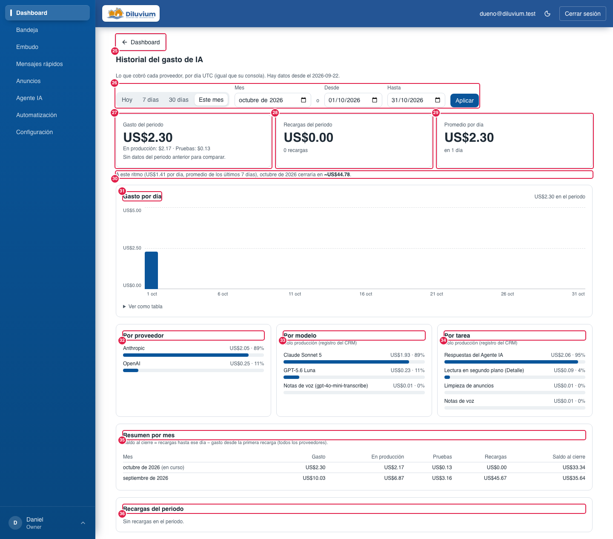
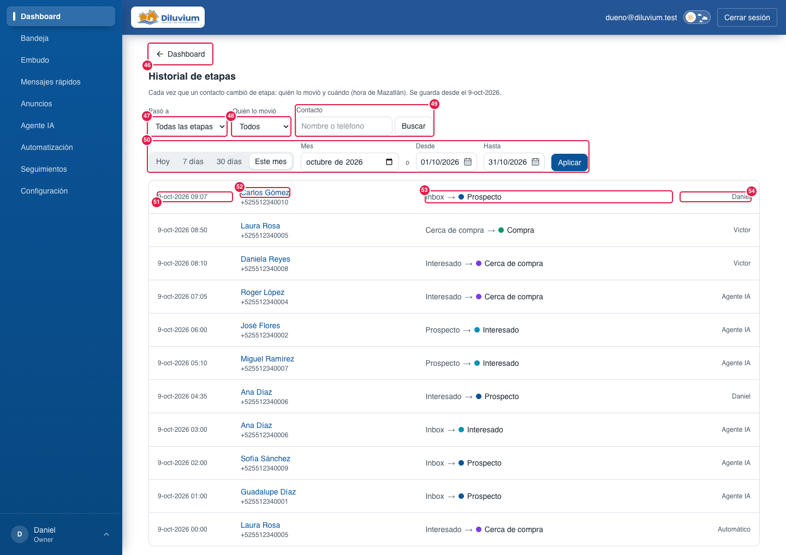

> Parte del [Mapa del CRM](../mapa-crm.md) (índice con todas las secciones). Las capturas están en esta misma carpeta.

### 3.1 Dashboard

Resumen del mes: cuánto se gasta en IA y en Railway (los servidores del CRM), cuántas conversaciones nuevas llegan, si el número de WhatsApp está conectado y si el Agente IA está contestando.

| # | Nombre oficial | Qué hace | Quién lo ve |
|---|---|---|---|
| 1 | **Gasto de IA** | Tarjeta con lo que se va gastando en IA en el mes, según lo que cobra cada proveedor (días UTC, igual que la consola de cada proveedor). Va hasta arriba porque el saldo importa más que las métricas. | Todos |
| 2 | **Total del mes** | Suma del gasto de todos los proveedores. | Todos |
| 3 | **Tarjeta del proveedor** (OpenAI, Anthropic, Google, xAI, OpenRouter) | Gasto del mes de ese proveedor y, debajo, **«En producción: $X · Pruebas: $Y»** (ver Pruebas en el Glosario). Arriba dice **«Actualizado hace N min»** (el CRM lee al proveedor cada 5 min); en naranja **«Sin actualizar desde hace…»** si la última lectura falló o tiene más de 20 min; **«Estimado con el registro del CRM»** si el proveedor no da su cobro por API (Google). Solo salen los que tienen llave conectada o gasto. | Todos |
| 4 | **Saldo** | Anthropic y OpenAI: recargas menos el gasto real desde la primera recarga. xAI y OpenRouter: el saldo que da el proveedor. Google: **«Saldo estimado»**. Con barra "% usado · quedan". | Todos |
| 5 | **"Registra una recarga para ver el saldo."** | Sale cuando a Anthropic, OpenAI o Google les falta su recarga anotada (xAI y OpenRouter no la necesitan: dan su saldo). | Todos |
| 6 | **Nota de abajo** | Aclara que el gasto y el saldo vienen de cada proveedor y se actualizan cada 5 minutos, que los «estimados» salen del registro del CRM y que no incluyen impuestos. | Todos |
| 7 | **Recargas registradas** | Lista de recargas: fecha · proveedor · monto · quién la anotó. | Todos |
| 8 | **+ Registrar recarga** | Anota una recarga que hiciste en la página del proveedor (proveedor, monto y fecha). | Todos |
| 9 | **Borrar** (recarga) | Quita una recarga mal capturada. | Todos |
| 10 | **Conversaciones nuevas** | Contactos nuevos que escribieron. No cuenta los importados de GHL, los del número de prueba ni los dados de alta a mano (Embudo › Nuevo contacto, 20). | Todos |
| 11 | **Hoy · 7 días · 30 días · Este mes** | Atajos para elegir el periodo. | Todos |
| 12 | **Mes / Desde / Hasta** | Periodo a mano (un mes o un rango de fechas). | Todos |
| 13 | **Aplicar** | Aplica las fechas elegidas. | Todos |
| 14 | **Nuevas hoy / Nuevas esta semana / Nuevas este mes** | Cifras con la comparación contra el periodo anterior al mismo momento (▲ más, ▼ menos). | Todos |
| 15 | **Conversaciones nuevas por día** | Gráfica de barras por día. | Todos |
| 16 | **Ver como tabla** | Muestra los números de la gráfica en tabla. | Todos |
| 17 | **Por canal** | Por qué canal llegaron (WhatsApp, Facebook…). | Todos |
| 18 | **Por etapa (actual)** | En qué etapa están hoy esas conversaciones. | Todos |
| 45 | **Historial** (botón en «Por etapa (actual)») | Abre **Dashboard › Historial de etapas** ([3.1.2](#312-historial-de-etapas)): cada vez que un contacto cambió de etapa, quién lo movió y cuándo. | Todos |
| 19 | **Llegaron por anuncio** | Cuántas vinieron de un anuncio de Meta y qué porcentaje del periodo. | Todos |
| 20 | **Pastilla de WhatsApp** (arriba a la derecha) | Estado del número según el monitoreo (cada 5 min): verde **"WhatsApp conectado"**, ámbar **"WhatsApp: revisar"**, rojo **"WhatsApp desconectado desde HH:MM"** (hora de Mazatlán) o gris **"Sin revisar desde HH:MM"** si la última revisión tiene más de 15 min. No consulta a Zernio al abrir la página. | Todos |
| 21 | **Estado de WhatsApp** (recuadro al hacer clic en 20) | 4 líneas: **Número** (conectado o no), **Último mensaje de un cliente** (hace X min), **Worker** (activo o no) y **Webhook de Zernio** (activo y fallos). | Todos |
| 22 | **Pastilla Agente IA** (junto a la de WhatsApp) | ¿El agente está contestando? Verde **"Agente IA contestando"**, ámbar **"Agente IA fuera de horario"**, roja **"Agente IA apagado"** (canal Apagado) o **"Agente IA callado"** (3 o más clientes de la última hora esperando más de 15 min y el agente sin mandar nada en 15 min, dentro de su horario). Sale de los datos del CRM; no consulta a Zernio. No está en la captura. | Todos |
| 23 | **Estado del Agente IA** (recuadro al hacer clic en 22) | 5 líneas: **Canal** (Encendido o Apagado), **Horario** (24/7 o días y horas, y si ahora está fuera), **Sin respuesta hace más de 15 min (de la última hora)** (cuántas conversaciones; estas sí cuentan para la alarma), **Atrasados (más de 1 h)** («N chats esperan a un vendedor»: solo dato, no alarma) y **Última respuesta del Agente IA** (hace X min). | Todos |
| 24 | **Historial** (botón junto a «Recargas registradas») | Abre **Dashboard › Historial del gasto de IA** ([3.1.1](#311-historial-del-gasto-de-ia)): el gasto y las recargas de cada mes o del periodo que elijas. | Todos |
| 40 | **Seguimientos del Agente IA** (tarjeta, abajo) | Del periodo elegido: **mensajes que salieron** (y cuántos no se entregaron), **chats**, cuántos **contestaron** (escribió después del seguimiento, hasta 72 h después del último), **avanzaron de etapa** (hoy más adelante que cuando salió el seguimiento; se mide desde el 6-oct-2026) y **compraron** (llegó a venta cerrada después). Debajo, la tabla por **caso**. En ensayo lo avisa. | Todos |
| 41 | **Railway (servidores del CRM)** (tarjeta debajo del Gasto de IA) | Lo que va costando Railway, donde viven el CRM, el worker, la base y Redis (producción y staging juntos), sin entrar a Railway: en el plan Hobby Railway ya no enseña «créditos restantes». Arriba: el **plan**, el **periodo de cobro** (del día de corte al siguiente, p. ej. «del 5-oct al 5-nov») y **«Actualizado hace X min»** (se lee cada 5 min; en naranja si tiene más de 20 min o si Railway falló). Solo aparece cuando el worker ya tiene el token de Railway. Desde el 7-oct-2026. | Todos |
| 42 | **Factura estimada** | Lo que se cobrará a la tarjeta el día de corte si el uso sigue al ritmo de estos días (nunca menos de lo que cuesta el plan, US$5 en Hobby). El primer día del periodo no se calcula: dice **«Se calcula después del primer día del periodo»**. Sin impuestos. | Todos |
| 43 | **Uso del periodo · Incluido en el plan** | **Uso del periodo**: lo que llevan gastado los servidores desde el día de corte (Railway avisa que puede venir unos minutos atrasado). **Incluido en el plan**: lo que queda de los US$5 que trae el plan Hobby, con barra «% usado» (naranja desde 80 %). Si el uso pasa de lo incluido dice **«Se pasó por US$X: se cobra a la tarjeta al corte»**: los servidores NO se apagan por eso. | Todos |
| 44 | **Aviso de pago pendiente** (recuadro naranja dentro de la tarjeta 41) | Sale solo si Railway marca la factura vencida o sin pagar: **«Railway marca un pago pendiente: revisa la tarjeta en Railway › Workspace › Billing antes de que detenga los servidores.»** Con la tarjeta rechazada Railway da pocos días de gracia antes de apagar todo. Si el plan aparece cancelado o inactivo dice **«Railway marca el plan como cancelado o inactivo…»**. No está en la captura (con el cobro al corriente no sale). Desde el 7-oct-2026. | Todos |

**Lo cambias tú desde la pantalla:** registrar y borrar recargas; el periodo de las conversaciones nuevas.

**Si la pastilla (20) sale roja:** revisa Zernio y la app de WhatsApp Business del celular; el paso a paso está en
`docs/go-live.md` › Alarma de desconexión. También llega el correo del issue `alerta-whatsapp`, a cualquier hora.

**Si la pastilla Agente IA (22) sale ámbar o roja:** revisa en Agente IA el interruptor del canal (Apagado), el **Horario
del Agente IA** en Opciones y las tarjetas "El agente no pudo responder" de la Bandeja. "Agente IA callado" también llega por correo
(issue `alerta-whatsapp`); el paso a paso está en `docs/go-live.md` › Alarma "Agente IA callado". Si dice "N chats esperan a un
vendedor", no es una falla: son clientes de hace más de 1 hora que un vendedor tiene que contestar. Una falla suelta al revisar
Zernio ya no manda correo: solo si se repite en la siguiente revisión.

**Pídeselo a Code:**
- "En Dashboard › (14) tarjetas de nuevas, agrega una que diga cuántas contestó el agente hoy."
- "En Dashboard › (3) tarjeta del proveedor, avísame en naranja cuando el saldo baje de US$5."
- "En Dashboard › (18) por etapa, agrega el total en pesos cotizado por etapa."
- "En Dashboard › (42) Factura estimada, muéstrame también lo que se pagó el mes pasado."

**Agente IA aquí:** todo lo que gasta al contestar, al transcribir notas de voz (se cobra en OpenAI) y al **leer chats
en segundo plano** para llenar el Detalle (Luna, ~US$0.0005 por lectura) se suma en **Gasto de IA**. Los chats que
atiende cuentan en **Conversaciones nuevas** como cualquier otro. La pastilla **Agente IA** (22) dice si está contestando.

Para Code: ruta `/inicio`; `app/(app)/inicio/` (`ai-spend-card`, `railway-card`, `ai-topups`, `period-cards`, `daily-chart`, `breakdown-list`, `range-filter`, `whatsapp-status`); datos en `lib/dashboard/` (Gasto de IA: `ai-spend.ts` junta el registro del CRM con la lectura real de cada proveedor, tabla `ai_provider_billing` de la migración 0054, que el worker llena cada 5 min con `lib/ai/billing/`); la pastilla (20–21) en `lib/monitoring/` (`status-pill`, `dashboard-status`) con lo que guarda el monitoreo en Redis; la pastilla Bot (22–23) en `lib/monitoring/` (`bot-status`, `bot-silence`) con datos de la base; Railway (41–44): `railway-card` con `lib/dashboard/railway.ts`, tabla `railway_billing` (migración 0063) que el worker llena cada 5 min con `lib/railway-billing/` (detalle en `docs/railway-costos.md`).

#### 3.1.1 Historial del gasto de IA

Se abre con el botón **Historial** (24). Es como **Conversaciones nuevas**, pero del gasto de IA: lo que cobró cada proveedor
por día, por mes o en el periodo que elijas, con sus desgloses y la proyección del mes. Los días son **UTC** (igual que la
consola de cada proveedor y la tarjeta Gasto de IA): lo que pasa de 5 pm a medianoche de Mazatlán cuenta en el día
siguiente. Hay datos desde el 22-sep-2026 (la primera recarga). Desde el 1-oct-2026.

| # | Nombre oficial | Qué hace | Quién lo ve |
|---|---|---|---|
| 25 | **← Dashboard** (botón) | Regresa al Dashboard. Es el mismo botón que «← Workflows» de Automatización; en el celular solo se ve la flecha. | Todos |
| 26 | **Hoy · 7 días · 30 días · Este mes · Mes · Desde / Hasta · Aplicar** | El periodo, igual que en Conversaciones nuevas (los días de los atajos son UTC). | Todos |
| 27 | **Gasto del periodo** | Lo que cobraron los proveedores en el periodo, con **«En producción: $X · Pruebas: $Y»** y la comparación (▲ más, ▼ menos) contra el periodo anterior al mismo día (el mes pasado si eliges un mes). Si el periodo anterior es de antes de que hubiera datos, dice «Sin datos del periodo anterior para comparar». | Todos |
| 28 | **Recargas del periodo** | Suma de las recargas registradas con fecha en el periodo y cuántas son. | Todos |
| 29 | **Promedio por día** | Gasto del periodo hasta hoy entre los días transcurridos. | Todos |
| 30 | **Proyección** | Solo en el mes en curso: «A este ritmo (US$X por día, promedio de los últimos 7 días), el mes cerraría en ~US$Y». Es un cálculo, no un cobro. | Todos |
| 31 | **Gasto por día** | Barras por día; **Ver como tabla** muestra gasto, en producción y pruebas de cada día. | Todos |
| 32 | **Por proveedor** | Cuánto cobró cada proveedor en el periodo (cobro real). | Todos |
| 33 | **Por modelo** | Cuánto costó cada modelo (Claude Sonnet 5, GPT-5.6 Luna, notas de voz…). **Solo producción**: sale del registro del CRM, los proveedores no dan ese detalle. | Todos |
| 34 | **Por tarea** | Respuestas del Agente IA, lectura en segundo plano (Detalle), limpieza de anuncios y notas de voz. **Solo producción** (registro del CRM). | Todos |
| 35 | **Resumen por mes** | Una fila por mes (el más reciente arriba): gasto, en producción, pruebas, recargas y **saldo al cierre** (recargas hasta ese día − gasto desde la primera recarga, de todos los proveedores). El mes actual dice «(en curso)». | Todos |
| 36 | **Recargas del periodo** (lista) | Fecha · proveedor · monto · quién. Solo se consulta: se registran y borran en el Dashboard (8, 9). | Todos |

**Lo cambias tú desde la pantalla:** solo el periodo. Las recargas se registran en el Dashboard.

**Pídeselo a Code:**
- "En Dashboard › Historial del gasto de IA › (35) resumen por mes, agrega el gasto por proveedor."
- "En Dashboard › Historial del gasto de IA › (30) proyección, usa el promedio de los últimos 14 días."

Para Code: ruta `/inicio/gasto-ia`; `app/(app)/inicio/gasto-ia/` (`page.tsx`, `spend-cards`, `monthly-summary`, `period-topups`) y los componentes compartidos del Dashboard (`range-filter` con `timeZone="UTC"`, `daily-chart` y `breakdown-list` con `format`); datos en `lib/dashboard/ai-spend-history.ts` (mismas reglas por día que `ai-spend.ts`: lectura del proveedor y piso del registro del CRM).
#### 3.1.2 Historial de etapas

Se abre con el botón **Historial** (45) de «Por etapa (actual)». Es la lista de **cada vez que un contacto cambió de
etapa**, del más reciente al más viejo: cuándo (hora de Mazatlán), quién, de qué etapa a cuál y quién lo movió. Cuenta
todos los caminos: el vendedor (arrastrando en el Embudo o en la Etapa del Detalle, también hacia atrás), el **Agente IA**
(al contestar o al leer el chat en segundo plano), **/banco** y el borrado de una etapa en Agente IA › Etapas (sus
contactos pasan a otra). **Empieza vacío el 9-oct-2026**: lo de antes no se guardaba. No avisa nada en el chat (ya sale la
ventana emergente al cambiar la etapa). Desde el 9-oct-2026.

| # | Nombre oficial | Qué hace | Quién lo ve |
|---|---|---|---|
| 46 | **← Dashboard** (botón) | Regresa al Dashboard. | Todos |
| 47 | **Pasó a** | Solo los cambios hacia esa etapa (p. ej. todos los que pasaron a **Compra**). | Todos |
| 48 | **Quién lo movió** | **Agente IA**, **Automático** (sin vendedor de por medio) o un vendedor por su nombre (incluye su /banco y las etapas que borró). | Todos |
| 49 | **Contacto · Buscar** | Busca por nombre o teléfono, sin importar acentos ni mayúsculas. | Todos |
| 50 | **Hoy · 7 días · 30 días · Este mes · Mes · Desde / Hasta · Aplicar** | El periodo, igual que en Conversaciones nuevas (días de Mazatlán); se conservan los otros filtros. Sin elegir nada, el mes en curso. | Todos |
| 51 | **Fecha y hora** | Cuándo cambió de etapa (hora de Mazatlán). | Todos |
| 52 | **Contacto** | Nombre y teléfono; al hacer clic se abre su chat en la Bandeja. | Todos |
| 53 | **De → a** | La etapa de antes y la nueva (con su color). Guarda los nombres que tenían **en ese momento**: si después se renombra o se borra una etapa, aquí sigue el nombre de entonces. | Todos |
| 54 | **Quién** | El vendedor (con el nombre que tenía en ese momento), **Agente IA** o **Automático**. | Todos |

Se muestran los **200** cambios más recientes del filtro; para ver más atrás, acorta el periodo. Solo se consulta: no se
edita ni se borra. Si se borra un contacto (Detalle › Datos personales) se borra también su historial, y **Exportar datos**
lo incluye (fecha y etapas, sin quién lo movió).

**Lo cambias tú desde la pantalla:** solo los filtros.

**Pídeselo a Code:**
- "En Dashboard › Historial de etapas, agrega arriba cuántos pasaron a cada etapa en el periodo."
- "En Dashboard › Historial de etapas › (48), agrega un filtro «Todos los vendedores»."

Para Code: ruta `/inicio/etapas`; `app/(app)/inicio/etapas/` (`page.tsx`, `stage-history-filters`) y `range-filter` con `keep`; tabla `contact_stage_history` (migración 0065, trigger `historial_fijar_autor`); se escribe en la misma transacción con `recordStageChanges` (`lib/contacts/stage-history.ts`) desde `updateContactStage` (`lib/actions/contacts.ts`), `moveStageForward` (`lib/contacts/stage.ts`: Agente IA, lector y /banco) y `deleteFunnelStage`; lectura en `lib/contacts/stage-history-queries.ts`.
