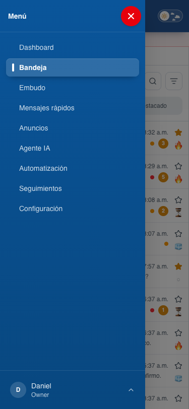
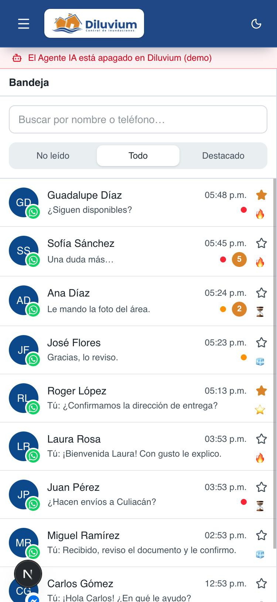
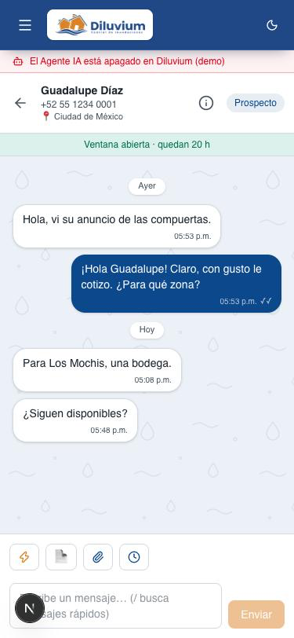
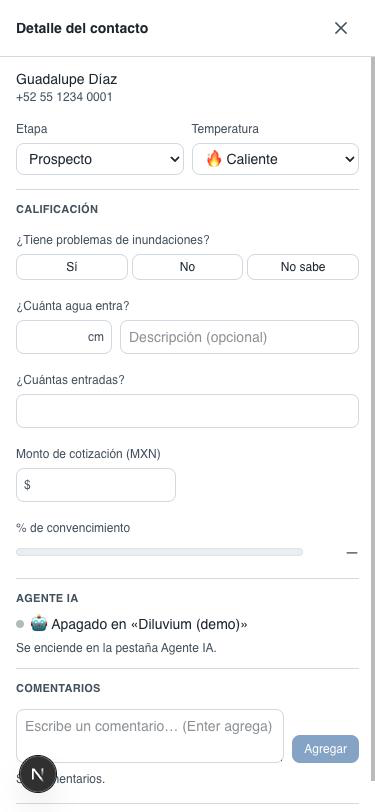
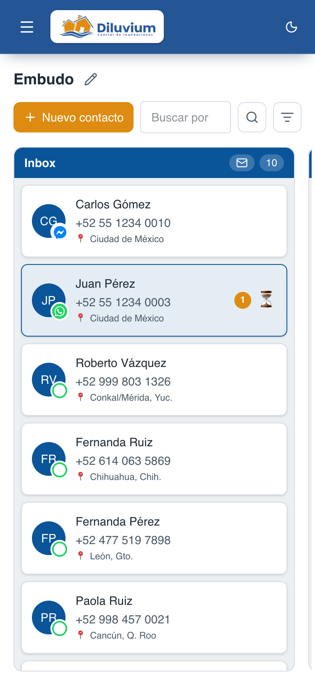
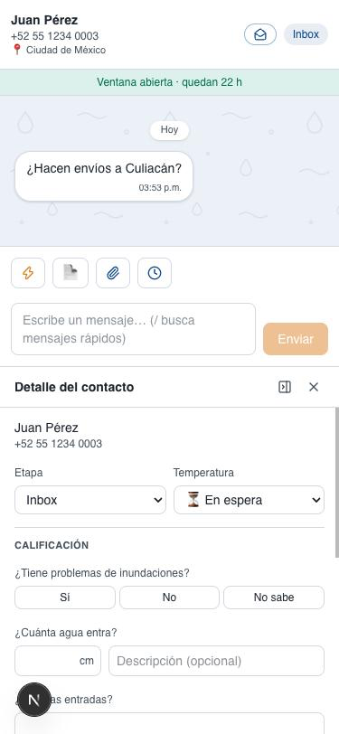
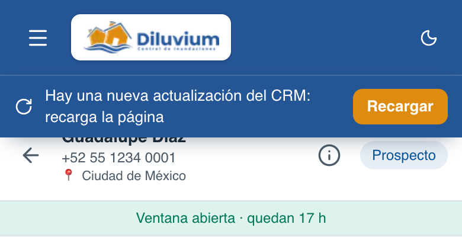

> Parte del [Mapa del CRM](../mapa-crm.md) (índice con todas las secciones). Las capturas están en esta misma carpeta.

### 3.10 Versión móvil (celular)

Desde el 28-sep-2026 el CRM se acomoda a pantallas angostas (menos de 768 px de ancho: un celular en vertical). Son
**las mismas pantallas y los mismos botones** de escritorio; solo cambia cómo se acomodan. Las capturas van sin
números dibujados: el número de la tabla nombra la pieza.

| # | Nombre oficial | Qué hace | Quién lo ve |
|---|---|---|---|
| 1 | **Botón ☰ (menú)** | En la barra de arriba, a la izquierda del logo. Abre un cajón con las mismas pestañas del menú lateral y, abajo, el **menú del usuario** (Mi cuenta, Cerrar sesión; esta pide confirmar con el globo de Menú › 10). Se cierra al elegir una pestaña, con ✕, tocando fuera o con Esc. | Todos |
| 2 | **Barra de arriba (móvil)** | Solo ☰, el logo y el interruptor de tema (la píldora, Menú › 5). El correo y "Cerrar sesión" viven en el menú del usuario (1). La cinta del clima (Menú › 14) no sale en el celular. | Todos |
| 3 | **Bandeja: lista** | Mientras no hay un chat abierto, la lista ocupa toda la pantalla (buscador con su filtro de temperatura, No leído/Todo/Destacado y las filas, igual que en escritorio). | Todos |
| 4 | **← Volver a la lista** | En el encabezado del chat, a la izquierda del nombre: regresa a la lista (3). | Todos |
| 5 | **(i) Detalle del contacto** | En el encabezado del chat: abre el mismo Detalle del contacto (3.2.3) encima del chat, a pantalla completa. ✕ lo cierra. En escritorio el detalle es el panel de la derecha, como siempre. | Todos |
| 6 | **Caja para escribir (móvil)** | Dos renglones: ⚡ 📄 📎 ▶ 🕒 arriba (y la píldora 🤖 al final; siempre está desde el 7-oct-2026) y la caja con **Enviar** abajo. En el celular **Enter baja de renglón** (el texto conserva sus saltos) y **solo el botón Enviar manda**; en escritorio Enter sigue enviando. El cursor es el del teléfono (sin la animación de escritorio, ver **Cursor al escribir**). | Todos |
| 7 | **Embudo: columnas** | Cada columna ocupa la pantalla; el tablero se desliza de lado columna por columna. Cada una trae su sobre **No leído** (Embudo › 33), igual que en escritorio. Para arrastrar una tarjeta a otra etapa: dejarla presionada un momento y moverla (el clic derecho no existe en celular). | Todos |
| 8 | **Pop-up del Embudo (móvil)** | Al tocar una tarjeta, el pop-up ocupa toda la pantalla **igual que la Bandeja**: el chat completo y, en su encabezado, el sobre (Marcar como leído), el **(i)** que abre el Detalle del contacto encima y la ✕ roja que cierra el pop-up. | Todos |
| 9 | **Demás pantallas** | Dashboard, Mensajes rápidos, Anuncios, Agente IA, Automatización, Seguimientos y Configuración se acomodan en una sola columna. **Nada se desliza de lado** (solo el Embudo, 7): las tablas de Anuncios, Vendedores y Corridas se apilan como tarjetas y las subpestañas de Agente IA se acomodan en varios renglones. | Todos |
| 10 | **✕ roja (cerrar)** | En el celular todo lo que se abre encima se cierra con una ✕ blanca en círculo rojo: el menú ☰, el Detalle del contacto (5), el pop-up del Embudo (8), los selectores del chat (⚡ mensajes rápidos, 📄 plantillas, 🕒 programar y el buscador "/"), el visor de fotos (el de siempre: el visor nuevo de escritorio, Bandeja › 3.2.5, no aplica en el celular), Nuevo contacto, Columnas del Embudo y el formulario de Mensajes rápidos. En escritorio no cambia nada (Esc, "Cerrar" o la ✕ chica de siempre; el Visor de archivos tiene su ✕ naranja, 3.2.5). | Todos |
| 11 | **▶ Automatizaciones** | Botón nuevo en la caja del chat (Bandeja y pop-up del Embudo), solo en el celular. Abre una lista como la de ⚡ con los workflows **encendidos** de Automatización: miniatura cuadrada de la imagen o el video (con el ícono de imagen/video a media opacidad encima; documento con su ícono), nombre, comando y el mensaje predeterminado. Tocar uno manda exactamente lo mismo que escribir su comando (el mensaje y el archivo, en su orden). En escritorio siguen con "/". | Todos |
| 12 | **Avisos emergentes (móvil)** | Tarjetas azules delgadas, **centradas arriba** debajo de la barra; no llegan al centro ni tapan el chat. Texto completo de quién hizo el cambio: "🤖 Agente IA movió a … a …", "🌎 Luis movió a … a …" (owner o admin), "👨🏽‍💻 Daniel movió a … a …" (vendedor) o "⚙️ Automatización movió…". Duran **4 segundos**, con una barra naranja delgada abajo que se vacía, y un halo oscuro difuminado solo alrededor de cada tarjeta. Máximo 3; desde el 4.º se juntan en "N contactos cambiaron de etapa ▾", que al tocarlo despliega cada cambio (tocar uno abre su chat) y "Ver todo en el Embudo"; desplegado no se va solo y al plegarlo vuelve a contar 4 segundos. ✕ blanca para quitarlo. En escritorio siguen como en 3.2.4 (10 segundos). | Todos |
| 13 | **Aviso de actualización (móvil)** | El mismo aviso de Menú › 13, pero como **franja azul** pegada debajo de la barra (en la barra del celular no cabe): «Hay una nueva actualización del CRM: recarga la página» y **Recargar**. Mismas reglas: solo cuando falló algo que hizo el vendedor por una versión vieja. | Todos |

**Lo cambias tú desde la pantalla:** nada nuevo; el tema claro/oscuro sigue en la barra.

**Pídeselo a Code:**
- "En Versión móvil › (1), pon Bandeja y Embudo como botones fijos abajo de la pantalla."
- "En Versión móvil › (8), que el pop-up del Embudo se vea como la Bandeja: chat completo y el detalle con (i)."

**Agente IA aquí:** nada.

**Qué falta:** el menú del clic derecho de la Bandeja con pulsación larga y el modo oscuro en móvil.

Para Code: corte en `md` (768 px); `app/(app)/layout.tsx` y `_components/mobile-nav.tsx` (☰), `app/layout.tsx`
(viewport), `dashboard/_components/inbox-board.tsx` (una columna, detalle encima), `chat-thread.tsx` (`onBack`),
`composer.tsx` (dos renglones, corte `sm`), `contactos/_components/contacts-board.tsx` (columnas de una pantalla,
corte `sm`), `contact-detail-panel.tsx` (pop-up a pantalla completa), `components/ui/use-media-query.ts`, `components/ui/close-x.tsx` (✕ roja), `workflow-picker.tsx` + `listWorkflowQuickSends`
en `lib/actions/workflows.ts` (▶ Automatizaciones), `stage-change-toasts.tsx` + `stage-toasts.ts` (avisos móviles), tablas apiladas con `max-md:block` en `sellers-panel.tsx` y `automatizacion-panel.tsx`, tarjetas en
`components/anuncios/ads-table.tsx`.
