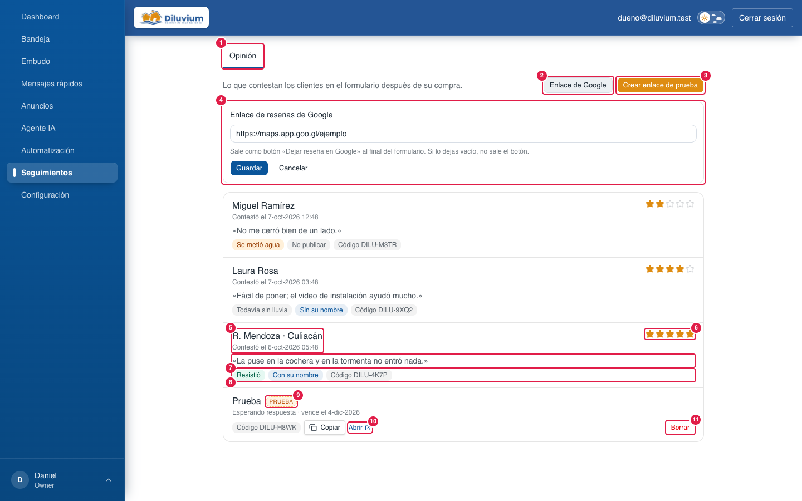
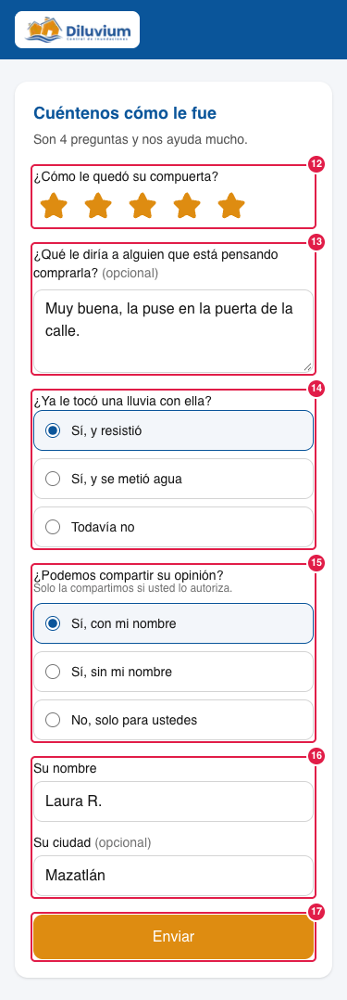
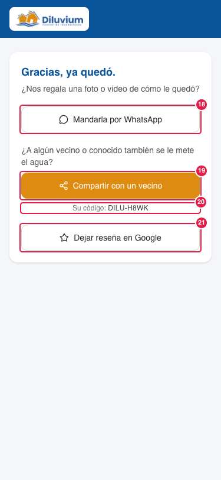

> Parte del [Mapa del CRM](../mapa-crm.md) (índice con todas las secciones). Las capturas están en esta misma carpeta.

### 3.11 Seguimientos

Pestaña del menú entre Automatización y Configuración (8-oct-2026): lo que sigue **después de la compra**. Hoy tiene
una subpestaña, **Opinión**. **Todos** la ven y la usan, vendedor incluido. No es lo mismo que Agente IA › Seguimientos.
Lleva el número 3.11 porque se agregó después (los números no cambian).

| # | Nombre oficial | Qué hace | Quién lo ve |
|---|---|---|---|
| 1 | **Opinión** | Subpestaña con lo que contestan los clientes en el [formulario de opinión](1-glosario.md#glosario). | Todos |
| 2 | **Enlace de Google** | Abre la caja del enlace de reseñas (4). | Todos |
| 3 | **Crear enlace de prueba** | Crea un enlace al formulario que no es de ningún cliente, para abrirlo y contestarlo como lo haría el cliente. Arriba sale «Enlace de prueba listo» con el enlace y **Copiar**; en la lista aparece como fila **Prueba** (9). | Todos |
| 4 | **Enlace de reseñas de Google** | El enlace del botón «Dejar reseña en Google» de la pantalla final (21). Debe empezar con https://; vacío = no sale el botón. **Guardar** · **Cancelar**. | Todos |
| 5 | **Quién y cuándo** | El nombre y la ciudad que dio el cliente si autorizó compartir su opinión con su nombre; si no, el nombre del contacto en el CRM. Debajo, cuándo contestó (hora de Mazatlán), o «Esperando respuesta · vence el …» o «Venció sin respuesta». Lo más reciente va primero. | Todos |
| 6 | **Estrellas** | De 1 a 5. | Todos |
| 7 | **Lo que dijo** | Su respuesta a «¿Qué le diría a alguien que está pensando comprarla?», entre comillas. | Todos |
| 8 | **Etiquetas** | La lluvia (**Resistió** en verde, **Se metió agua** en ámbar o **Todavía sin lluvia**), el permiso (**Con su nombre**, **Sin su nombre** o **No publicar**) y su [código de recomendación](1-glosario.md#glosario). | Todos |
| 9 | **Prueba** | Marca de un enlace de prueba (3): no es de un cliente. | Todos |
| 10 | **Copiar · Abrir** | Mientras siga sin contestar: copia el enlace o lo abre en otra pestaña. | Todos |
| 11 | **Borrar** | Solo en los enlaces de prueba: los quita de la lista. Las opiniones de los clientes no se borran. | Todos |

**El formulario que ve el cliente** (página aparte, sin menú ni datos de nadie, pensada para el celular):

 

| # | Nombre oficial | Qué hace | Quién lo ve |
|---|---|---|---|
| 12 | **¿Cómo le quedó su compuerta?** | Estrellas de 1 a 5 (obligatorio). | El cliente |
| 13 | **¿Qué le diría a alguien que está pensando comprarla?** | Texto libre, opcional (hasta 1000 letras): sale listo para un anuncio. | El cliente |
| 14 | **¿Ya le tocó una lluvia con ella?** | Sí, y resistió · Sí, y se metió agua · Todavía no (obligatorio). | El cliente |
| 15 | **¿Podemos compartir su opinión?** | Sí, con mi nombre · Sí, sin mi nombre · No, solo para ustedes (obligatorio). Se guarda el texto exacto de lo que autorizó. | El cliente |
| 16 | **Su nombre · Su ciudad** | Solo con «Sí, con mi nombre»: el nombre es obligatorio y la ciudad no. Si no autoriza con su nombre, no se guardan. | El cliente |
| 17 | **Enviar** | Revisa las respuestas obligatorias (avisa en rojo junto a cada una y sube la pantalla al primer aviso) y guarda. Cada enlace se contesta **una vez**: si lo abre otra vez sale «Ya recibimos su opinión. Gracias.»; si venció o está incompleto, lo dice. | El cliente |
| 18 | **Mandarla por WhatsApp** | Abre el chat con Diluvium con «Hola, les mando la foto de cómo me quedó la compuerta.»: la foto o el video llegan al chat del CRM. | El cliente |
| 19 | **Compartir con un vecino** | Abre WhatsApp para elegir a quién mandarle un mensaje con el enlace al chat de Diluvium y su código ya escrito. | El cliente |
| 20 | **Su código** | Su código de recomendación. | El cliente |
| 21 | **Dejar reseña en Google** | Abre el enlace de 4. Sale **para todos**, sin importar las estrellas (Google no permite pedir reseña solo a los clientes contentos). | El cliente |

Para Code: rutas `/seguimientos` (`app/(app)/seguimientos/`; subpestañas en `lib/seguimientos/sections.ts`) y `/opinion/[token]` (pública, `app/opinion/[token]/`); la respuesta entra por `app/api/opinion/route.ts` (límite por IP); `lib/opiniones/` (`codigo`, `respuestas`, `enlaces`, `store`, `queries`, `vista`), `lib/actions/opiniones.ts`, ACL `opinion`; tablas `opiniones` y `opiniones_config` (migración 0064); diseño `docs/opiniones.md`.
