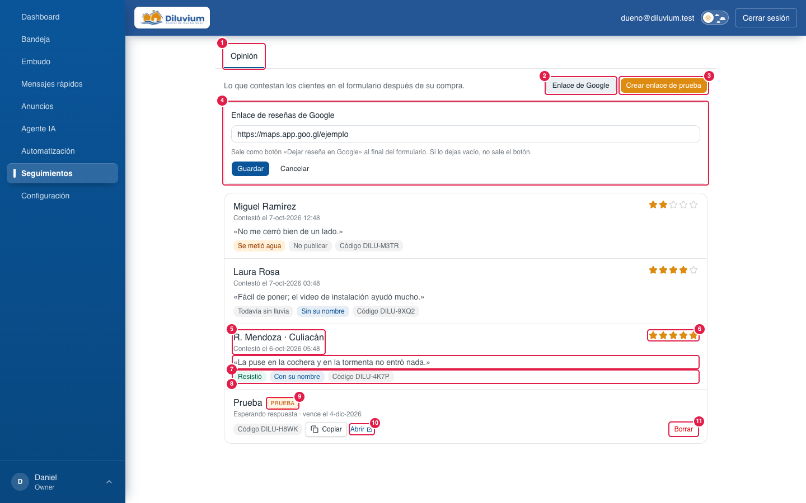
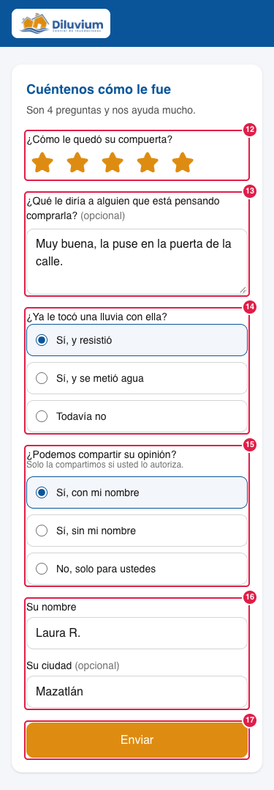
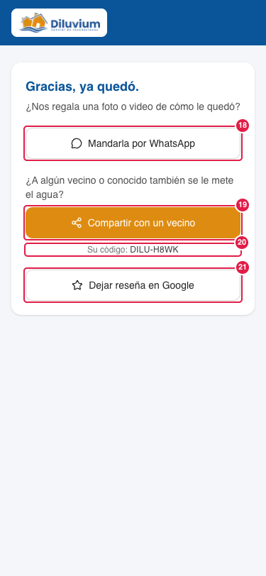
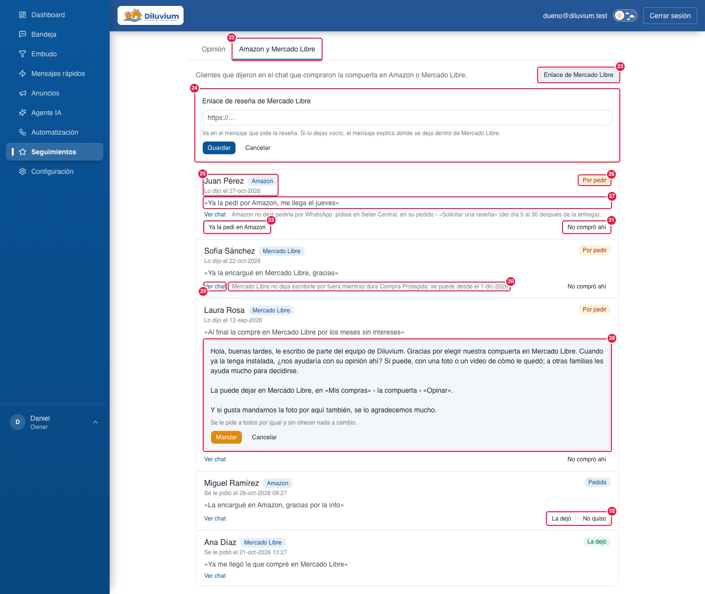

> Parte del [Mapa del CRM](../mapa-crm.md) (índice con todas las secciones). Las capturas están en esta misma carpeta.

### 3.11 Seguimientos

Pestaña del menú entre Automatización y Configuración (8-oct-2026): lo que sigue **después de la compra**. Tiene dos
subpestañas: **Opinión** y **Amazon y Mercado Libre** (27-oct-2026). **Todos** la ven y la usan, vendedor incluido. No es
lo mismo que Agente IA › Seguimientos.
Lleva el número 3.11 porque se agregó después (los números no cambian).

| # | Nombre oficial | Qué hace | Quién lo ve |
|---|---|---|---|
| 1 | **Opinión** | Subpestaña con lo que contestan los clientes en el [formulario de opinión](1-glosario.md#glosario). | Todos |
| 2 | **Enlace de Google** | Abre la caja del enlace de reseñas (4). | Todos |
| 3 | **Crear enlace de prueba** | Crea un enlace al formulario que no es de ningún cliente, para abrirlo y contestarlo como lo haría el cliente. Arriba sale «Enlace de prueba listo» con el enlace y **Copiar**; en la lista aparece como fila **Prueba** (9). | Todos |
| 4 | **Enlace de reseñas de Google** | El enlace del botón «Dejar reseña en Google» de la pantalla final (21). Debe empezar con https://; vacío = no sale el botón. **Guardar** · **Cancelar**. | Todos |
| 5 | **Quién y cuándo** | El nombre y la ciudad que dio el cliente si autorizó compartir su opinión con su nombre; si no, el nombre del contacto en el CRM. Debajo, cuándo contestó (hora de Mazatlán), o «Esperando respuesta · vence el …» o «Venció sin respuesta». Lo más reciente va primero. | Todos |
| 6 | **Estrellas** | De 1 a 5. | Todos |
| 7 | **Lo que dijo** | Su respuesta a «¿Qué le diría a alguien que está pensando comprarla?», entre comillas. | Todos |
| 8 | **Etiquetas** | La lluvia (**Resistió** en verde, **Se metió agua** en ámbar o **Todavía sin lluvia**), el permiso (**Con su nombre**, **Sin su nombre** o **No publicar**) y su [código de recomendación](1-glosario.md#glosario). | Todos |
| 9 | **Prueba** | Marca de un enlace de prueba (3): no es de un cliente. | Todos |
| 10 | **Copiar · Abrir** | Mientras siga sin contestar: copia el enlace o lo abre en otra pestaña. | Todos |
| 11 | **Borrar** | Solo en los enlaces de prueba: los quita de la lista. Las opiniones de los clientes no se borran. | Todos |

**El formulario que ve el cliente** (página aparte, sin menú ni datos de nadie, pensada para el celular):

 

| # | Nombre oficial | Qué hace | Quién lo ve |
|---|---|---|---|
| 12 | **¿Cómo le quedó su compuerta?** | Estrellas de 1 a 5 (obligatorio). | El cliente |
| 13 | **¿Qué le diría a alguien que está pensando comprarla?** | Texto libre, opcional (hasta 1000 letras): sale listo para un anuncio. | El cliente |
| 14 | **¿Ya le tocó una lluvia con ella?** | Sí, y resistió · Sí, y se metió agua · Todavía no (obligatorio). | El cliente |
| 15 | **¿Podemos compartir su opinión?** | Sí, con mi nombre · Sí, sin mi nombre · No, solo para ustedes (obligatorio). Se guarda el texto exacto de lo que autorizó. | El cliente |
| 16 | **Su nombre · Su ciudad** | Solo con «Sí, con mi nombre»: el nombre es obligatorio y la ciudad no. Si no autoriza con su nombre, no se guardan. | El cliente |
| 17 | **Enviar** | Revisa las respuestas obligatorias (avisa en rojo junto a cada una y sube la pantalla al primer aviso) y guarda. Cada enlace se contesta **una vez**: si lo abre otra vez sale «Ya recibimos su opinión. Gracias.»; si venció o está incompleto, lo dice. | El cliente |
| 18 | **Mandarla por WhatsApp** | Abre el chat con Diluvium con «Hola, les mando la foto de cómo me quedó la compuerta.»: la foto o el video llegan al chat del CRM. | El cliente |
| 19 | **Compartir con un vecino** | Abre WhatsApp para elegir a quién mandarle un mensaje con el enlace al chat de Diluvium y su código ya escrito. | El cliente |
| 20 | **Su código** | Su código de recomendación. | El cliente |
| 21 | **Dejar reseña en Google** | Abre el enlace de 4. Sale **para todos**, sin importar las estrellas (Google no permite pedir reseña solo a los clientes contentos). | El cliente |

**Amazon y Mercado Libre** (27-oct-2026; rediseñada el mismo día, pedido del dueño: más simple): los clientes que
dijeron en el chat que **ya compraron** la compuerta en una de esas tiendas, para pedirles su reseña ahí. Los anota solo
el Agente IA en segundo plano, con la misma lectura que llena el Detalle (sin gasto extra de IA), y solo si el cliente
nombra esa tienda en el chat. Cada cliente cae en **una sección** según lo que se puede hacer hoy y tiene **una sola
acción**; nada se marca a mano. **Amazon** no deja escribirle al comprador por fuera: se pide en Seller Central (35) y
el cliente sale solo de la lista cuando Amazon ya no deja pedirla (35 días después de que lo dijo). **Mercado Libre** no
deja escribirle por fuera hasta que vence Compra Protegida: se pide a los 40 días de que lo dijo, con un **texto fijo**
(sin IA) si nos escribió hace poco (28) o, si no, primero con la plantilla **Reseña en tienda** (36).

| # | Nombre oficial | Qué hace | Quién lo ve |
|---|---|---|---|
| 22 | **Amazon y Mercado Libre** | Subpestaña con los clientes que compraron en una de esas tiendas. | Todos |
| 23 | ~~Enlace de Mercado Libre~~ | Se quitó el 27-oct-2026 (decisión del dueño: menos opciones). El mensaje explica dónde se deja la reseña dentro de Mercado Libre. | — |
| 24 | ~~Enlace de reseña de Amazon · de Mercado Libre~~ | Se quitó el 27-oct-2026 con el 23. | — |
| 25 | **Quién, tienda y cuándo** | El nombre del contacto y la tienda; abajo, cuándo lo dijo. | Todos |
| 26 | ~~Estado~~ | Se quitó el 27-oct-2026: ahora lo dice la sección (34). | — |
| 27 | **Lo que dijo** | Su último mensaje que nombra la tienda, entre comillas: así se ve que de verdad compró ahí. | Todos |
| 28 | **Pedir reseña** | Solo **Mercado Libre**, ya pasados los 40 días y si nos escribió hace poco (WhatsApp: 24 h; Instagram: 7 días). Abre el mensaje tal cual saldría (saludo de la hora del cliente, sin su nombre; gracias por comprar ahí; su opinión con foto o video «cuando ya la tenga instalada»; dónde se deja; y que nos mande la foto por WhatsApp también). **Mandar** lo envía como mensaje del vendedor (el Agente IA se pausa en ese chat) y pasa a **Solicitadas**. | Todos |
| 29 | **Ver chat** | Abre su chat en la Bandeja. | Todos |
| 30 | **Qué sigue** | Una línea bajo el nombre: qué hacer o por qué todavía no («Se le puede escribir desde el 12-nov-2026…», «Le mandamos la plantilla el…: cuando conteste, sale «Pedir reseña»», «Se le pidió el…»). | Todos |
| 31 | **Quitar** | Antes «No compró ahí». Pregunta con el aviso de arriba del CRM; lo quita de la lista y el Agente IA ya no lo vuelve a anotar (si se equivocó o ya no se le va a pedir). | Todos |
| 32 | ~~La dejó · No quiso~~ | Se quitó el 27-oct-2026 (decisión del dueño): el CRM no puede ver las reseñas de las tiendas. | — |
| 33 | ~~Ya la pedí en Amazon~~ | Se quitó el 27-oct-2026 (decisión del dueño): en su lugar, 35. | — |
| 34 | **Por solicitar · En espera · Solicitadas** | Las secciones, con cuántos hay en cada una. **Por solicitar**: se puede hoy. **En espera**: todavía no (Compra Protegida de Mercado Libre, o ya se mandó la plantilla y falta que conteste). **Solicitadas**: ya salió el texto. Las vacías no salen. | Todos |
| 35 | **Pedir en Amazon** | Solo **Amazon**. Abre en otra pestaña los **pedidos enviados con Easy Ship** de Seller Central (los ya entregados a la paquetería): en su pedido se toca «Solicitar una reseña» › **Sí** (Amazon deja del día 5 al 30 después de la entrega; una por pedido). Debajo dice hasta qué fecha. | Todos |
| 36 | **Mandar plantilla** | Solo **Mercado Libre** por WhatsApp, ya pasados los 40 días y con más de 24 h desde su último mensaje. Abre la plantilla **Reseña en tienda** tal cual saldría (con sus 3 botones: Me quedó bien · Tuve un problema · Aún no la instalo). **Mandar** la envía y el cliente pasa a **En espera** hasta que conteste; entonces sale «Pedir reseña» (28). | Todos |

Para Code: rutas `/seguimientos` (`app/(app)/seguimientos/`; subpestañas en `lib/seguimientos/sections.ts`) y `/opinion/[token]` (pública, `app/opinion/[token]/`); la respuesta entra por `app/api/opinion/route.ts` (límite por IP); `lib/opiniones/` (`codigo`, `respuestas`, `enlaces`, `store`, `queries`, `vista`), `lib/actions/opiniones.ts`, ACL `opinion`; tablas `opiniones` y `opiniones_config` (migración 0064); diseño `docs/opiniones.md`. Amazon y Mercado Libre
(`?seccion=tiendas`): `lib/resenas-tienda/` (`tiendas`, `mensaje`, `store`, `queries`, `vista`: sección y acción de
cada cliente en `pasoDe`), `lib/actions/resenas-tienda.ts` (`pedirResena`, `mandarPlantillaResena`, `quitarResena`),
plantilla `resena_tienda` en `lib/templates/labels.ts`,
campo `compro_en` del lector (`lib/ai/runtime/lector-core.ts`), tabla `resenas_tienda` y enlaces en `opiniones_config`
(migración 0074).
