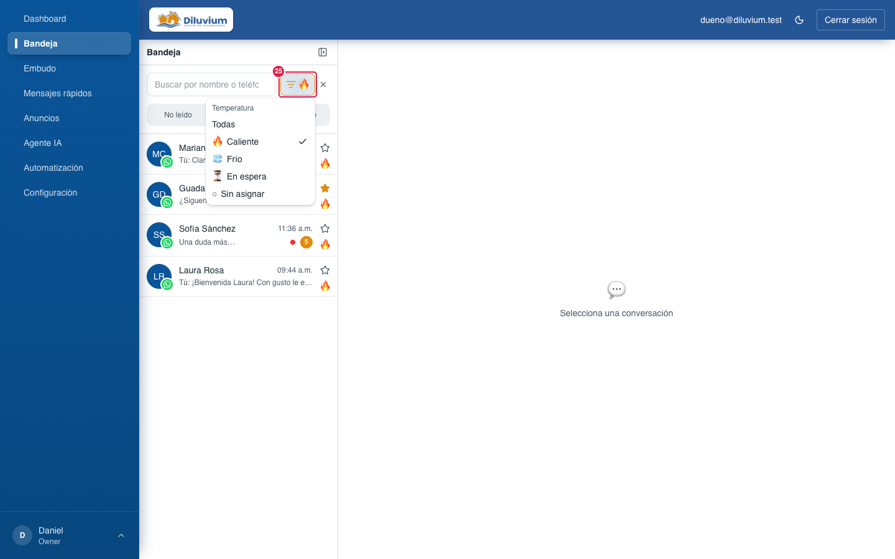
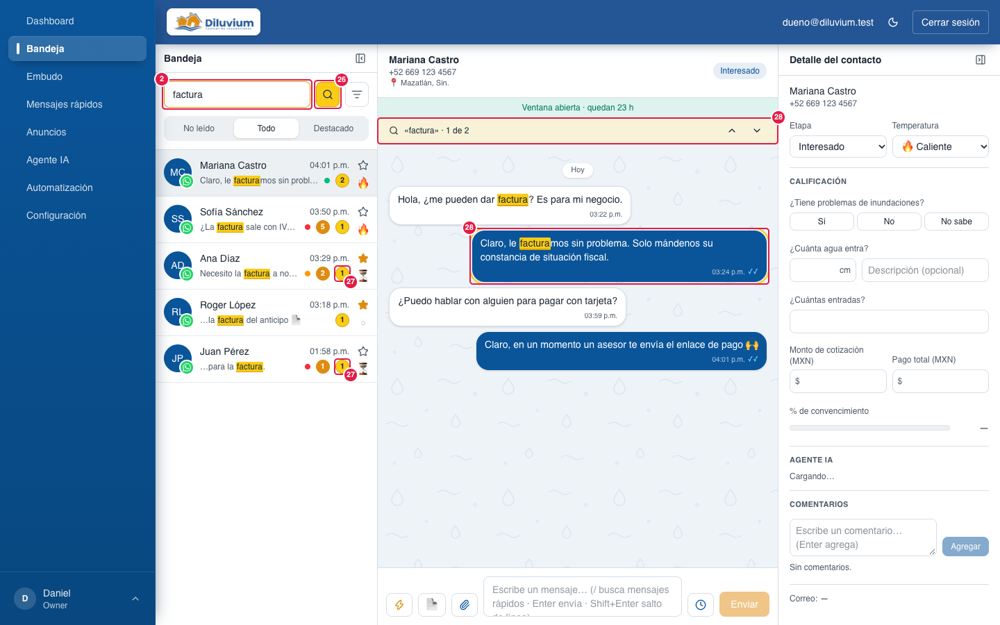

> Parte del [Mapa del CRM](../mapa-crm.md) (índice con todas las secciones). Las capturas están en esta misma carpeta.

### 3.2 Bandeja

La bandeja de entrada de **todos** los mensajes: lista de chats a la izquierda, el chat en medio y el Detalle
del contacto a la derecha. La lista y el Detalle se pueden ocultar para dar espacio al chat.

Clic derecho sobre una fila de la lista: menú de esa conversación (23).

Filtro de temperatura (25) abierto, con 🔥 elegido: la lista deja solo los calientes y la **×** quita el filtro.

Lupa (26) prendida con «factura»: solo quedan los chats con la palabra, cada uno con su círculo amarillo (27) junto al
naranja, y el chat abierto la resalta y salta a la coincidencia más reciente con la barra «1 de 2» (28).

| # | Nombre oficial | Qué hace | Quién lo ve |
|---|---|---|---|
| 1 | **Ocultar lista** | Esconde o muestra la lista de chats; se recuerda en esa computadora. | Todos |
| 2 | **Buscar por nombre o teléfono…** | Busca chats sin importar acentos ni mayúsculas; también por **@usuario** de Instagram (con o sin @). Con la lupa (26) prendida dice **«Buscar en los chats…»** y busca dentro de los mensajes. | Todos |
| 3 | **No leído · Todo · Destacado** | Filtros de la lista. **Destacado** = chats cuyo contacto tiene la estrella (7). Se combinan con el filtro de temperatura (25): «Destacado + 🔥» = calientes y destacados. La lista siempre va del mensaje más reciente al más viejo. | Todos |
| 4 | **Fila de conversación** | Iniciales con el logo del canal, nombre, hora del último mensaje y vista previa ("Tú:" si el último fue nuestro, también si lo mandó el agente). Si el primer mensaje del cliente no llegó al CRM, la vista previa dice «Recibiendo mensaje…» y luego «El cliente escribió, pero WhatsApp no pasó el mensaje al CRM…» (ver **Mensaje no disponible** en el Glosario). Clic abre el chat y lo marca como leído. | Todos |
| 5 | **Semáforo** | Verde menos de 15 min, ámbar menos de 1 h, rojo más de 1 h desde el mensaje del cliente sin respuesta de una persona. | Todos |
| 6 | **Círculo naranja** | Mensajes sin leer. | Todos |
| 7 | **Estrella (Destacado)** | Marca al **contacto** como Destacado ⭐ para todo el equipo: se prende en todos sus chats, en su tarjeta del Embudo y en el pop-up. Convive con la temperatura (8). Aparece en el filtro Destacado. | Todos |
| 8 | **Temperatura** | 🔥 🧊 ⏳ o ○. Clic para cambiarla sin abrir el chat. Aquí no hay ⭐: Destacado es la estrella (7). | Todos |
| 9 | **Encabezado del chat** | Nombre, teléfono y ciudad (por la lada). En un chat de **Instagram**: nombre y **@usuario · Instagram** (sin teléfono ni ciudad). | Todos |
| 10 | **Chip de etapa** | Etapa actual del contacto. | Todos |
| 11 | **Aviso de ventana de 24 h** | "Ventana abierta · quedan X h" (verde) o, vencida, "Pasaron 24 h…" (ámbar). En **Instagram**, vencida dice hasta cuándo **solo un vendedor** puede contestar («…hasta el vie 9 oct, 10:00 p.m. (el Agente IA y las automatizaciones ya no)») y, pasados 7 días, «Instagram no deja escribirle hasta que vuelva a escribir». | Todos |
| 12 | **Gratis por anuncio** | "🎁 Gratis por anuncio hasta…" o "📣 Responde antes de…: 72 h gratis". | Todos |
| 13 | **Burbuja del cliente** | Mensaje del cliente (izquierda, blanca). Los **links** salen azules y subrayados; clic los abre en otra pestaña (Chat › 23). | Todos |
| 14 | **Burbuja nuestra** | Mensaje del vendedor o del agente (derecha, azul; a propósito no dice quién). Los **links** salen en azul claro y subrayados; clic los abre en otra pestaña (Chat › 23). 🕗 enviando (también mientras espera su turno si WhatsApp pidió esperar) · ✓ enviado · ✓✓ entregado · ✓✓ azul leído. Si WhatsApp dice "entregado" o "leído", el mensaje **nunca** queda como "No se envió". | Todos |
| 15 | **Nota de voz** | Reproductor del audio. | Todos |
| 16 | **Transcripción** | Lo que dijo el cliente en la nota de voz, en texto. | Todos |
| 17 | **Aviso 🤖** | Nota del agente para el vendedor (el cliente no la ve). | Todos |
| 18 | **Mensaje programado** | "🕒 Programado para…" al final del chat, con **Editar** y **Cancelar**. | Todos |
| 19 | **Agente IA leyendo… / escribiendo… / enviando…** | Píldora que dice qué está haciendo el agente en ese chat en este momento. | Todos |
| 20 | **Caja para escribir** | Ver [3.2.2 Caja para escribir](3.2.2-caja-para-escribir.md#322-caja-para-escribir-composer). | Todos |
| 21 | **Detalle del contacto** | Ficha del cliente. Ver [3.2.3 Detalle del contacto](3.2.3-detalle-del-contacto.md#323-detalle-del-contacto). | Todos |
| 22 | **Ocultar panel de contacto** | Esconde o muestra el Detalle; se recuerda en esa computadora. | Todos |
| 23 | **Menú del clic derecho** | Sobre una fila (en celular, dejándola presionada): **Marcar como no leído** (pone el círculo naranja, 6, para dejarla pendiente; si ese chat estaba abierto, se cierra) o **Marcar como leído** (lo quita, y en el Embudo también quita el azul de la tarjeta). Es para todo el equipo; el círculo se quita solo al abrir el chat o al contestar. | Todos |
| 25 | **Filtro de temperatura** (ícono a la derecha del buscador) | Menú corto: **Todas · 🔥 Caliente · 🧊 Frío · ⏳ En espera · ○ Sin asignar**, una a la vez. Con algo elegido el ícono se pinta naranja y muestra el emoji; la **×** de al lado lo quita. Se suma a la pestaña (3) y a la búsqueda. No se recuerda al recargar. Desde el 28-sep-2026. | Todos |
| 26 | **Lupa: buscar en los chats** (entre el buscador y el filtro) | Prendida se pinta de amarillo (y el borde del buscador): el buscador (2) busca una palabra **dentro de los chats** de todos los contactos, sin acentos, desde 3 letras (con menos: «Escribe al menos 3 letras»). Solo quedan los chats con la palabra y la vista previa (4) muestra el pedazo donde aparece, resaltado. Se suma a la pestaña (3) y al filtro (25). Otro clic la apaga y vuelve a buscar por nombre o teléfono. No se recuerda al recargar. Apagada en la primera captura; prendida en la de la lupa. Desde el 29-sep-2026. | Todos |
| 27 | **Círculo amarillo** | Con la lupa (26): en cuántos mensajes de ese chat aparece la palabra. Va junto al círculo naranja (6), que no cambia. En la captura de la lupa. | Todos |
| 28 | **Palabra resaltada y «1 de N»** (en el chat) | Con la lupa (26): la palabra va resaltada en amarillo en las burbujas y transcripciones, el chat salta a la coincidencia **más reciente** (burbuja con borde amarillo; si es vieja, carga los mensajes anteriores hasta llegar) y la barra de arriba del chat dice «palabra · 1 de 3» con **↑** (anterior) y **↓** (siguiente). En la captura de la lupa. | Todos |
| 24 | **Franja del Agente IA** (arriba de todo, solo si aplica) | Si el Agente IA tiene horario: «El Agente IA solo contesta mié–jue 20:00–6:00 (ahora está fuera de horario)» en ámbar, o «(ahora sí está contestando)» en gris; se actualiza sola cada minuto. Si el canal está Apagado: «El Agente IA está apagado en WhatsApp Diluvium» en rojo. Con 24/7 y Encendido no sale. No está en la captura. | Todos |

**Lo cambias tú desde la pantalla:** temperatura, estrella, leído / no leído (clic derecho), etapa y todo el
Detalle; contestar, programar, mandar plantillas; pausar o activar al agente (en el Detalle).

**Pídeselo a Code:**
- "En Bandeja › (10) chip de etapa, muestra «Cerca de compra» en vez de «cerca_compra»."
- "En Bandeja › (5) semáforo, que el rojo salga a los 30 minutos en vez de a la hora."
- "En Bandeja › (3) filtros, agrega un filtro «Con aviso del agente»."

**Agente IA aquí:** contesta en el chat (burbujas azules), muestra la píldora (19) mientras lee o escribe, deja
avisos 🤖 (17), avanza la etapa (10) y usa la transcripción (16) de las notas de voz. Cuando un vendedor contesta,
se pausa en ese chat (según Opciones). Si no contesta todo (tiene horario o el canal está Apagado), lo dice la
franja (24). Pausado o apagado solo deja de contestar: en **segundo plano** sigue leyendo el chat y dejando al día la
etapa y el Detalle; lo que está haciendo se ve en el Detalle (3.2.3 › 28). La píldora (19) es solo de cuando **contesta**.

Para Code: ruta `/dashboard`; `app/(app)/dashboard/_components/` (`inbox-board`, `conversation-list`, `chat-thread`, `temperature-picker`, `agent-activity-pill`, `scheduled-in-thread`, `bot-banner`); franja (24) con `lib/monitoring/bot-silence.ts` (`loadBotBanner`); menú del clic derecho `components/ui/context-menu.tsx`; datos en `lib/inbox/`; tiempo real `/api/inbox/stream`. Filtro de temperatura: `app/(app)/_components/card-filter-button.tsx` → `listConversations({ temperature })` (lib/inbox/actions.ts, validado) → `listFilter` en lib/inbox/queries.ts; reglas en `lib/contacts/filters.ts`. Lupa (26–28): `app/(app)/_components/chat-search-button.tsx` y `chat-search-badge.tsx` → `listConversations({ searchChats })` → `lib/inbox/chat-search.ts` (índice `pg_trgm` de la migración 0050); resaltado `components/ui/search-highlight.tsx` + `lib/text/highlight.ts` (dentro de `LinkedText`, también en los links); barra y salto en `chat-thread.tsx` (`searchTerm`, `listChatMatches`); colores `--busqueda*` en `app/globals.css`. Destacado = `contacts.destacado` (migración 0048; `conversations.is_starred` y el valor de temperatura 'destacado' quedan sin uso); estrella → `setContactDestacado` (lib/actions/contacts.ts), aviso en vivo como cambio de «temperatura». Links azules (13, 14 y en todo el CRM): `components/ui/linked-text.tsx` + detección pura `lib/text/links.ts` (con pruebas), estilo `[data-link="inline"]` en `app/globals.css` (azul claro sobre fondos navy).
