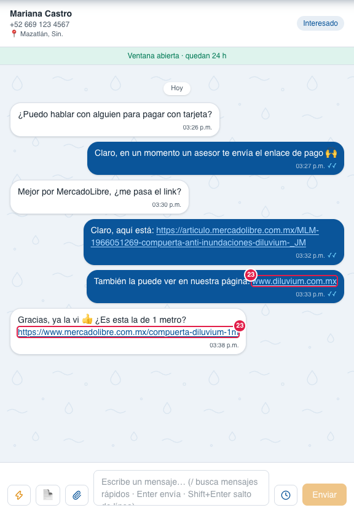
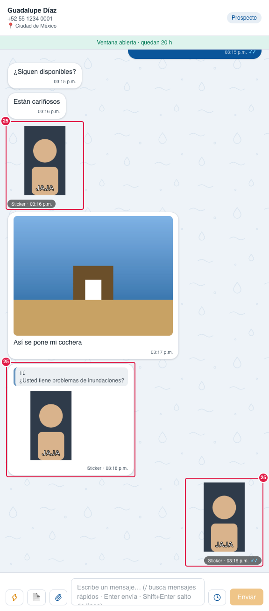
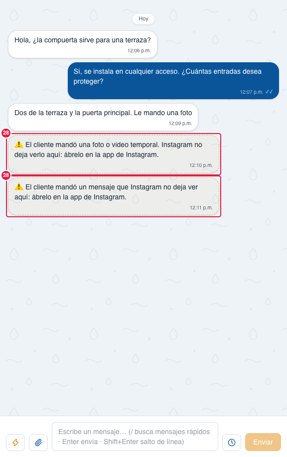

> Parte del [Mapa del CRM](../mapa-crm.md) (índice con todas las secciones). Las capturas están en esta misma carpeta.

#### 3.2.1 Chat: mensajes, avisos y tarjetas del agente

El mismo chat se usa en la Bandeja y en el pop-up del Embudo. Estas capturas muestran lo que puede aparecer
dentro de él.

| # | Nombre oficial | Qué hace | Quién lo ve |
|---|---|---|---|
| 1 | **📣 Llegó por anuncio** | Tarjeta con el nombre y la miniatura del anuncio que trajo al cliente. Clic abre la página del anuncio. | Todos |
| 2 | **Separador de día** | Hoy, Ayer o la fecha. | Todos |
| 3 | **Respuesta del agente** | Mensaje que mandó Ángela. | Todos |
| 4 | **Palomitas azules** | El cliente ya lo leyó. | Todos |
| 5 | **⚠ 🤖 El agente no pudo responder** | Explica el motivo en palabras simples (sin saldo, falta la llave, proveedor saturado, tardó demasiado…). El cliente sigue sin respuesta. | Todos |
| 6 | **Reintentar** (tarjeta del agente) | Le pide al agente un intento más, ya. | Todos |
| 7 | **Apagar** (tarjeta del agente) | Pausa al agente solo en ese chat; vuelve con **Activar** en el Detalle. | Todos |
| 8 | **🤖 Pausado · vuelve hoy 22:30** | Solo informa que el agente está en pausa en este chat y hasta cuándo. Se activa en el Detalle. | Todos |
| 9 | **Documento** | PDF con miniatura de la primera página, nombre, páginas y peso. Clic lo abre en el [Visor de archivos](3.2.5-visor-de-archivos.md#325-visor-de-archivos). Mientras se copia dice "Procesando…"; si no se pudo bajar (o llegó vacío) tras varios intentos, dice **"No se pudo descargar"** (nunca un archivo en blanco). Igual para audio, imagen, video y XML. Los archivos que adjunta el vendedor (foto, video, documento) se ven igual que los del cliente, con ✓/✓✓ como cualquier mensaje. **Solo se abren dentro del CRM los archivos verificados** (Glosario): si el contenido no coincide —p. ej. un «PDF» que por dentro es otra cosa, o una «foto» que no es foto— sale como esta tarjeta y el visor solo ofrece **Descargar**. Desde el 30-sep-2026. | Todos |
| 10 | **🤖 Depósito recibido** | El agente vio un comprobante: revisar el depósito en el banco y **confirmárselo al cliente en el chat**; con esa confirmación el Agente IA lo pasa a Compra (sin ella se queda en Cerca de compra). | Todos |
| 11 | **Respuesta del agente al comprobante** | Confirma al cliente y pide sus datos de envío. | Todos |
| 12 | **Respuesta de un vendedor** | Al contestar un vendedor, el agente se pausa en ese chat (según Opciones). | Todos |
| 13 | **⚠ No se envió** | El mensaje no salió. | Todos |
| 14 | **Motivo** | Por qué no salió, en palabras simples: ventana de 24 h cerrada, número que no recibe mensajes de WhatsApp, WhatsApp no pudo subir el archivo, tipo de archivo no permitido; cualquier otro: "WhatsApp no lo entregó (código N)". | Todos |
| 15 | **Reintentar** (mensaje) | Vuelve a mandar ese mismo mensaje. | Todos |
| 16 | **PRUEBA** | El chat es de un número de prueba; no cuenta en el Dashboard. Hoy no sale en ningún chat: los de prueba se borraron el 28-sep-2026. | Todos |
| 17 | **Importado del celular** | Mensaje copiado del historial del teléfono al conectar el número. El agente no lo contesta. En un chat de **Instagram** dice **Importado de Instagram** (copiado al conectar la cuenta: los últimos 500 chats). | Todos |
| 18 | **Respuesta del agente en el número de prueba** | Así se prueba al agente sin tocar a clientes reales. | Todos |
| 19 | **🤖 No le llegó al cliente la imagen de …** | Tarjeta de envío: WhatsApp aceptó el archivo de un workflow y después avisó que falló. Dice el motivo y el comando para reenviarlo (p. ej. /banco). La etapa no se regresa. | Todos |
| 20 | **🤖 WhatsApp sí recibió el mensaje…** | Tarjeta de envío: WhatsApp aceptó el mensaje pero el CRM no pudo guardar la confirmación. Revisar en el celular antes de escribirlo otra vez (sin Reintentar, para no duplicar). | Todos |
| 21 | **Recibiendo mensaje…** | Burbuja del cliente con borde punteado, hasta 1 minuto: WhatsApp avisó que el cliente escribió pero aún no pasa el contenido; el CRM lo está verificando. Casi siempre se convierte sola en el mensaje real. Captura pendiente. | Todos |
| 22 | **⚠️ El cliente escribió, pero WhatsApp no pasó el mensaje al CRM. Míralo en el celular.** | Burbuja del cliente con borde naranja punteado (en lugar del antiguo «[Unsupported message]»): se confirmó que el primer mensaje no llegó. El texto solo está en la app del celular. Si trae la tarjeta 📣 (1), el cliente llegó por ese anuncio. Si el mensaje llega después, la tarjeta se reemplaza sola. Captura pendiente. | Todos |
| 23 | **Link** | Cualquier link del mensaje (https://…, www.…, diluvium.com.mx, amzn.to/…) sale **subrayado**: azul en la burbuja del cliente y azul claro en la nuestra, para que se lea sobre el fondo azul. Clic lo abre en otra pestaña. El punto o la coma del final no entran en el link, y un correo (ventas@…) no es link. Igual en el pop-up del Embudo. Desde el 29-sep-2026. | Todos |
| 24 | **Pantalla completa** (video) | Ícono blanco de cuatro esquinas arriba a la derecha de cada video del chat (del cliente o enviado). Se ve con el video en pausa o al terminar y se oculta mientras corre. Un clic, o doble clic sobre la imagen del video (no sobre la barra), lo pone en pantalla completa y empieza a reproducirse. Para salir: Esc, el botón de salir de Chrome (abajo a la derecha) o doble clic. Para no repetirla, «Pantalla completa» ya no sale en el menú ⋮ ni en la barra de Chrome, y tampoco se ofrece **Silenciar**: el menú ⋮ queda con Descargar, Velocidad de reproducción y Pantalla en pantalla (desde el 30-sep-2026). Por eso el video mide al menos 208 px de ancho: uno vertical muestra franjas negras a los lados. En iPhone abre el reproductor del teléfono. Igual en el pop-up del Embudo. Desde el 30-sep-2026. Captura pendiente. | Todos |
| 25 | **Sticker** | Sticker de WhatsApp como en WhatsApp: **sin burbuja**, siempre del **mismo tamaño** (más chico que una foto) y **solo la hora** abajo, en una píldora con los colores del CRM: **blanca** con hora gris si es del cliente (izquierda) y **azul** con hora blanca y ✓✓ si lo mandó un vendedor desde el celular (derecha). Así no se confunde con una foto, que siempre va dentro de su burbuja. Si el sticker responde a un mensaje, va dentro de su burbuja normal con la cita. Clic lo abre en grande. Igual en el pop-up del Embudo y en el celular. Desde el 30-sep-2026. | Todos |
| 26 | **⚠ Salió incompleto** (Instagram) | Texto chico ámbar bajo un mensaje nuestro de Instagram que **sí salió** pero no completo: una parte de un texto largo, o el texto que acompañaba a una foto, no le llegó al cliente (Instagram la rechazó). Dice qué parte; escríbele lo que faltó. Desde el 2-oct-2026. Captura pendiente. | Todos |
| 27 | **🤖 Seguimiento** (marca) | Texto chico arriba de un mensaje nuestro que mandó un **seguimiento del Agente IA** (no lo escribió una persona). Solo con el interruptor de Opciones en **Real** (84). | Todos |
| 28 | **⚠️ El cliente mandó una foto o video temporal…** (Instagram) | Tarjeta con borde naranja punteado (la misma del mensaje no disponible de WhatsApp), **no** una burbuja del cliente: el cliente mandó por Instagram algo que el CRM no puede mostrar. «El cliente mandó una foto o video temporal. Instagram no deja verlo aquí: ábrelo en la app de Instagram.» (las fotos o videos de «ver una vez») o «El cliente mandó un mensaje que Instagram no deja ver aquí…». Ábrelo en la app de Instagram y contéstale. Sí cuenta como mensaje del cliente: el chat sube en la Bandeja y el Agente IA sabe que mandó algo que no se pudo ver. Desde el 6-oct-2026 (también en los mensajes anteriores). | Todos |

**Lo cambias tú desde la pantalla:** Reintentar o Apagar en la tarjeta del agente; Reintentar un mensaje que no salió.

**Pídeselo a Code:**
- "En Bandeja › Chat › (3) respuesta del agente, pon un 🤖 chiquito junto a la hora para distinguirla."
- "En Bandeja › Chat › (10) Depósito recibido, que se vea en naranja como la tarjeta de error."

**Agente IA aquí:** es el protagonista de esta parte: sus respuestas (3, 11, 18), sus avisos (10) y su tarjeta
de error (5–7). El aviso de pausa (8) sale cuando alguien lo pausó o cuando un vendedor contestó. Ante la tarjeta
(22) le escribe al cliente, dentro de su horario, el texto fijo «¡Hola! Gracias por escribirnos 😊 Tuvimos una falla
técnica y su mensaje no nos llegó. ¿Nos ayuda escribiéndolo de nuevo para seguir con su atención?» (sin usar el
modelo, sin gasto de IA) solo si no hay nada que leer; si el cliente ya escribió otra cosa, o el mensaje real llega
después, contesta lo que dice. Mientras dice «Recibiendo mensaje…» (21) no contesta nada.

Para Code: `chat-thread.tsx` (Link, 23: `components/ui/linked-text.tsx` + `lib/text/links.ts`), `ad-referral-card.tsx`, `agent-in-thread.tsx` (aviso de pausa y avisos 🤖), `agent-error-card.tsx`, `document-card.tsx`; tipos de aviso en `lib/ai/runtime/policy.ts` (`NoticeKind`). Mensaje no disponible (21–22; tarjeta de Instagram 28: `lib/messaging/instagram-unviewable.ts`, por el texto guardado): `messages.metadata.noDisponible` (sin migración), reglas y textos en `lib/messaging/unavailable.ts`, doble verificación en `lib/messaging/unavailable-check.ts` (cola `no-disponible`, `worker/unavailable.ts`), texto fijo del agente en `lib/ai/runtime/run.ts`.
