> Parte del [Mapa del CRM](../mapa-crm.md) (índice con todas las secciones). Las capturas están en esta misma carpeta.

#### 3.2.2 Caja para escribir (composer)

Donde el vendedor escribe. Con la ventana de 24 h abierta se escribe libre, se **adjuntan archivos** (📎 › Adjunta +)
y se mandan fotos y videos de la Biblioteca (📎 › Multimedia); cerrada, solo plantilla (y no se pueden adjuntar).

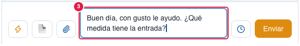

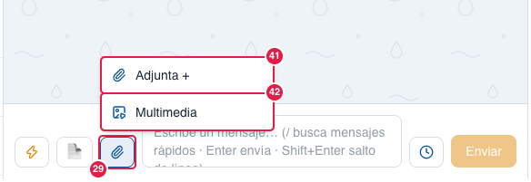
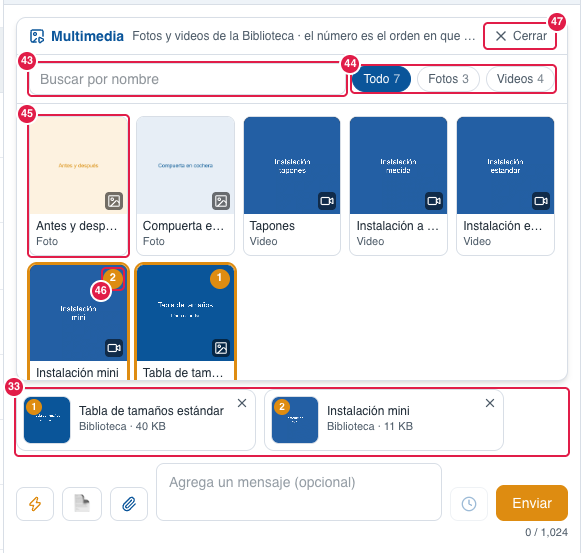

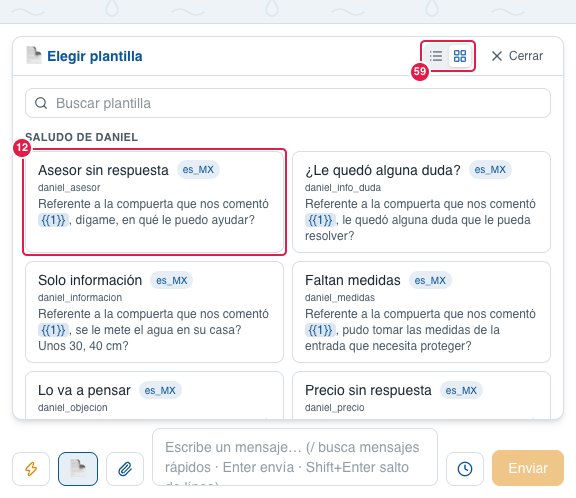

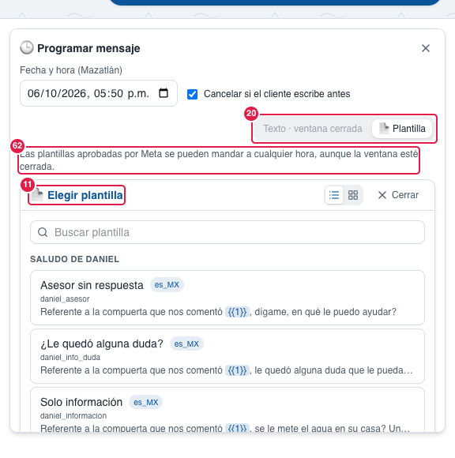

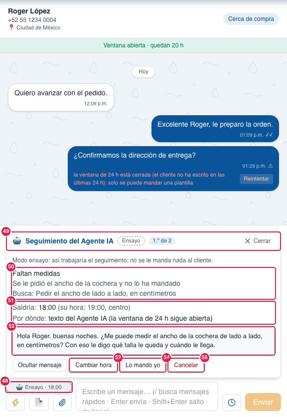
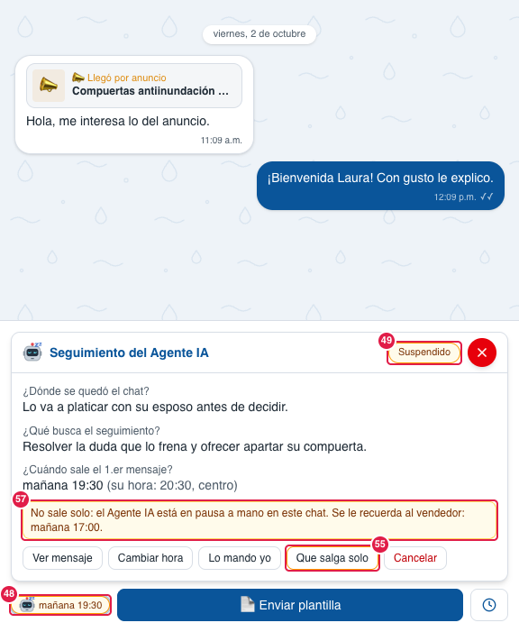
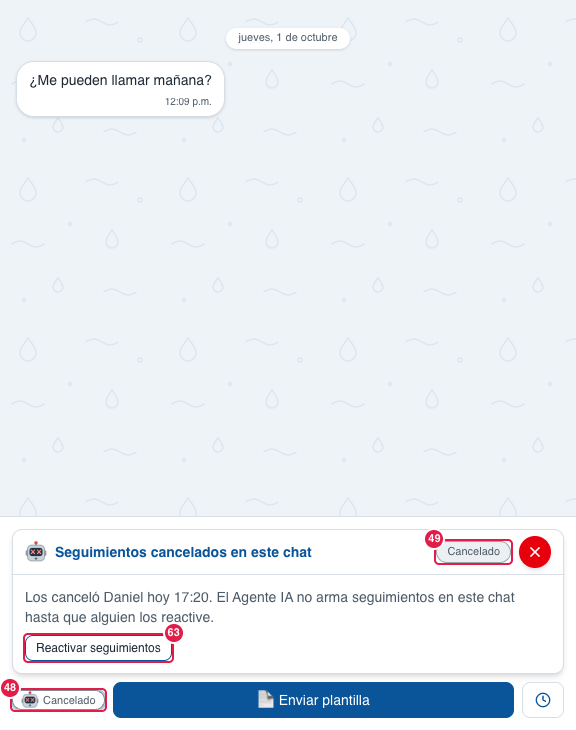
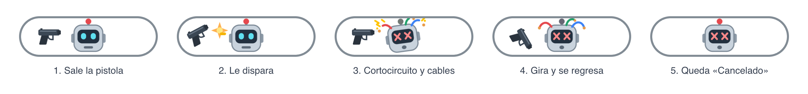
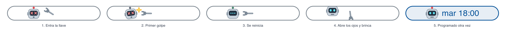
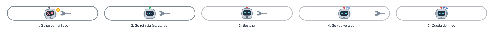
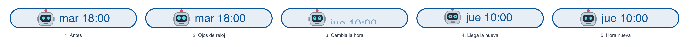
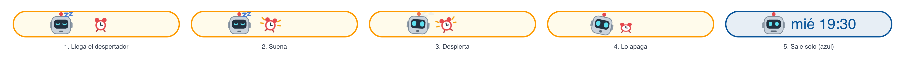
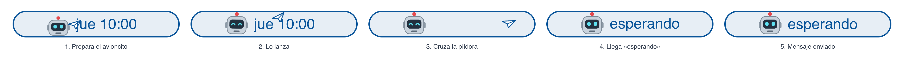
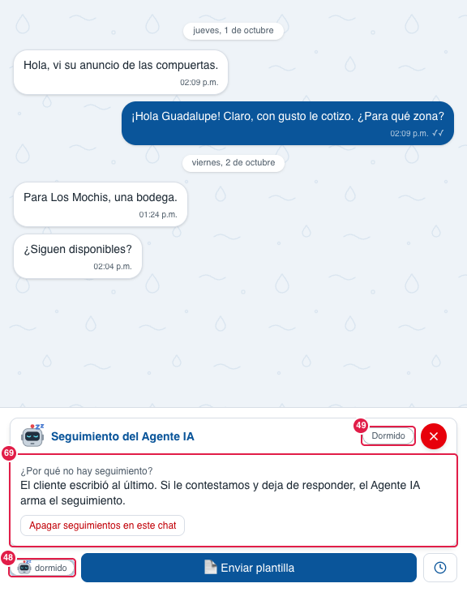
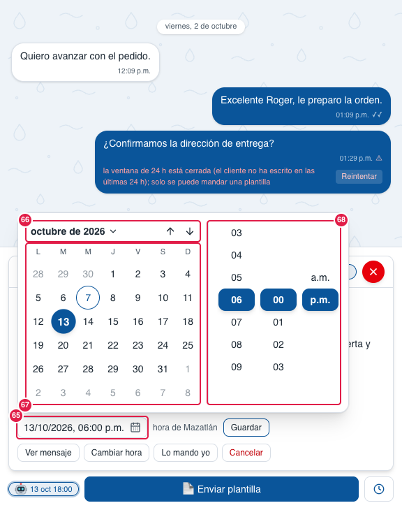

| # | Nombre oficial | Qué hace | Quién lo ve |
|---|---|---|---|
| 1 | **⚡ Mensajes rápidos** | Abre la ventana de mensajes rápidos (27–28) para insertar uno. | Todos |
| 2 | **📄 Plantillas** | Abre las plantillas aprobadas por Meta. No sale en chats de **Instagram** (no tiene plantillas). | Todos |
| 3 | **Escribe un mensaje…** | Caja de texto. Empieza con 2 renglones y **crece sola** desde el 3.º para que se vea todo lo escrito (el historial se acomoda arriba); pasado el 40 % de la pantalla se desliza por dentro, y al enviar vuelve a 2 renglones. **Enter** envía, **Shift+Enter** hace salto de línea, **"/"** busca mensajes rápidos (el texto gris dice "/ busca mensajes rápidos"). **Cmd+V** con una foto o captura de pantalla la adjunta. Al escribir, el **cursor es azul** y las letras nuevas entran con un desvanecido (ver **Cursor al escribir** en el Glosario). | Todos |
| 4 | **🕒 Programar mensaje** | Abre el formulario para programar. Con archivos adjuntos se apaga: programar no lleva archivos por ahora. | Todos |
| 5 | **Enviar** (naranja) | Manda el mensaje. Con archivos, se activa cuando **todos terminaron de subir**; salen uno por mensaje en el orden de la vista previa y el texto va como pie del primero. | Todos |
| 6 | **⚡ Mensajes rápidos** (menú del "/") | Menú que aparece al escribir "/". | Todos |
| 7 | **Automatizaciones** | Comandos de workflows (/tamaños, /banco, /video-estandar, /video-me, /video-mini…) con "▶ ejecutar": manda ese material en el chat **de inmediato** (sin los pasos ⏱ Esperar del workflow). Cuenta como mensaje del vendedor. Se encuentran sin importar acentos ni la ñ ("/taman" encuentra /tamaños). | Todos |
| 8 | **Lista de mensajes rápidos** | Nombre y texto; al elegir uno se pone en lugar del "/". Solo {{vendedor}} se llena solo (con tu nombre); {{nombre}} lo completas tú. | Todos |
| 9 | **↑↓ elegir · Enter insertar · Esc cerrar** | Ayuda de teclas del menú. | Todos |
| 10 | **"/" en la caja** | Lo que escribes después de "/" filtra la lista por nombre y texto, sin importar acentos ni mayúsculas ("cuanta" encuentra "Cuánta agua entra"). | Todos |
| 11 | **Elegir plantilla** | Lista de plantillas que se pueden mandar, por secciones (60), con buscador (58) y vista de lista o cuadrícula (59). Es la misma en 📄, en 🕒 Programar mensaje y en el primer mensaje de Contactos. | Todos |
| 12 | **Plantilla** | Título amigable de las conocidas («Precio sin respuesta», «Faltan medidas», «Lo va a pensar»…, igual para `seg_X` que para `daniel_X`) con el **nombre técnico chico debajo**; las desconocidas muestran su nombre. Idioma y texto con los {{1}} resaltados (1 línea en lista, 3–4 en cuadrícula). Solo salen las aprobadas y que el CRM puede armar. | Todos |
| 13 | **Cerrar** | Cierra la lista de plantillas. | Todos |
| 14 | **← Volver a la lista** | Regresa a elegir otra plantilla. | Todos |
| 15 | **Variable {{1}}** | Hueco a llenar (con un ejemplo). El {{1}} ya viene con el **primer nombre del cliente** (se puede cambiar); si el contacto no tiene nombre, va vacío. En las plantillas de seguimiento **seg_precio, seg_informacion, seg_info_duda, seg_valorar y seg_medidas**, y en las **daniel_precio, daniel_informacion, daniel_info_duda, daniel_valorar, daniel_medidas, daniel_asesor y daniel_objecion**, el {{1}} es **cuándo nos escribió el cliente** («el día de ayer», «anoche», «antier», «el lunes», «la semana pasada»…) y ya viene puesto (se puede cambiar). | Todos |
| 16 | **Vista previa** | Cómo le llegará al cliente. | Todos |
| 17 | **Enviar plantilla** | Manda la plantilla. | Todos |
| 18 | **Fecha y hora (Mazatlán)** | Cuándo sale el mensaje programado (con el calendario del CRM, 65). En **Texto** no deja pasar del cierre de la ventana de 24 h (Instagram: 7 días); al cambiar a Texto, si la hora ya quedaba después, se ajusta sola al último minuto permitido. En **Plantilla**, hasta 60 días. | Todos |
| 19 | **Cancelar si el cliente escribe antes** | Si el cliente escribe antes de esa hora, el programado no sale. | Todos |
| 20 | **Texto / 📄 Plantilla** | Qué se programa. **Texto** dice hasta cuándo vale («Texto · hasta 3:21 p.m.», «Texto · hasta mié 3:21 p.m.»). Si la ventana ya cerró o cierra en menos de 2 min, Texto sale apagado («Texto · ventana cerrada», el motivo al pasar el ratón) y el formulario abre en Plantilla. En **Instagram** solo texto, y solo si a esa hora no habrán pasado 7 días desde el último mensaje del cliente. | Todos |
| 21 | **Mensaje a enviar** | El texto del programado. | Todos |
| 22 | **Programar** | Guarda el programado; aparece al final del chat. | Todos |
| 23 | **✕ Cerrar** | Cierra sin programar. | Todos |
| 24 | **"Pasaron 24 h desde su último mensaje. Solo se puede enviar una plantilla."** | Aviso de ventana cerrada. Si el chat lo abrimos nosotros y el cliente aún no escribe, dice **"El cliente todavía no escribe: mientras no conteste, solo se puede enviar una plantilla (o escríbele gratis desde WhatsApp Web)."** | Todos |
| 25 | **📄 Enviar plantilla** | Único botón para escribir con la ventana cerrada. En **Instagram** no existe: hasta 7 días se sigue escribiendo normal (solo vendedores) y después la caja dice «Pasaron más de 7 días desde el último mensaje del cliente: Instagram no deja escribirle hasta que vuelva a escribir.» | Todos |
| 26 | **🕒 Programar plantilla** | Programa una plantilla para más tarde. | Todos |
| 27 | **⚡ Mensajes rápidos** (ventana del ⚡) | Todos los mensajes rápidos; al elegir uno se agrega al final de lo que llevas escrito (no se manda solo). | Todos |
| 28 | **✕ Cerrar** | Cierra la ventana del ⚡. | Todos |
| 29 | **📎 Adjuntar** | Abre un menú con dos opciones: **Adjunta +** (41) y **Multimedia** (42). Se cierra con Esc o tocando fuera. | Todos |
| 30 | **Capa para soltar** | Aparece al arrastrar archivos sobre el chat (historial y caja); se quita al soltar o al salir. No aparece con la ventana cerrada ni en un canal archivado. | Todos |
| 31 | **Seleccionar** | Abre el selector de archivos, igual que 📎 › Adjunta +. | Todos |
| 32 | **Tipos y límites** | Fotos (.jpg, .jpeg, .png, .heic), videos .mp4 de hasta 16 MB y documentos (.pdf, Word, Excel, PowerPoint, .txt, .xml) de hasta 100 MB. Máximo 10 archivos. | Todos |
| 33 | **Vista previa del archivo** | Un cuadro por archivo, en el orden en que saldrán (con dos o más, cada uno lleva su número naranja). El archivo empieza a subir en cuanto entra; los de **Multimedia** dicen «Biblioteca · peso» y ya están listos (no se suben). | Todos |
| 34 | **Miniatura** | Foto o primer cuadro del video; en documentos, el ícono y el tipo (PDF, DOCX, XML…). | Todos |
| 35 | **Nombre y peso** | Nombre del archivo y cuánto pesa. Una foto HEIC o de más de 5 MB aparece ya como .jpg ("Convirtiendo a JPG…" mientras tanto). | Todos |
| 36 | **Barra de subida** | Avance de la subida ("Subiendo… 18%"); verde = listo. Si el archivo no es válido, en su lugar sale el motivo en rojo. Los de Multimedia no la tienen. | Todos |
| 37 | **✕ Quitar** | Quita ese archivo antes de enviar. | Todos |
| 38 | **Agrega un mensaje (opcional)** | Con archivos, la caja se vuelve el pie del **primer** archivo. Sin texto salen solo los archivos. | Todos |
| 39 | **Contador 0 / 1,024** | Largo del pie; WhatsApp acepta hasta 1,024 caracteres (en rojo si se pasa). | Todos |
| 40 | **Aviso de archivo no aceptado** | "WhatsApp no acepta este archivo desde el CRM (.zip). Mándalo desde el celular o WhatsApp Web." También avisa si pasa de 10 archivos. ✕ lo cierra. | Todos |
| 41 | **Adjunta +** | Abre el selector de archivos de tu equipo (se pueden elegir varios). | Todos |
| 42 | **Multimedia** | Abre las fotos y videos de la [Biblioteca](3.7-automatizacion.md#37-automatización) para mandarlos sin volver a subirlos. | Todos |
| 43 | **Buscar por nombre** | Filtra por el nombre con que está en la Biblioteca, sin importar acentos ni mayúsculas. | Todos |
| 44 | **Todo · Fotos · Videos** | Filtro, con cuántos hay de cada uno. | Todos |
| 45 | **Archivo de Multimedia** | Miniatura (la foto, o el segundo 2 del video: los de instalación empiezan en blanco), nombre y tipo. La miniatura se hace sola al subir el archivo a la Biblioteca; no se descarga nada al abrir Multimedia. Tocarlo lo agrega a la vista previa (33); tocarlo otra vez lo quita. | Todos |
| 46 | **Número de orden** | En qué lugar sale (1, 2, 3…); es el mismo número de la vista previa. El texto de la caja va como pie del 1. | Todos |
| 47 | **Cerrar** | Cierra Multimedia; lo elegido se queda en la vista previa. Al enviar se cierra solo. | Todos |
| 48 | **🤖 Seguimiento** (píldora) | Solo sale cuando el chat tiene un [seguimiento del Agente IA](1-glosario.md#glosario). Va **en el hueco de la barra arriba de ⚡ 📄 📎** (en el celular, al final del renglón de iconos; con la ventana cerrada, junto a "Enviar plantilla") y no agranda la barra. Mide **lo mismo que ⚡ 📄 📎** (nunca más ancha: así la caja para escribir no se encoge con la lista y el Detalle abiertos; 6-oct-2026) y dice solo cuándo sale, hora de Mazatlán (**«🤖 mañana 17:00»**) o «🤖 esperando» tras el último intento. El tipo lo dicen la **carita del robot** (imagen propia, 6-oct-2026) y el color: robot normal azul = sale solo; robot **dormido** ámbar = **suspendido** (Pausar agente puesto a mano: no sale solo hasta «Que salga solo»); robot con **ojos en X** gris = **Cancelado** (se queda así hasta **Reactivar seguimientos**, 63) o rojo = **Se dio de baja** (64). **Cancelado** y el robot dormido gris van **sin palabra**, solo la carita en medio de la píldora (7-oct-2026): lo que pasa lo dicen la carita y su ventana; robot **dormido gris** = no hay nada que seguir por ahora (69); gris punteada = ensayo. Desde el 7-oct-2026 la píldora **siempre está** en todos los chats (antes desaparecía si el cliente contestaba o compraba), y «esperando» se queda mientras el último mensaje sea nuestro aunque ya no queden intentos. El texto completo sale al pasar el ratón; el de la píldora no se puede seleccionar (6-oct-2026). **Escenas del robot** (9-oct-2026): cuando la píldora cambia con el chat abierto juega una animación corta dentro de ella: **disparo** al pasar a Cancelado (Cancelar, 56, o Apagar seguimientos en este chat, 69): sale una pistola por la izquierda, le dispara, el robot hace cortocircuito (chispas y cables que le brincan de la cabeza) y queda con ojos en X; la pistola gira como de vaquero y se regresa por la orilla izquierda hasta que ya no se ve (1.9 s). **Llave inglesa** al Reactivar (63): entra por la orilla derecha y le da dos golpes; el robot se queda «cargando» hasta que el CRM responde y entonces abre los ojos y brinca (se desliza a su lugar cuando llega la hora), o bosteza y se vuelve a dormir si todavía no hay seguimiento (2.2 s o más si el CRM tarda). **Ojos de reloj** al Cambiar hora (53): giran y la hora de antes se va mientras llega la nueva (1.5 s; con el robot dormido no sale). **Despertador** en Que salga solo (55): suena, el robot despierta, lo apaga y la píldora pasa a azul (2 s). **Avioncito de papel** cuando sale un mensaje del seguimiento: cruza la píldora y llega la hora del siguiente o «esperando» (1.8 s; no sale si el mensaje falló ni en ensayo). Arrancan **al presionar el botón** (9-oct-2026: antes tardaban 1–2 s en empezar); si el CRM no deja hacer el cambio (p. ej. una hora fuera de horario), la píldora regresa sola, sin escena, y sale el aviso. Las ve todo el que tenga ese chat abierto, vendedor o admin, lo haya hecho él u otro; al abrir un chat no sale ninguna, y con «reducir movimiento» del sistema queda directo la carita. Al terminar, el robot se queda tal cual, sin parpadeo (10-oct-2026); la llave se va por la orilla derecha, por donde entró. Clic abre su burbuja (49). | Todos |
| 49 | **Seguimiento del Agente IA** (burbuja) | Arriba de la caja, como Mensajes rápidos. Encabezado (6-oct-2026): la carita del robot según el estado (más grande desde el 7-oct-2026, sin agrandar el encabezado), el título y, junto a la ✕, el **estado**: **Programado** (azul), **Suspendido** (ámbar: Pausar agente puesto a mano), **Esperando respuesta** (ya salieron todos los mensajes), **Dormido** (gris: nada que seguir, 69), **Cancelado** (gris) o **Se dio de baja** (rojo); **Ensayo** solo con el interruptor de Opciones en Ensayo. La **✕ roja** (como en el visor de archivos, sin la palabra «Cerrar») o Esc la cierra. Títulos, preguntas y botones no se pueden seleccionar; las respuestas y el mensaje sí (para copiarlos). | Todos |
| 50 | **¿Dónde se quedó el chat? · ¿Qué busca el seguimiento?** | Dos preguntas cortas: lo que quedó abierto (p. ej. «Falta el ancho de la entrada, medido de lado a lado en centímetros.») y lo que debe conseguir el mensaje en este chat (si no hay, el «Qué busca» del caso, 90). Lo escribe el Agente IA en segundo plano. | Todos |
| 51 | **¿Cuándo sale el 2.º mensaje?** | A qué hora sale (Mazatlán: «hoy 20:00», «mañana 10:00», «mar 13 oct, 18:00») y, si es distinta, **su hora** (la del cliente según su lada); «hora puesta a mano» si un vendedor la cambió. Tras el último mensaje dice **¿Y ahora?**: «Ya salieron los 2 mensajes. Si no contesta antes del …, pasa a frío.»; pasado ese plazo, «… y no ha contestado (pasó a frío)». Debajo, un renglón por mensaje que ya salió: «✓ 1.er mensaje: salió hoy 17:15» (en ensayo: «habría salido»; un seguimiento que mandó un vendedor: «lo mandó un vendedor»; ✗ y el motivo si no salió). Desde el 6-oct-2026 ya no dice «Por dónde» ni el nombre de la plantilla: el mensaje exacto se ve con Ver mensaje (52). | Todos |
| 52 | **Ver mensaje** | Muestra el **mensaje exacto** que va a salir. Con la ventana de 24 h abierta, el del Agente IA con el saludo que pone el CRM según la hora del cliente, **sin el nombre** (el del perfil de WhatsApp muchas veces no es el suyo; 6-oct-2026): «Hola, buenas noches, le escribo de parte del equipo de Diluvium. …». Con la ventana cerrada, la plantilla ya llena ({{1}} puesto): la del caso (seg_…) en el 1.º y 2.º intento en cuanto Meta la aprueba (mientras tanto, «Hola, buenas tardes.» o la de respaldo); en el 2.º y 3.er intento, la que mejor encaja con cómo quedó el chat (la elige el Agente IA en segundo plano; nunca una que repita una pregunta ya hecha) o, si ninguna, el saludo. | Todos |
| 53 | **Cambiar hora** | Fecha y hora nuevas (hora de Mazatlán) con el **calendario del CRM** (65) y **Guardar**; vuelve a calcular si a esa hora sale con texto o con plantilla. Si a esa hora el CRM no lo dejaría salir (fuera de 7:00–21:00 del cliente, con plantilla después de las 19:00 de su hora o a menos de 7 días de otra plantilla), **no la guarda** y dice por qué y entre qué horas de Mazatlán elegir (6-oct-2026): así sale justo a la hora elegida. Al guardar, la píldora hace los **ojos de reloj** (48). | Todos |
| 54 | **Lo mando yo** | Abre **WhatsApp Web** con el mensaje ya escrito: gratis y sin ventana de 24 h. Al llegar tu mensaje al CRM, el seguimiento se da por atendido. | Todos |
| 55 | **Que salga solo** | Solo en una **sugerencia** (chat con Pausar agente puesto a mano): deja que ese intento salga solo a su hora; si el cliente contesta, la conversación sigue con el Agente IA. La píldora hace el **despertador** (48). | Todos |
| 56 | **Cancelar** | Pide confirmación y cancela **todo** el seguimiento de ese pendiente y **los seguimientos de ese chat**: la píldora hace la **escena del disparo** (48) y queda «Cancelado» (ojos en X) y ni el Agente IA ni la lectura en segundo plano arman otro ahí (chat de prueba, de proveedor o de alguien que ya compró) hasta **Reactivar seguimientos** (63). | Todos |
| 57 | **Aviso de suspendido** | «No sale solo: el Agente IA está en pausa a mano en este chat. Se le recuerda al vendedor: …» (en su última hora de trabajo antes del intento si cae fuera de turno, según el **Horario de los vendedores** de Agente IA › Seguimientos, 92; de fábrica lunes a viernes 9–18 y sábado 9–13, hora de Mazatlán). | Todos |
| 58 | **Buscar plantilla** | Filtra por título, nombre técnico y texto, sin importar acentos ni mayúsculas («medidas» encuentra «Faltan medidas»). | Todos |
| 59 | **Lista / Cuadrícula** | Íconos en el encabezado de Elegir plantilla: lista (título + 1 línea) o tarjetas (título, idioma y 3–4 líneas; 2 columnas si cabe, 1 en panel angosto). Se recuerda en esta computadora. | Todos |
| 60 | **Secciones de plantillas** | «Saludo de Daniel» (las `daniel_*`), «Seguimiento» (las `seg_*`) y «Otras». Las vacías no salen. | Todos |
| 61 | **Hasta cuándo sale el texto** | Línea arriba de Mensaje a enviar (21): «El texto solo puede salir mientras la ventana de 24 h esté abierta: hasta mié 7 oct, 3:21 p.m. (Mazatlán). Para después, usa una plantilla.» En Instagram, lo mismo con su límite de 7 días. | Todos |
| 62 | **Plantillas a cualquier hora** | Línea arriba de Elegir plantilla en el 🕒: «Las plantillas aprobadas por Meta se pueden mandar a cualquier hora, aunque la ventana esté cerrada.» | Todos |
| 63 | **Reactivar seguimientos** | En la burbuja de una píldora «Cancelado» (con la etiqueta «Cancelado» junto a la ✕): dice quién los canceló y cuándo; al pulsarlo, el último seguimiento vuelve a programarse si el chat no cambió; si cambió, el Agente IA vuelve a leer el chat en un minuto o dos y arma uno nuevo si el último mensaje es nuestro (mientras tanto la píldora dice «dormido»; 7-oct-2026: antes la píldora podía quedarse sin nada). La píldora hace la **llave inglesa** (48) al instante y espera «cargando» la respuesta. Lo pueden hacer vendedores y admins. | Todos |
| 64 | **WhatsApp no entregó el seguimiento** (aviso rojo) | Se abre solo una vez (por computadora) cuando el cliente **se dio de baja de las promociones** de Diluvium (error 131050): el seguimiento ya se canceló y no se le mandan más plantillas; si escribe, se le contesta normal. **Entendido** lo cierra; **Volver a darle seguimiento** quita la marca. | Todos |
| 65 | **Calendario** (campo) | Muestra la fecha y la hora como «13/10/2026, 06:00 p.m.» con un ícono de calendario; al tocarlo se abre el calendario del CRM (66–68) debajo o arriba del campo. Esc o un clic afuera lo cierran (Esc no cierra la ventana de atrás). En el celular abre el selector del teléfono. Igual en todo el CRM (ver [Calendario](1-glosario.md#glosario)). | Todos |
| 66 | **Mes ▾ · ↑ ↓** | El mes y el año; al tocarlo salen los 12 meses para saltar a otro. Las flechas pasan al mes anterior o al siguiente (con los meses abiertos, al año). **Deslizar hacia abajo** sobre los días (un dedo en el Magic Mouse, dos en el trackpad) pasa al mes siguiente y **hacia arriba** al anterior, con el mismo gesto del visor de archivos (los días siguen al dedo y el mes nuevo entra deslizándose). | Todos |
| 67 | **Días** | Lunes primero, con los días del mes de antes y de después en gris. El elegido se pinta en círculo azul; hoy lleva un aro; los días que no se pueden elegir (antes de hoy en 🕒 Programar, por ejemplo) salen apagados. | Todos |
| 68 | **Hora · minutos · a.m./p.m.** | Ruedas como las del iPhone (7-oct-2026): una **banda azul fija** en medio y la lista gira debajo; la hora y los minutos **no tienen fin** (después de 11 viene 12 y después de 59, 00). Lo que queda en la banda al soltar es lo elegido; tocar una opción la lleva a la banda. Arriba y abajo se desvanecen. El cambio se ve al momento en el campo (65). En Agente IA › Seguimientos los minutos van de 5 en 5. | Todos |
| 69 | **¿Por qué no hay seguimiento?** (píldora dormida) | La razón: «El cliente escribió al último…», «Contestó el seguimiento…», «Ya compró», «No seguir: …», «El caso … está apagado», «El Agente IA lee el chat en unos minutos…», «Los chats de Instagram no llevan seguimientos del Agente IA» o Agente IA apagado en el canal. **Apagar seguimientos en este chat** (con confirmación) lo deja en «Cancelado» hasta Reactivar (63), con la escena del disparo (48). | Todos |

**Lo cambias tú desde la pantalla:** qué mensajes rápidos y plantillas existen (en [Mensajes rápidos](3.4-mensajes-rapidos.md#34-mensajes-rápidos))
y qué comandos hay (en [Automatización](3.7-automatizacion.md#37-automatización)).

**Pídeselo a Code:**
- "En Bandeja › Caja para escribir › (3), que Enter haga salto de línea y Ctrl+Enter envíe."
- "En Bandeja › Caja para escribir › (19), que la casilla venga desmarcada."
- "En Bandeja › Caja para escribir › (44), agrega el filtro «Recientes»."
- "En Bandeja › Caja para escribir › (48), que la píldora diga también el caso («Medidas · 18:00»)."

**Agente IA aquí:** no usa esta caja. Lo que escribe **o adjunta** un vendedor aquí cuenta como su respuesta (y como
primera respuesta) y pausa al agente en ese chat si así está en Opciones. El **seguimiento** (48–57) lo calcula el
Agente IA en segundo plano, en la misma lectura con la que llena el Detalle (sin gasto extra de IA); un mensaje nuevo
en el chat lo cancela o lo rehace.

Para Code: `composer.tsx`, `snippet-picker.tsx`, `template-picker.tsx` (secciones y títulos `lib/templates/labels.ts`), `schedule-form.tsx` (límite del texto `lib/scheduled/rules.ts` `textMaxLocal`/`canScheduleText`, formato `lib/scheduled/deadline-format.ts`), `archived-composer.tsx`; comandos `lib/actions/workflows.ts` (`runWorkflowCommand`); adjuntos `chat-drop-zone.tsx`, `attachment-tray.tsx`, `use-chat-attachments.ts`, reglas `lib/chat-attachments/rules.ts` (XML: `XML_COMO_TEXTO`), subida `app/api/inbox/adjuntos`, envío `lib/inbox/attachment-actions.ts` + `worker/chat-uploads.ts`; menú del 📎 `attach-menu.tsx`, Multimedia `multimedia-picker.tsx` + `lib/chat-attachments/multimedia.ts` (id por envío: `multimediaMessageId` en `keys.ts`); lista en memoria y miniaturas `use-multimedia-assets.ts` + `lib/media-library/make-thumbnail.ts` (columna `media_assets.thumbnail`, 0052); calendario (65–68) `components/ui/date-time-picker.tsx` + cuentas en `lib/dates/picker.ts`; seguimiento (48–57, 63, 69) `followup-pill.tsx` (estado siempre: `loadFollowUpState` en `lib/followups/view.ts`), `lib/actions/seguimientos.ts`, `lib/followups/` (tabla de casos `cases.ts` = fábrica y lo fijo, tabla editable de la organización `tabla.ts` + `tabla-store.ts` (0062), aviso de Cambiar hora `sendTimeProblem` en `schedule.ts` + `sendTimeMessage` en `view.ts`, horas `schedule.ts`, zona por lada `timezone.ts`, ficha `ficha.ts`, revisión del borrador `borrador-check.ts`, seguimientos del vendedor `vendor-attempts.ts`, cancelar al pasar a Compra `sale.ts`, base `store.ts` + `view.ts`, tabla `follow_ups` de la 0056 + 0057), ficha en el lector `lib/ai/runtime/lector-core.ts`.
