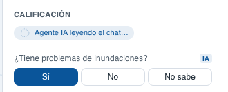
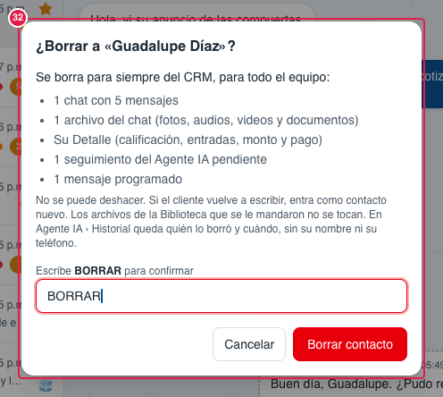

> Parte del [Mapa del CRM](../mapa-crm.md) (índice con todas las secciones). Las capturas están en esta misma carpeta.

#### 3.2.3 Detalle del contacto

La ficha del cliente. Es **la misma** a la derecha de la Bandeja y en el pop-up del Embudo. Se guarda sola al
salir de cada campo: junto al título aparece **"Guardando…"** y luego **"Guardado ✓"** (no hay botón Guardar).
Ningún dato es definitivo: el agente corrige lo que el cliente aclare después.

| # | Nombre oficial | Qué hace | Quién lo ve |
|---|---|---|---|
| 1 | **Nombre y teléfono** | Datos del contacto. Un cliente de **Instagram** muestra su **@usuario · Instagram** en lugar del teléfono. | Todos |
| 2 | **Etapa** | Cambiarla aquí la mueve también en el Embudo. La que pone un vendedor manda; el agente solo avanza, también en segundo plano. | Todos |
| 3 | **Marca "IA"** | Ese dato lo escribió el agente al último. Si lo editas, se quita. Cuando lo acaba de llenar dice "IA actualizando" y el campo brilla. | Todos |
| 4 | **Temperatura** | En la **Bandeja**: 🔥 Caliente, 🧊 Frío, ⏳ En espera o Sin asignar (Destacado es la estrella de la lista). En el **pop-up del Embudo** el mismo campo es un menú de dos partes: arriba la temperatura (una) y, abajo de la línea, **⭐ Destacado** (se prende o apaga aparte); el campo muestra las dos, p. ej. «🔥 Caliente ⭐». | Todos |
| 5 | **Calificación** | Sección con las preguntas de la venta. | Todos |
| 6 | **¿Tiene problemas de inundaciones?** | Sí · No · No sabe. | Todos |
| 7 | **¿Cuánta agua entra?** | Centímetros y una descripción opcional. | Todos |
| 8 | **¿Cuántas entradas?** | Número de entradas. Si lo bajas, pide confirmación porque borra anchos. | Todos |
| 9 | **Ancho de la entrada (cm)** | Una fila por entrada. Siempre en **centímetros**, con «cm» a la vista (como el agua, 7). El Agente IA convierte lo que dijo el cliente: 1.75 m → 175 cm, pulgadas × 2.54; un número sin unidad de 10 o más ya son centímetros (230 = 230 cm, nunca metros). | Todos |
| 10 | **Línea** | Mini o Estándar. | Todos |
| 11 | **Tamaño sugerido** | Lo calcula el CRM con [Tallas y medidas](3.6-agente-ia.md#36-agente-ia). | Todos |
| 12 | **Manual** | Tamaño escrito a mano; manda sobre el sugerido. | Todos |
| 13 | **Monto de cotización (MXN)** | Total de lo que el cliente **eligió comprar al final** (si se le cotizaron 2 y eligió 1, es el total de 1). Lo deja al día el Agente IA en segundo plano; puede cambiar aun después de la compra. A la derecha, (27). | Todos |
| 14 | **% de convencimiento** | Barra de qué tan cerca está de comprar. Solo lo decide el agente (no se edita). | Todos |
| 15 | **Llegó por anuncio** | El anuncio que lo trajo (enlace), el resumen que hizo el agente y "También volvió por…". | Todos |
| 16 | **Agente IA (estado)** | 🟢 Activo · 🟠 Pausado · vuelve… · o "Apagado en «canal»". Pausado o apagado solo deja de contestar: el Detalle se sigue llenando en segundo plano (28). | Todos |
| 17 | **Pausar agente** | Abre el menú de pausa (24). | Todos |
| 18–21 | *(Comentarios: se quitaron el 6-oct-2026)* | Ningún vendedor los veía. El Agente IA ya no escribe comentarios; los guardados siguen en la base, pero no se muestran. | — |
| 22 | **Correo** | Dato compacto al final. Las **etiquetas** de GHL ya no se muestran (7-oct-2026, decisión del dueño): siguen guardadas y vuelven con las difusiones (v2). | Todos |
| 23 | **Ocultar panel** | Esconde el Detalle. | Todos |
| 24 | **Pausar el agente en este chat** | 8 horas · 12 horas · 24 horas · Hasta una fecha y hora… · Pausar indefinidamente. | Todos |
| 25 | **🤖 Pausado · vuelve hoy 22:30** | Estado cuando está en pausa (o "Pausado indefinidamente"). | Todos |
| 26 | **Activar** | Regresa al agente a ese chat. Contesta a partir del siguiente mensaje del cliente. Queda en Agente IA › Historial con quién lo hizo (igual que Pausar agente). | Todos |
| 27 | **Pago total (MXN)** | Lo que el cliente **ya pagó** (anticipo + resto, o el pago completo), junto al monto (13): así se ve quién cotizó mucho y no compró. Lo llena el Agente IA en segundo plano con los comprobantes y los pagos confirmados en el chat; se corrige a mano. | Todos |
| 28 | **Agente IA en segundo plano** (bajo Calificación) | Qué está haciendo el Agente IA con el Detalle, en vivo: «⏳ Agente IA leerá el chat en ~3 min» (llegó algo nuevo y espera a que el chat se calme), «Agente IA leyendo el chat…» (lo está leyendo ahora; segunda captura), «Agente IA actualizó 2 datos» (unos segundos, mientras brillan los campos) y «✓ Al día · leído 10:42». Si una lectura falla: «No pudo leer el chat · se reintenta solo». Sale aunque el Agente IA esté apagado o pausado; nunca le escribe al cliente. Si nunca ha leído ese chat, no se muestra. | Todos |
| 29 | **Datos personales** | Sección al final del Detalle (7-oct-2026) para los derechos del cliente sobre sus datos (ARCO): sacarle una copia de todo lo suyo o borrarlo. | Todos |
| 30 | **Exportar datos** | Descarga `contacto-<nombre>-<fecha>.zip` con **datos.json** (contacto, origen y anuncio, etapa, temperatura, Detalle con sus entradas, fechas y cada mensaje con fecha en hora de Mazatlán, quién habló —Cliente, Vendedor o Agente IA—, texto, transcripción y nombre de los archivos), **chat.txt** para leer («[2026-10-03 10:12] Cliente: …») y la carpeta **archivos/** solo con lo que **mandó el cliente** (lo que mandó Diluvium va solo por su nombre). Si los archivos del cliente pasan de 200 MB, lo dice y ofrece **Descargar sin archivos**. | Todos |
| 31 | **Borrar contacto** (rojo) | Abre la ventana de confirmación (32). | Todos |
| 32 | **Ventana «¿Borrar a …?»** | Dice qué se borra para siempre, para todo el equipo: los chats con cuántos mensajes, los archivos del chat, el Detalle, los seguimientos del Agente IA y los mensajes programados pendientes; pide escribir **BORRAR**. Al confirmar, el contacto desaparece de la Bandeja y del Embudo sin recargar (también en las pantallas de los demás) y queda una fila en Agente IA › Historial (tipo «Contactos borrados») con quién y cuándo, sin su nombre y solo con los últimos 4 dígitos del teléfono. Los archivos de la Biblioteca que se le mandaron no se tocan y el gasto de IA del Dashboard se conserva. Si algún archivo no se pudo borrar del almacenamiento, lo dice («quedaron N archivos») con **Reintentar**. No se puede deshacer; si el cliente vuelve a escribir, entra como contacto nuevo. | Todos |

**Lo cambias tú desde la pantalla:** todos los campos menos el % de convencimiento; pausar y activar al agente;
exportar los datos del contacto o borrarlo (29–32).

**Pídeselo a Code:**
- "En Bandeja › Detalle › (27) pago total, separa anticipo y liquidación."
- "En Bandeja › Detalle › (24) menú de pausa, agrega la opción «2 horas»."
- "En Bandeja › Detalle › (30) Exportar datos, agrega también los comentarios internos al zip."
- "En Bandeja › Detalle › (22) vuelve a mostrar las etiquetas" (cuando haya difusiones, v2).
- "En Bandeja › Detalle › (14) % de convencimiento, déjame corregirlo a mano."

**Agente IA aquí:** llena y corrige los campos con lo que dice el cliente (marca "IA"), decide el % de
convencimiento, avanza la etapa y resume el anuncio en (15).
Lo hace **siempre en segundo plano**, aunque esté apagado o pausado en el chat: unos 3 minutos después de que
el chat se calma lee todo en orden y deja al día etapa, datos, monto (13) y pago (27); lo que está haciendo se ve
en vivo en (28). Nunca le escribe al
cliente. Solo avanza la etapa, y la que puso un vendedor a mano la respeta (solo la avanza por algo que pase
en el chat después).

Para Code: `app/(app)/contactos/_components/contact-details.tsx` (+ `contact-entradas`, `contact-comments`, `convencimiento-picker`, `ia-mark`, `agent-contact-switch`), `dashboard/_components/bot-off-menu.tsx`; datos `lib/contacts/qualification.ts`, `lib/actions/contact-qualification.ts` (sin `tags` desde el 7-oct-2026; `contacts.tags` sigue en la base). Datos personales (29–32, ARCO): `contact-arco-section.tsx` + `delete-contact-dialog.tsx` (portal, Esc solo la cierra) + `deleting-contacts.ts` (la Bandeja y el Embudo no la quitan mientras muestra su resultado); acciones `lib/actions/contact-arco.ts` (`getContactArcoSummary`, `deleteContact`, `retryContactFilesDeletion`); borrar `lib/contacts/arco/delete.ts` (llaves propias `keys.ts`, nunca `library/`; bucket después del commit `delete-files.ts`; reintento firmado `pending-files-token.ts`; aviso `contact.deleted` en `lib/contacts/notify-updated.ts`; Historial kind `contacto_borrado`); exportar = ruta GET `app/api/contactos/[contactId]/exportar/route.ts` (`export-data.ts`, `chat-txt.ts`, `export-files.ts` con tope de 200 MB, zip en streaming `zip-stream.ts` con fflate). Detalle en `docs/bandeja.md` › Borrar y exportar un contacto (ARCO).
