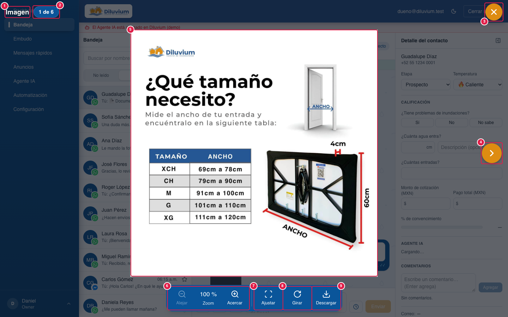
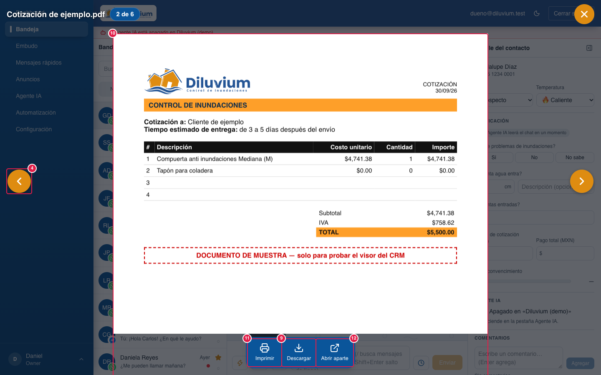

> Parte del [Mapa del CRM](../mapa-crm.md) (índice con todas las secciones). Las capturas están en esta misma carpeta.

#### 3.2.5 Visor de archivos

Lo que se abre encima al dar clic en una **foto, sticker, PDF o documento** del chat (Bandeja y pop-up del Embudo).
Recorre **todos los archivos de ese chat**, del más viejo al más nuevo; las notas de voz y los videos no entran
porque se reproducen en la burbuja. Detrás se sigue viendo el CRM, oscurecido al 65 %. Elegido por el dueño
probando opciones el 30-sep/1-oct-2026 (opción B). **En el celular** sigue el visor de siempre (✕ roja, ver
[Versión móvil](3.10-version-movil.md#310-versión-móvil-celular), punto 10).

| # | Nombre oficial | Qué hace | Quién lo ve |
|---|---|---|---|
| 1 | **Nombre del archivo** | Arriba a la izquierda, en grande. Las fotos de WhatsApp no traen nombre: dice «Imagen» (o «Sticker»). | Todos |
| 2 | **«1 de 6»** | Píldora azul: qué archivo es de cuántos tiene el chat. | Todos |
| 3 | **✕ Cerrar** | Círculo naranja arriba a la derecha; se pone **rojo** al pasar el mouse. También cierra **Esc** (en el pop-up del Embudo, Esc cierra solo el visor). | Todos |
| 4 | **‹ › Anterior / Siguiente** | Flechas naranjas a los lados (se adelantan hacia su lado al pasar el mouse); también las teclas **← →**. No salen en el primero/último. | Todos |
| 5 | **Lupa** (foto) | Al pasar el mouse por la foto el cursor es una lupa: **un clic = 200 %** hacia donde se hizo clic; otro clic regresa a 100 %. La **rueda del mouse nunca hace zoom**: en 200 % sube, baja y va a los lados; también se puede arrastrar la foto. Siempre se llega a las cuatro orillas. | Todos |
| 6 | **Alejar · Zoom · Acercar** (foto) | En la barra azul de abajo: 100 → 150 → 200 → 300 → 400 → 500 %, y el porcentaje en medio. | Todos |
| 7 | **Ajustar** (foto) | Regresa la foto a como se abrió: completa y centrada al 100 %. | Todos |
| 8 | **Girar** (foto) | Un cuarto de vuelta a la derecha. | Todos |
| 9 | **Descargar** | Baja el archivo original. Si la foto se **giró**, baja **tal como se ve** (mismo nombre y formato, tamaño original). | Todos |
| 10 | **Hojas del PDF** | El PDF lo dibuja el CRM (ya no el visor de Chrome), una página debajo de otra: las verticales (cotizaciones) a lo ancho; las cuadradas o acostadas, completas. Se baja con la rueda, con dos dedos o arrastrando con un dedo hacia arriba. | Todos |
| 11 | **Imprimir** (PDF) | Manda **cada página completa, una por hoja**, a su tamaño real (antes salía recortado). Mientras la prepara dice «Preparando…». | Todos |
| 12 | **Abrir aparte** (PDF) | Abre el PDF original en otra pestaña con el visor completo de Chrome (seleccionar texto, buscar, girar). | Todos |
| 13 | **Deslizar** (sin marca: es un gesto) | **Un dedo a los lados en el Magic Mouse** (o clic, arrastrar y soltar) cambia al archivo anterior/siguiente en **todos** los archivos, también encima de la hoja del PDF; uno por gesto y el archivo sigue al dedo. En el primero/último **cede 40 px y regresa**. Dos dedos no cambian de archivo (es de la Mac). Con el visor abierto, el gesto no hace «Atrás» en Chrome. | Todos |
| 14 | **Archivo que no se puede ver** | XML u otro archivo que no es foto ni PDF **verificado** (Glosario): recuadro con **Descargar …**. | Todos |

**Lo cambias tú desde la pantalla:** nada; solo ver, girar, imprimir y descargar.

**Pídeselo a Code:**
- "En Visor de archivos › (5) Lupa, que el clic acerque a 300 %."
- "En Visor de archivos › (13) Deslizar, que cueste un poco más cambiar de archivo."

**Agente IA aquí:** no interviene.

Para Code: `media-viewer.tsx` (escritorio o móvil, se decide al abrir), `media-viewer-desktop.tsx`, `viewer-toolbar.tsx`, `viewer-pdf-stage.tsx` + `viewer-pdf-document.ts` (pdf.js, worker propio), `viewer-print.ts` (#visor-impresion en `app/globals.css`), `viewer-rotated-download.ts`, `media-viewer-mobile.tsx` (el de siempre); lógica pura en `lib/inbox/viewer.ts`; `/api/media/{id}/{i}?bytes=1` entrega fotos y PDF verificados desde el mismo dominio (pdf.js, imprimir y la foto girada).
