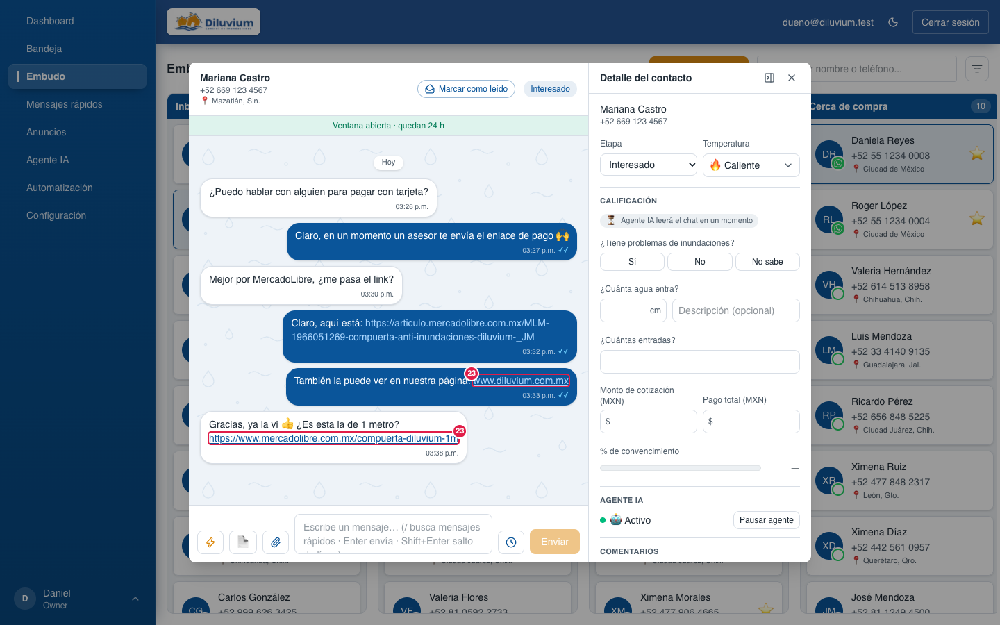
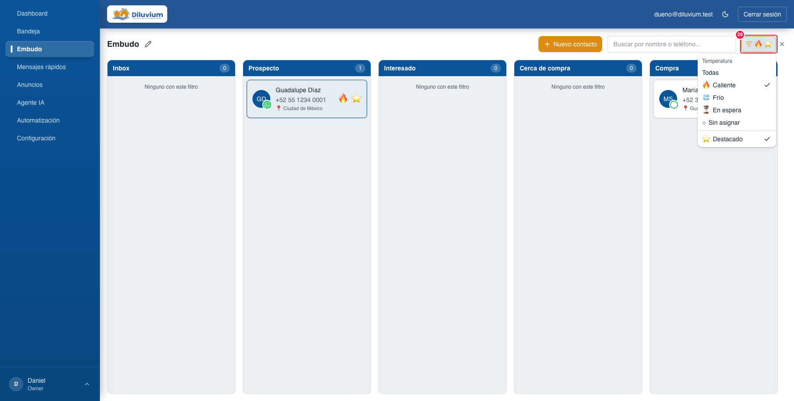
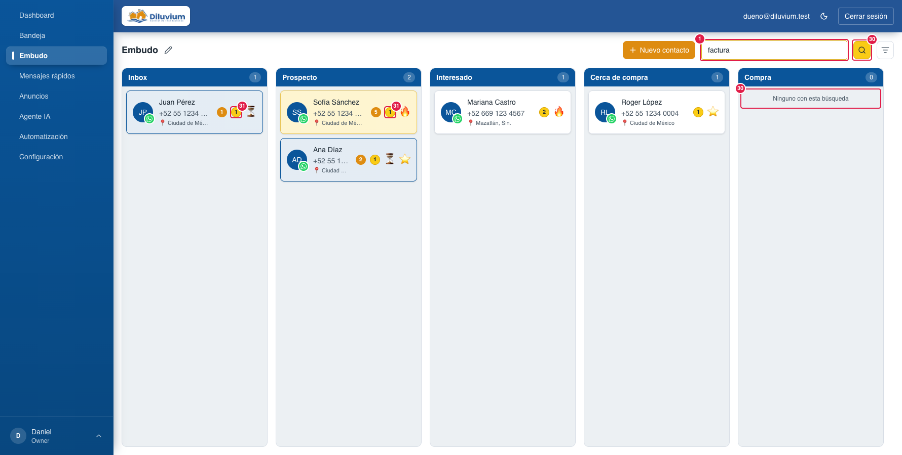
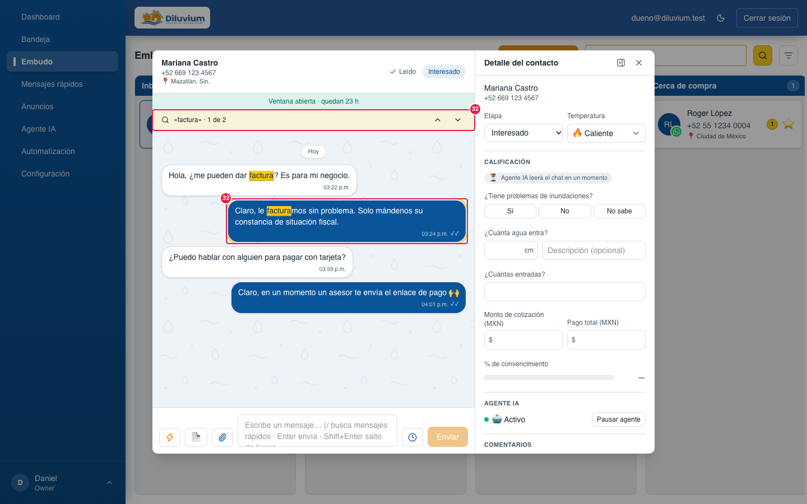
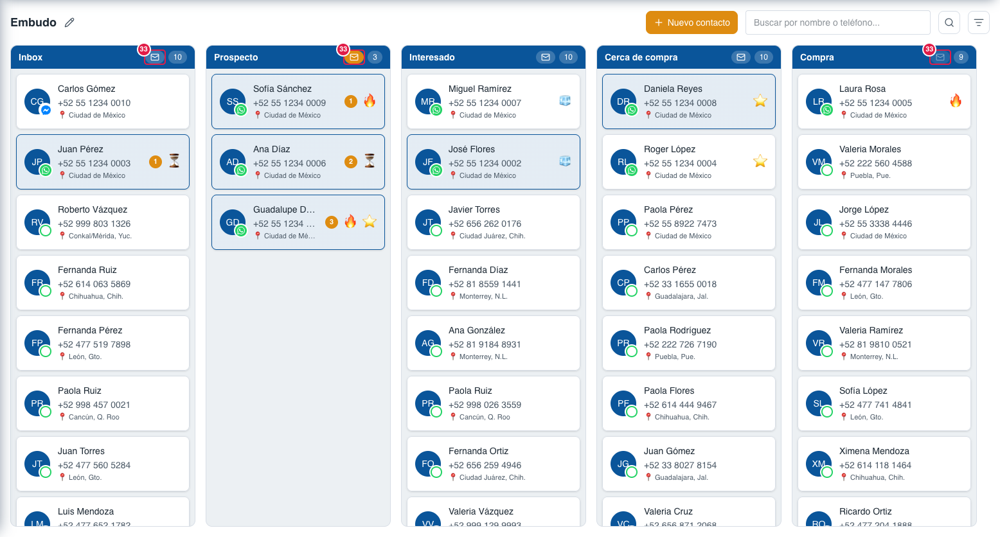
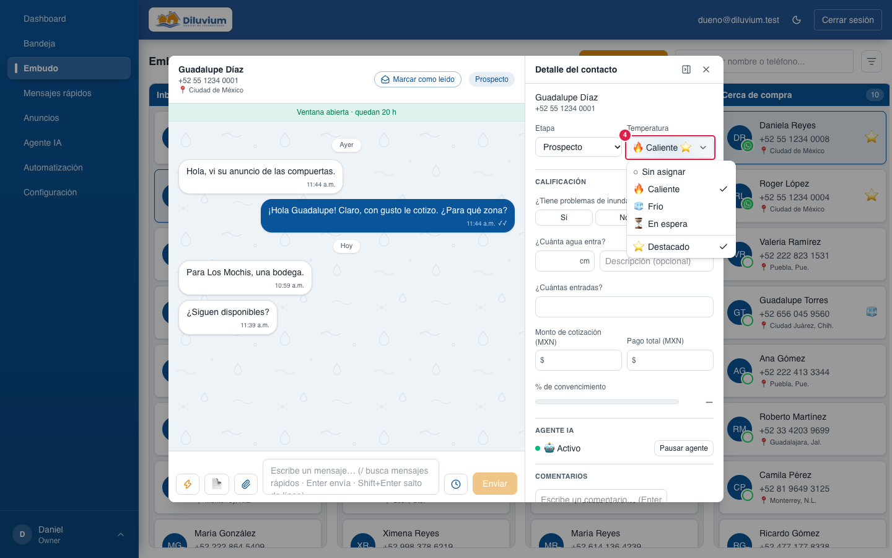

> Parte del [Mapa del CRM](../mapa-crm.md) (índice con todas las secciones). Las capturas están en esta misma carpeta.

### 3.3 Embudo

El tablero con una columna por etapa. Cada tarjeta es un contacto. Arrastrar una tarjeta a otra columna le cambia
la etapa. Todo se actualiza solo, sin recargar. Las columnas se editan con el **lápiz (17)** junto al título
(desde el 27-sep-2026: renombrar, agregar, borrar, reordenar).

Pop-up del contacto (clic en una tarjeta): el mismo chat y el mismo Detalle de la Bandeja, sin salir del tablero.
Abrirlo quita el círculo naranja (6); el azul (4) se quita al contestar o con **Marcar como leído (19)**.

Links en el chat del pop-up: salen azules y subrayados, igual que en la Bandeja (el 23 es el de Bandeja › Chat).

Clic derecho sobre una tarjeta: menú de ese contacto (16).

Filtro (29) abierto con 🔥 y ⭐ Destacado: cada columna deja solo las tarjetas calientes y destacadas, y las vacías dicen
«Ninguno con este filtro».

Lupa (30) prendida con «factura»: cada columna deja solo las tarjetas cuyo chat tiene la palabra, con el círculo amarillo
(31) junto al naranja; la tarjeta amarilla de Sofía muestra que el círculo (sólido, con borde) no se confunde con su fondo.
La columna sin coincidencias dice «Ninguno con esta búsqueda».

Pop-up abierto desde esa tarjeta con la lupa prendida (32): la palabra resaltada y la barra «1 de 2».

**No leído (33)** (desde el 30-sep-2026): el sobre junto al contador de cada columna. Prendido en Prospecto (naranja):
quedan solo las tarjetas pendientes —círculo naranja, azul o amarilla— y el contador dice cuántas (3). Inbox lo tiene
apagado (blanco: sí tiene pendientes) y Compra tenue (no tiene ninguna).

Temperatura en el pop-up (Detalle › 4): arriba la temperatura, abajo de la línea ⭐ Destacado, cada una por su lado.

**＋ Nuevo contacto (20)** (desde el 28-sep-2026): alta a mano, como la pestaña Contactos de GHL. Al crearlo se abre su
pop-up. Un contacto **sin chat** (nuevo o importado de GHL) muestra cómo escribirle primero (24–26): gratis desde
WhatsApp Web, o con una plantilla desde el CRM.

| # | Nombre oficial | Qué hace | Quién lo ve |
|---|---|---|---|
| 1 | **Buscar por nombre o teléfono...** | Filtra las tarjetas de todas las columnas (también por **@usuario** de Instagram; la tarjeta de un cliente de Instagram lo muestra en lugar del teléfono). Con la lupa (30) prendida dice **«Buscar en los chats…»** y busca dentro de los mensajes. | Todos |
| 2 | **Columna de etapa** | Nombre de la etapa, el sobre **No leído** (33) y cuántos contactos tiene (con un filtro, cuántos quedan). Arriba va el de actividad más reciente: el último que **escribió** (sube solo, al momento) o el último que **entró** a la etapa. Un mensaje nuestro no lo mueve. | Todos |
| 3 | **Tarjeta amarilla** | El agente necesita al vendedor (pidió un asesor, depósito recibido, error, parece un contestador automático, no le escribió nada al cliente, solo iba a repetir una pregunta…) y ningún vendedor ha contestado después. También se quita con **Quitar tarjeta** (clic derecho, 16) si el aviso ya no importa; vuelve si el agente manda un aviso nuevo. | Todos |
| 4 | **Tarjeta azul** | El cliente escribió y nadie le ha contestado. Se quita cuando sale una respuesta (vendedor desde el CRM o el celular, o el agente) o con **Marcar como leído** / **Quitar tarjeta** (19 o el clic derecho, 16); abrir el chat **no** la quita. Vuelve con el siguiente mensaje del cliente. Si también aplica amarilla, gana la amarilla. | Todos |
| 5 | **Tarjeta blanca** | Nada pendiente. Al pasar el mouse se ilumina en gris (el azul es solo para 4). | Todos |
| 6 | **Círculo naranja** | Mensajes sin ver. Se quita al abrir el chat o con Marcar como leído. | Todos |
| 7 | **Temperatura** y **⭐ Destacado** | La temperatura del contacto y, al lado y del mismo tamaño, ⭐ si es Destacado (la estrella de la Bandeja). Pueden ir juntas: 🔥 ⭐. | Todos |
| 8 | **Ciudad por lada** | 📍 Ciudad calculada por la lada del teléfono. | Todos |
| 9 | **PRUEBA** | Contacto del número de prueba. Hoy ninguno la lleva: se quitó el 28-sep-2026 al borrar los chats de prueba (la captura muestra uno de ejemplo). | Todos |
| 10 | **Columna Compra** | Los que ya compraron: anticipo o pago total que un **vendedor** confirmó en el chat (cuenta en Anuncios › Compraron). Es la columna con el papel «Venta cerrada» (70): si el papel pasa a otra, cuenta esa. | Todos |
| 11 | **Chat** (pop-up) | El mismo chat de la Bandeja, con su caja para escribir. | Todos |
| 12 | **Detalle del contacto** (pop-up) | El mismo Detalle de la Bandeja. | Todos |
| 13 | **Ocultar detalle del contacto** | Esconde el Detalle en el pop-up; se recuerda en esa computadora. | Todos |
| 14 | **✕ Cerrar** | Cierra el pop-up (también con Esc). | Todos |
| 15 | **Fondo oscuro** | Clic afuera del pop-up también lo cierra. | Todos |
| 17 | **✎ Editar columnas** (lápiz junto a «Embudo») | Abre el editor de columnas (18). | Todos |
| 18 | **Columnas del Embudo** (pop-up) | El mismo editor de Agente IA › Etapas (62–71): nombre, orden, papel, modelo y regla del Agente IA de cada columna. Todo cambio pide confirmar; las demás pantallas abiertas lo ven al momento. | Todos |
| 16 | **Menú del clic derecho** | Sobre una tarjeta: **Marcar como leído** si tiene círculo naranja (6) o está azul (4): quita los dos en todos sus chats, igual que (19). Si no, **Marcar como no leído**: pone el círculo en su chat más reciente y, si el último mensaje es del cliente, regresa el azul. Lo mismo que en la Bandeja y se ve en las dos. No quita el amarillo. Abajo, solo en tarjetas azules (4) o amarillas (3): **Quitar tarjeta** la deja blanca en todos sus chats (no quita el círculo naranja ni cambia nada del agente); vuelve a pintarse si el cliente escribe otra vez o el agente manda un aviso nuevo. Solo en el Embudo y para todo el equipo. En celular no hay pulsación larga: ahí es arrastrar. | Todos |
| 19 | **Marcar como leído** (pop-up) | A la derecha del nombre y el teléfono del chat. Quita el azul (4) y el círculo (6) aunque nadie le haya contestado al cliente (p. ej. solo dijo «gracias»); la tarjeta queda blanca. Sin nada que quitar dice **✓ Leído**. No quita el amarillo. Solo en el Embudo. | Todos |
| 20 | **＋ Nuevo contacto** | Abre el alta (21–23). | Todos |
| 21 | **Nuevo contacto** (pop-up) | **Nombre** y **Teléfono (WhatsApp)** obligatorios; Apellido, Correo y **Etapa** (de fábrica, la de entrada). El teléfono se escribe como sea: 10 dígitos = México; de otro país, con + y la lada. Sin zona horaria: la ciudad sale de la lada (8). No cuenta en Dashboard › Conversaciones nuevas. | Todos |
| 22 | **"Ese teléfono ya es del contacto «…»"** · **Abrir «…»** | El número ya existe (también si se guardó como +521): no se duplica; abre ese contacto. | Todos |
| 23 | **Crear contacto** | Lo crea arriba de su columna y abre su pop-up (24). | Todos |
| 24 | **"Este contacto aún no tiene chat"** (pop-up) | Sale en vez del chat cuando el contacto nunca ha escrito (nuevo o importado de GHL). | Todos |
| 25 | **Escribir desde WhatsApp Web** (**Gratis**) | Mensaje opcional + **Abrir en WhatsApp Web** (o **en el celular**): abre su chat con el texto ya escrito y tú das Enviar. Sin plantilla ni límite de 24 h. Lo mandado llega solo al CRM y crea el chat. Debe estar abierto WhatsApp Web con el número de Diluvium. | Todos |
| 26 | **📄 Enviar plantilla desde el CRM** (**Con costo**) | **Elegir plantilla** → **Enviar plantilla**: abre el chat por WhatsApp con una plantilla aprobada (Marketing ≈ $0.73). Después, en el CRM solo se puede mandar otra plantilla hasta que el cliente conteste (Bandeja › 24). | Todos |
| 27 | **"Este número también está en el contacto «…»"** · **Abrir ese contacto** | Hay otro contacto (más antiguo) con ese número: el chat quedaría en ese, así que se manda desde ahí. | Todos |
| 28 | **Aviso de Meta** (pop-up grande) | Si WhatsApp (Meta) rechaza la plantilla: título, **Por qué pasó**, **Qué hacer** y **Entendido** (el mismo de Mensajes rápidos › 31). | Todos |
| 29 | **Filtro** (ícono a la derecha del buscador) | Menú corto: **Temperatura** (Todas · 🔥 · 🧊 · ⏳ · ○ Sin asignar, una a la vez) y, aparte, **⭐ Destacado** (la marca del contacto). Se pueden combinar (🔥 + Destacado) y se suman a la búsqueda. Con algo elegido el ícono se pinta naranja y muestra los emojis; la **×** lo quita. **Las columnas no cambian:** mismas etapas, orden, colores y arrastre; solo quedan las tarjetas que cumplen, cada columna cuenta las suyas y la vacía dice «Ninguno con este filtro». Una tarjeta que deja de cumplir (p. ej. le cambias la temperatura en el pop-up) se va del tablero. No se recuerda al recargar. Desde el 28-sep-2026. | Todos |
| 30 | **Lupa: buscar en los chats** (entre el buscador y el filtro) | La misma de la Bandeja (26): prendida y amarilla, el buscador (1) busca una palabra **dentro de los chats** de todos los contactos, desde 3 letras. **Las columnas no cambian:** solo quedan las tarjetas cuyo chat tiene la palabra (cada columna cuenta las suyas; la vacía dice «Ninguno con esta búsqueda») y se suma al filtro (29). Mientras busca, junto al título dice «Buscando en los chats…». No se recuerda al recargar. Apagada en la primera captura; prendida en la de la lupa. Desde el 29-sep-2026. | Todos |
| 31 | **Círculo amarillo** (tarjeta) | Con la lupa (30): en cuántos mensajes de sus chats aparece la palabra, junto al círculo naranja (6). Es amarillo **sólido con borde**, distinto del fondo claro de la tarjeta amarilla (3). En la captura de la lupa. | Todos |
| 32 | **Palabra resaltada y «1 de N»** (pop-up) | Al abrir la tarjeta con la lupa prendida, el chat del pop-up resalta la palabra en amarillo, salta a la coincidencia más reciente y la recorre con ↑ ↓, igual que la Bandeja (28). En la captura del pop-up con la lupa. | Todos |
| 33 | **No leído** (sobre junto al contador) | Píldora del mismo alto que el contador, solo con el sobre. Prendida (**naranja**) esa columna deja solo las tarjetas con algo pendiente: círculo naranja (6), azul (4) o amarilla (3); el contador cuenta solo esas y la vacía dice «Nada sin leer ni sin contestar». Cada columna va por su lado (se pueden prender varias). **Blanca** = apagada y la columna tiene pendientes; **tenue** = apagada y no tiene ninguno. En vivo: una tarjeta que se vuelve pendiente aparece sola; la que abres se queda mientras el pop-up está abierto aunque la leas, y se va al cerrarlo. Se suma al buscador (1), la lupa (30) y el filtro (29). No se recuerda al recargar. Desde el 30-sep-2026. | Todos |

**Lo cambias tú desde la pantalla:** contactos nuevos (20) y el primer mensaje a quien no tiene chat (25–26), la etapa (arrastrando la tarjeta), leído / no leído (clic derecho o **Marcar como leído**, 19), quitar el color de la tarjeta (clic derecho › **Quitar tarjeta**), las
columnas (lápiz, 17) y todo lo del chat y el Detalle en el pop-up. Los cambios a las columnas (crear, renombrar, borrar,
ordenar, papel, modelo) quedan en **Agente IA › Historial**.

**Pídeselo a Code:**
- "En Embudo › (2) columna, agrega el total en pesos de las cotizaciones de esa etapa."
- "En Embudo › (5) tarjeta, muestra cuánto tiempo lleva en esa etapa."
- "En Embudo › (18) columnas, que la columna nueva nazca con el Modelo 1."

**Agente IA aquí:** mueve tarjetas hacia adelante (sale el aviso emergente), también en segundo plano con el agente
apagado o pausado; pinta la tarjeta de amarillo cuando necesita al vendedor, y su chat y Detalle se ven igual que en
la Bandeja (con el indicador de lo que está leyendo, Detalle › 28).

Para Code: ruta `/embudo` (`/contactos` redirige); `app/(app)/contactos/_components/` (`contacts-board`, `contact-card`, `contact-detail-panel`, `contact-chat`); colores `lib/contacts/funnel-signals.ts` y `funnel-tone.ts`, estilos `[data-funnel]` y `[data-funnel-card]` (luz gris) en `app/globals.css`; «Marcar como leído» = `mark-read-button.tsx` + `conversations.attended_at` (migración 0045); «Quitar tarjeta» (16) = `clearContactCard` (lib/inbox/actions.ts) → `clearContactCardForOrg` (lib/inbox/queries.ts): `attended_at` + `urgent_cleared_at` (migración 0060; el aviso del agente NO se resuelve); orden de la columna = `board-live.ts` (`columnsByStage`: etapa o último entrante, que sale de `window_expires_at` − 24 h). Columnas: tabla `funnel_stages` (migración 0041), editor `app/(app)/_components/stages-editor.tsx`, etapas en vivo `funnel-stages-provider.tsx` (evento SSE `stages.updated`). Nuevo contacto: `new-contact-dialog.tsx` → `createContact` (lib/actions/contacts.ts) → `lib/contacts/create-manual.ts` (source `manual`, candado por teléfono como la entrada, fuera de Conversaciones nuevas en `lib/dashboard/queries.ts`); teléfono `lib/contacts/manual-phone.ts`. Sin chat: `first-message.tsx`; WhatsApp Web `lib/contacts/whatsapp-link.ts`; plantilla `startChatWithTemplate` (lib/inbox/actions.ts) → `lib/messaging/start-conversation.ts` → Zernio `POST /v1/inbox/conversations`. Filtro (29): mismo `card-filter-button.tsx`, en el navegador sobre las tarjetas ya cargadas (`matchesCardFilter` de `lib/contacts/filters.ts`, lee `destacado` del contacto). Temperatura + ⭐ del pop-up: `temperature-destacado-menu.tsx` (solo si `ContactDetails` recibe `onDestacadoChange`); puesta al día en vivo `applyMarks` (board-live.ts). Lupa (30–32): `ChatSearchButton` + `searchChatsByContact` (lib/inbox/actions.ts → `searchChatsByContactForOrg` en lib/inbox/chat-search.ts, [contactId, cuántos]); el tablero filtra sus tarjetas con ese resultado, lo vuelve a pedir con cada `message.upserted`/`message.deleted` (1.5 s) y pasa `searchTerm` a `ContactDetailPanel` → `ContactChat` → `ChatThread`. No leído (33): botón en el encabezado de `StageColumn` (contacts-board.tsx), estado `unreadStages` por etapa y `keptContactId` (la tarjeta abierta no se va hasta cerrar el pop-up); regla `needsAttention` en `lib/contacts/funnel-tone.ts` (círculo, azul o amarilla) sobre las señales que el tablero ya tiene en vivo (sin consulta nueva).
