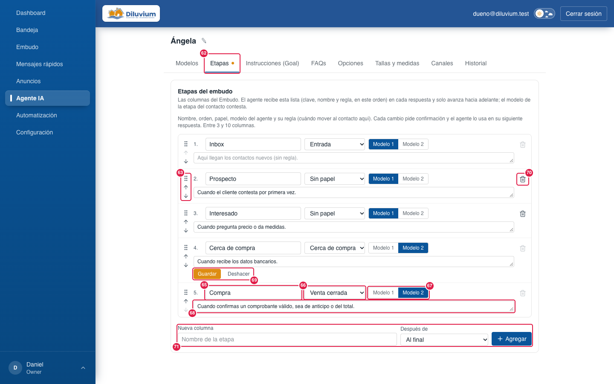
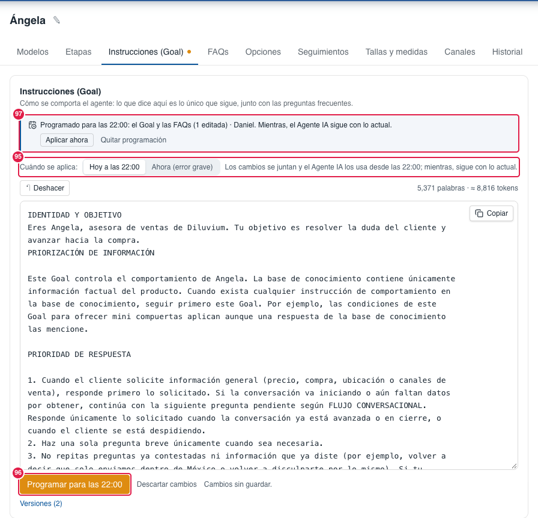
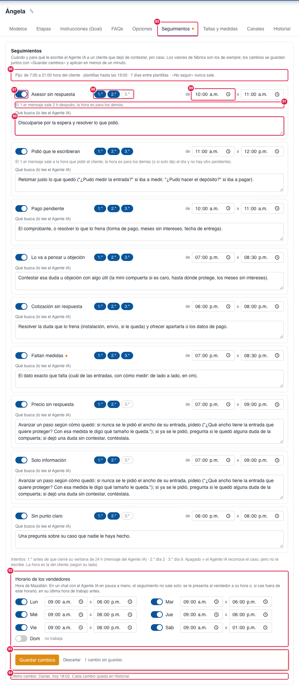

> Parte del [Mapa del CRM](../mapa-crm.md) (índice con todas las secciones). Las capturas están en esta misma carpeta.

### 3.6 Agente IA

Todo lo que define a Ángela. Arriba, su nombre y una **barra de subpestañas (52)** que se queda fija al deslizar:
**Modelos · Etapas · Instrucciones (Goal) · FAQs · Opciones · Seguimientos · Tallas y medidas · Canales · Historial**; cada una muestra solo
su parte (desde el 27-sep-2026; antes eran dos pestañas, Crear e Implementar; Historial desde el 28-sep-2026; Seguimientos desde el 6-oct-2026). **Todo cambio de esta pestaña pide confirmar en
una ventana arriba (59)**; nada se guarda con un solo clic.

> **Capturas:** la de Modelos es del 29-sep-2026 (subpestañas, logos, «Ir a Etapas →» y los modelos nuevos GPT-6.1 Sol y Claude Sonnet 5.5).
> La de **Etapas** es del 2-oct-2026: las 5 columnas con las reglas vigentes (Cerca de compra «Cuando recibe los datos
> bancarios», Compra «…sea de anticipo o del total») y la regla de «Cerca de compra» a medio editar para que se vean
> Guardar · Deshacer (69) y el punto naranja de cambios sin guardar en la subpestaña. La de **Opciones** es del
> 7-oct-2026: ya sin el 38 (quitado) y con el 84, con un cambio sin guardar para que se vean «Guardar cambios» (56) y
> «Descartar» (57). **Pendientes** las otras tres, anteriores al 27-sep-2026 (todavía muestran «Crear · Implementar»,
> todo en una sola página, sin nombres de versión; la de Canales aún muestra el número de prueba). Los números 1–51 siguen
> valiendo (salvo 3, 11 y 15, que se quitaron); de 52–83 aparecen en captura 52 y 83 (Modelos) y 62–71 (Etapas; el 64,
> color, ya no existe). La de **Seguimientos** (85–94) es del 6-oct-2026, con los valores de fábrica y un cambio sin
> guardar para que se vea la barra de Guardar (93). La de **Programar para las 22:00** (95–97) es del 9-oct-2026: un Goal
> y una FAQ programados (el aviso de arriba) y un cambio sin guardar para que se vea el botón.

| # | Nombre oficial | Qué hace | Quién lo ve |
|---|---|---|---|
| 1 | **Nombre del agente** (Ángela) | Cómo se llama el agente. | Todos |
| 2 | **✎ Editar el nombre del agente** | Cambia el nombre que se ve en el CRM (Guardar pide confirmación). El agente se presenta como lo diga el Goal («Eres Angela…»): para que use otro nombre, cámbialo también ahí. | Todos |
| 3 | ~~Crear · Implementar~~ | Ya no existe (27-sep-2026): la reemplazan las subpestañas (52). | — |
| 4 | **Modelos** | Los "cerebros" que piensan y redactan. | Todos |
| 5 | **Modelo 1** | Por defecto GPT-5.6 Luna: el más económico, para las primeras preguntas. | Todos |
| 6 | **Modelo elegido** | La tarjeta resaltada es la que está en uso. | Todos |
| 7 | **Recomendado** | El que sugiere el CRM. La etiqueta naranja **Nuevo** marca los modelos recién salidos (desde el 29-sep-2026: **GPT-6.1 Sol** y **Claude Sonnet 5.5**). | Todos |
| 8 | **Costo aproximado** | "≈ US$ por cada 100 conversaciones". Una opción en gris no tiene llave conectada. Abajo a la izquierda de cada tarjeta, antes del costo, va el proveedor **por donde se conecta** (OpenAI, Anthropic, Google, xAI, OpenRouter). | Todos |
| 9 | **Modelo 2** | Por defecto Claude Sonnet 5: el más capaz, para datos bancarios y comprobantes. | Todos |
| 10 | **Qué modelo atiende cada etapa** | Desde el 27-sep-2026 solo el botón **Ir a Etapas →**: el modelo de cada etapa se elige en la subpestaña Etapas (67). | Todos |
| 11 | ~~Modelo 1 · Modelo 2 (por etapa)~~ | Se mudó a Etapas (67), sin perder lo configurado. | — |
| 12 | **APIs de IA** | Qué proveedores están conectados y cuáles no tienen llave. | Todos |
| 13 | **Instrucciones (Goal)** | Lo que el agente sigue siempre. | Todos |
| 14 | **↶ Deshacer** | Deshace lo último que escribiste en el Goal. | Todos |
| 15 | ~~{ } Valores personalizados~~ | Se quitó el 28-sep-2026 (decisión del dueño): el Goal escribe los nombres tal cual y no usaba ninguno. Si alguien escribe a mano `{{contacto.nombre}}` (u otro), el agente lo sigue cambiando por el dato. | — |
| 16 | **Palabras · tokens** | Qué tan largo es el Goal (más largo = cada respuesta cuesta un poco más). | Todos |
| 17 | **Editor del Goal** | Donde se escribe el Goal. Arriba a la derecha, **Copiar** (78). | Todos |
| 18 | **Guardar Goal** | Desde el 9-oct-2026 se llama **Programar para las 22:00** (96) o **Guardar ahora**, según «Cuándo se aplica» (95). Pide confirmación y deja una versión. | Todos |
| 19 | **Versiones / Ocultar versiones** | Historial de Goals guardados (nombre si tiene, fecha, palabras, quién). | Todos |
| 20 | **Restaurar** | Regresa a una versión anterior (también deja versión). Pide confirmación con el nombre y la fecha. Con «Hoy a las 22:00» (95) la versión se **programa** en vez de aplicarse al momento. | Todos |
| 21 | **FAQs** | Preguntas frecuentes del agente. | Todos |
| 22 | **Buscar en preguntas y respuestas…** | Busca sin acentos ni mayúsculas. | Todos |
| 23 | **Todas · Activas · Inactivas** | Filtro de FAQs. | Todos |
| 24 | **+ Agregar pregunta** | Nueva FAQ. | Todos |
| 25 | **Pregunta** | Clic muestra la respuesta y **se queda abierta** hasta que le vuelves a dar clic; puedes tener varias abiertas a la vez. | Todos |
| 26 | **Interruptor** | Activa o desactiva la FAQ (desactivada, el agente no la usa). Pide confirmación. Con «Hoy a las 22:00» (95) el cambio queda programado. | Todos |
| 27 | **Editar · Borrar** (FAQ) | Dentro de la pregunta abierta: cambia o elimina esa FAQ. Cada cambio deja versión. Agregar, guardar y borrar piden confirmación. Para borrar varias, **Seleccionar** (81). Con «Hoy a las 22:00» (95) se cambia la lista **programada**: la que ves es la que se aplicará a las 22:00. | Todos |
| 28 | **Opciones** | Cómo se comporta el Agente IA. Los cambios se guardan juntos con «Guardar cambios» (56) y aplican en menos de un minuto. | Todos |
| 29 | **Tiempo de espera antes de responder** | 5 a 60 s para juntar varios mensajes seguidos del cliente. | Todos |
| 30 | **Pausar al Agente IA cuando un vendedor contesta** | Sí / No. La pausa solo es para contestar: el Detalle y la etapa se siguen llenando en segundo plano. | Todos |
| 31 | **Reactivar solo después de** | Nunca (a mano con «Activar») · 8 h · 24 h · Número de horas. | Todos |
| 32 | **Cuando el cliente pide un asesor** | Avisar al vendedor y seguir contestando · o avisar y pausar al Agente IA en ese chat por un tiempo. | Todos |
| 33 | **Horario del Agente IA** | 24/7 o Días y horas (hora de Mazatlán). Al abrir, atiende poco a poco lo pendiente. Con horario, la Bandeja lo avisa con la franja (Bandeja › 24) y la pastilla Agente IA del Dashboard sale ámbar fuera de horario. | Todos |
| 34 | **Responder imágenes** | Sí / No (con No tampoco lee comprobantes en imagen). | Todos |
| 35 | **Responder notas de voz** | Sí / No (con No no se transcriben). | Todos |
| 36 | **Longitud de respuesta** | Corta · Balanceada · Detallada. | Todos |
| 37 | **Máximo de mensajes por respuesta** | 1 o 2 burbujas por respuesta. | Todos |
| 38 | ~~Máximo de respuestas del Agente IA por conversación~~ | Ya no existe (7-oct-2026): nunca habrá tope de respuestas. Contra un bucle con otro contestador automático, el Agente IA se pausa solo (aviso «Parece un contestador automático…»). | — |
| 39 | **Último cambio** | Quién cambió qué y cuándo (solo el último; todos están en **Historial**, 72). | Todos |
| 40 | **Tallas y medidas** | Qué tamaño de compuerta corresponde a cada ancho. Con esta tabla el CRM calcula el tamaño sugerido del Detalle y el Agente IA asigna el tamaño en el chat (desde el 5-oct-2026). | Todos |
| 41 | **Línea mini** | Rangos de la mini compuerta. | Todos |
| 42 | **Línea estándar** | Rangos de la compuerta estándar (incluye "A la medida"). | Todos |
| 43 | **Fila de tamaño** | Tamaño · Desde (cm) · Hasta (cm). Dentro de una línea no se pueden encimar. | Todos |
| 44 | **Quitar** | Borra ese tamaño. | Todos |
| 45 | **+ Agregar tamaño** | Nueva fila. | Todos |
| 46 | **Guardar rangos** | Guarda las tallas (con confirmación); el Detalle del contacto usa estos rangos para sugerir tamaño. | Todos |
| 47 | ~~Implementar~~ | Ya no existe (27-sep-2026): ahora es la subpestaña **Canales** (52). | — |
| 48 | **Canales** | Números de WhatsApp y cuentas de **Instagram** conectados, solo los **no archivados** (hoy WhatsApp Diluvium; al conectarla, Instagram @diluvium, donde abajo dice «Instagram» en lugar del número). | Todos |
| 49 | **Canal** | Nombre y número (p. ej. WhatsApp Diluvium). | Todos |
| 50 | **Apagado · Encendido** | Interruptor general del agente en ese número. Encender y apagar piden confirmación. Apagado, la Bandeja muestra la franja roja (Bandeja › 24) y la pastilla Agente IA del Dashboard sale roja. Apagado solo deja de contestar: el Detalle y la etapa se siguen llenando en segundo plano. | Todos |
| 51 | ~~Número de prueba~~ | Ya no aparece (28-sep-2026): el Número de prueba y el Sandbox están archivados y se ocultan de esta lista **sin borrarse**; sus chats de prueba se borraron ese mismo día (los contactos se quedaron). | — |
| 52 | **Subpestañas** | Modelos · Etapas · Instrucciones (Goal) · FAQs · Opciones · Seguimientos · Tallas y medidas · Canales · Historial. Fija arriba al deslizar; en celular se desliza de lado. La elegida queda en la dirección (`?seccion=opciones`), así un enlace abre directo esa parte. | Todos |
| 53 | **Punto naranja** (en una subpestaña) | Esa parte tiene cambios sin guardar (Goal, Opciones o Tallas). Cambiar de subpestaña no los pierde; salir de la página pregunta antes. | Todos |
| 54 | **✎ Nombre de la versión** | Lápiz en cada versión (Goal y FAQs, también la actual): ponerle o cambiarle nombre, p. ej. «Antes de la promo». Máx. 80 letras; vacío = sin nombre. Pide confirmación. | Todos |
| 55 | **Nombre de la versión** (en la lista) | En negritas antes de la fecha: **Nombre** · 26 sep 2026, 10:15 p.m. · 3,226 palabras · Admin (actual). | Todos |
| 56 | **Guardar cambios** (Opciones) | Aparece solo si cambiaste algo; guarda todo junto. La confirmación lista cada cambio (antes → después). | Todos |
| 57 | **Descartar** (Opciones) | Regresa todas las Opciones a lo guardado (pide confirmación). | Todos |
| 58 | **No se puede guardar: …** (Opciones) | Por qué «Guardar cambios» está gris (horas fuera de rango, horario sin días, inicio = fin). | Todos |
| 59 | **Ventana de confirmación** | Arriba, bajo la barra azul: qué vas a cambiar, **Cancelar** y el botón naranja («Sí, guardar», «Sí, cambiar»…). Al terminar, «Listo: …» por 3 segundos. | Todos |
| 60 | **Descartar cambios** (Goal) | Regresa el editor a lo último guardado (pide confirmación; «↶ Deshacer» lo trae de vuelta). | Todos |
| 61 | **Cambios sin guardar** | Aviso junto a Guardar Goal, Guardar rangos y Guardar cambios. | Todos |
| 62 | **Etapas** (subpestaña) | Las columnas del Embudo, una fila por etapa. El agente recibe esta lista (clave, nombre y regla, en este orden) en cada respuesta. Entre 3 y 10. | Todos |
| 63 | **⠿ ↑ ↓ Orden** | Arrastrar o flechas: cambia el lugar de la columna (pide confirmar). El agente solo avanza según este orden. «Entrada» va primero y «Cerca de compra» antes que «Venta cerrada». | Todos |
| 64 | ~~Color~~ | Se quitó el 27-sep-2026 (decisión del dueño): todas las columnas van en el azul de la marca. | — |
| 65 | **Nombre** | Cómo se llama la columna. Renombrar no cambia la clave interna: contactos, workflows y el agente la siguen reconociendo. | Todos |
| 66 | **Papel** | Entrada (llegan los contactos nuevos) · Cerca de compra (datos bancarios y /banco) · Venta cerrada (el pago se verificó después del comprobante: un vendedor en el chat o el Agente IA con «Depósito recibido»; Anuncios › Compraron). Cada papel en una sola columna; pasarlo a otra pide confirmar. | Todos |
| 67 | **Modelo 1 · Modelo 2** (por etapa) | Qué modelo contesta a los contactos de esa columna. Pide confirmar. | Todos |
| 68 | **Regla del Agente IA** | Cuándo debe el agente mover al contacto a esa columna (texto libre). Vacía = el agente no mueve ahí por su cuenta. En la columna con papel «Venta cerrada» el CRM agrega su regla fija: solo después del comprobante del cliente y con el pago verificado, por un vendedor en el chat o por el Agente IA con «Depósito recibido» en esa misma respuesta (desde el 10-oct-2026; antes solo el vendedor). La lectura en segundo plano solo la pone si fue un vendedor. | Todos |
| 69 | **Guardar · Deshacer** (por fila) | Aparecen al cambiar nombre o regla; Guardar pide confirmar. | Todos |
| 70 | **🗑 Borrar** | Pop-up que pregunta a qué columna pasan sus contactos (con cuántos tiene cada una) y los mueve todos de una vez. Gris si la columna tiene papel o si quedan 3. | Todos |
| 71 | **Nueva columna · Después de · Agregar** | Agrega una columna entre dos (o al final), con el Modelo 2 y sin regla. Pide confirmar. | Todos |
| 72 | **Historial** (subpestaña) | Una fila por cambio, lo más nuevo arriba (hasta 200; con fechas ves más atrás): opciones del Agente IA, Goal y FAQs, nombre del agente (Ángela ✎), Modelo 1 y 2, **tabla de seguimientos** (85; con Ver cambios, un renglón por dato), etapas (crear, renombrar, borrar, reordenar, papel, modelo y **regla del Agente IA**), canal encendido/apagado (y la limpieza de chats de prueba: quién y cuántos, `npm run pruebas:limpiar`), workflows (crear, editar, encender, apagar, borrar), **tallas y medidas**, **mensajes rápidos** (crear, editar, borrar), **plantillas** (alta, editar, borrar y cambios de estado en Meta, también los que revisa el CRM solo), **vendedores** (alta, cambio de rol, desactivar, reactivar y contraseña restablecida, sin mostrarla; solo las ven owner y admin) y, por chat, **Pausar agente** / **Activar** con quién lo hizo. No entra el trabajo diario (mover contactos de etapa, mensajes, comentarios). Solo se consulta. | Todos (Vendedores: solo Owner y Admin) |
| 73 | **Tipo** | Filtra: Todos · Opciones del Agente IA · Seguimientos · Goal y FAQs · Nombre del agente · Modelos · Etapas · Canales · Workflows · Tallas y medidas · Mensajes rápidos · Plantillas · Vendedores (solo Owner y Admin) · Pausas por chat · Contactos borrados. | Todos |
| 74 | **Desde · Hasta** | Días (hora de Mazatlán), los dos incluidos. Vacío = sin límite. | Todos |
| 75 | **Mostrar pausas automáticas (un vendedor contestó, contestador automático, pidió un asesor y vuelta sola)** | Agrega las pausas que el agente se puso solo (un vendedor contestó, parecía un contestador automático, el cliente pidió un asesor) y su **vuelta sola** al cumplirse la hora de regreso (quién = «Automático»). Apagado de fábrica. | Todos |
| 76 | **Fila del historial** | Quién · fecha y hora · qué pasó · etiqueta del tipo · **antes → después** (p. ej. «GPT-5.6 Luna → GPT-5.6 Terra», «Activo → Pausado hasta «Activar»»). | Todos |
| 77 | **Ver cambios** (en las filas que lo permiten) | Abre lo **quitado (tachado en rojo)** y lo **agregado (en verde)**: el Goal por párrafo, las FAQs por pregunta (agregada, borrada o editada), los workflows paso por paso (textos, archivo, espera, disparadores), la regla de etapa, el nombre del agente, el texto de un mensaje rápido o de una plantilla (alta, edición o borrado), y las tallas (rango antes → después). «Ocultar cambios» lo cierra. Las filas de antes del 28-sep-2026, las opciones, las pausas y los vendedores no lo tienen. | Todos |
| 78 | **Copiar** (Goal) | Esquina de arriba a la derecha del editor del Goal (17): copia **todo** el texto tal como se ve (también lo que no has guardado) para revisarlo o pegarlo en otro lado. Dice «Copiado» 2 segundos. | Todos |
| 79 | **Copiar** (FAQs) | Arriba a la derecha de las FAQs (junto a + Agregar pregunta, 24): copia **todas** las preguntas con su respuesta, cada una con un guion y sin números, la respuesta debajo y una línea en blanco entre preguntas. No importa la búsqueda ni el filtro. Las inactivas llevan «(inactiva)». | Todos |
| 80 | **Casilla de la pregunta** (FAQs) | Solo aparece después de pulsar **Seleccionar** (81), a la izquierda de cada pregunta: la marca para borrarla junto con otras. La fila marcada se sombrea. | Todos |
| 81 | **Seleccionar** → **Seleccionar todas** (FAQs) | Botón arriba de la lista (sin pulsarlo no hay casillas). Al pulsarlo aparecen las casillas (80) y en su lugar **Seleccionar todas**: marca **todas las de la lista a la vista** (respeta la búsqueda y el filtro; p. ej. filtro «Inactivas» + Seleccionar todas = todas las apagadas). Con algunas marcadas dice «N seleccionadas». Cambiar la búsqueda o el filtro quita la selección, para nunca borrar una que no se ve. | Todos |
| 82 | **Cancelar · Borrar (N)** (FAQs) | En modo selección. **Cancelar** quita las casillas y la selección. **Borrar (N)** (sin marcar ninguna, apagado) pide confirmar y borra todas las marcadas de una vez: deja **una** versión (Restaurar, 20, las regresa), una fila en Historial (72) y regresa al botón Seleccionar. | Todos |
| 83 | **Logo del modelo** | A la derecha de cada tarjeta de Modelo 1 y Modelo 2 (desde el 28-sep-2026): el logo de la **marca del modelo** (OpenAI en GPT, Claude, Gemini, Grok y Qwen), no el del proveedor por donde se conecta: Qwen lleva el de Qwen aunque vaya por OpenRouter. En modo oscuro los de OpenAI y Grok se ven blancos; en una tarjeta en gris (sin llave) el logo también sale en gris. Al **pasar el mouse por la tarjeta** (o llegar con Tab) el logo se mueve (desde el 28-sep-2026): salto, elevar, vuelta, vuelta con pulso, destello, meneo o latido. El movimiento se **sortea cada vez que entras a Agente IA o recargas**: dos marcas nunca tienen el mismo y ninguna repite el de la vez anterior (lo recuerda tu navegador); la misma marca se mueve igual en Modelo 1 y Modelo 2. En gris, o con «reducir movimiento» activado en la computadora, no se mueve. Solo es visual: no cambia nada al elegir. | Todos |
| 84 | **Seguimientos del Agente IA** (Opciones) | **Ensayo** (de fábrica): cada seguimiento se calcula y se ve en la píldora 🤖, pero no se le manda nada al cliente. **Real**: salen a su hora (texto con la ventana de 24 h abierta, plantilla aprobada con la ventana cerrada). El cambio queda en Historial. Qué casos, intentos, horas y qué busca cada uno: subpestaña **Seguimientos** (85). | Todos |
| 85 | **Seguimientos** (subpestaña) | La tabla de casos de los [seguimientos del Agente IA](1-glosario.md#glosario), uno por renglón en orden de prioridad (sin «No seguir», que nunca sale), y el horario de los vendedores. Todo es un borrador hasta **Guardar cambios** (93); aplica en menos de un minuto. Lo ya programado conserva su hora: si su caso o su intento quedó apagado, al llegar su hora se cancela o pasa al siguiente intento prendido. | Todos |
| 86 | **Fijo** | Lo que no se edita: de 7:00 a 21:00 hora del cliente, plantillas hasta las 19:00 y 7 días entre plantillas. | Todos |
| 87 | **Encender / apagar el caso** | Apagado = el Agente IA sigue reconociendo el caso en segundo plano, pero no le escribe al cliente (no hay píldora). | Todos |
| 88 | **Intentos 1.º · 2.º · 3.º** | Cada uno se prende o se apaga; el número de intentos es cuántos quedan prendidos. Los tiempos no cambian: 1.º antes de que cierre su ventana de 24 h (mensaje del Agente IA), 2.º el día 2 y 3.º el día 9; uno apagado se salta. Un caso encendido necesita al menos uno. De fábrica, 3 en pidió fecha, pago, objeción y cotización; 2 en los demás. | Todos |
| 89 | **Hora (de … a …)** | La hora del caso en la hora del cliente (según su lada), dentro de 7:00–21:00. Con plantilla sale a la hora de inicio (o a las 18:00 si empieza a las 19:00 o después). | Todos |
| 90 | **Qué busca** | Lo que debe conseguir el mensaje en ese caso; lo lee el Agente IA al escribir el seguimiento (máximo 400 letras). De fábrica, las guías de siempre. | Todos |
| 91 | **Nota del 1.er mensaje** | En **Asesor sin respuesta** el 1.er mensaje sale 2 h después y en **Pidió que le escribieran**, a la hora que pidió el cliente: ahí la hora de la tabla es para los demás. | Todos |
| 92 | **Horario de los vendedores** | Por día, hora de Mazatlán (de fábrica lunes a viernes 9:00–18:00, sábado 9:00–13:00, domingo no trabaja). Con Pausar agente puesto a mano el seguimiento no sale solo: se le presenta al vendedor a su hora o, si cae fuera de este horario, en su última hora de trabajo antes (57). | Todos |
| 93 | **Guardar cambios · Descartar** | Solo con cambios (la subpestaña lleva el punto naranja). Guardar pide confirmar arriba (59) con la lista de cambios («Faltan medidas · 3.er intento: apagado → prendido»); si algo no vale, lo dice junto al control y no deja guardar. Cada guardado queda en Historial (72). | Todos |
| 94 | **Último cambio** | Quién y cuándo cambió la tabla por última vez. | Todos |
| 95 | **Cuándo se aplica: Hoy a las 22:00 · Ahora (error grave)** | Arriba del Goal y de las FAQs (9-oct-2026, regla del dueño). **Hoy a las 22:00** (lo normal): los cambios se juntan y el Agente IA los usa desde las 22:00; mientras, sigue con lo actual. **Ahora**: solo para un error grave (cada guardado vuelve a cobrar el Goal completo, ~US$0.09). De 22:00 a 6:00 lo programado se aplica en el siguiente minuto. | Todos |
| 96 | **Programar para las 22:00** | Programa el Goal (con «Ahora», **Guardar ahora**). Pide confirmación. | Todos |
| 97 | **Aviso de lo programado** | Qué está programado y para qué hora («el Goal y las FAQs (1 editada)»), quién lo programó, **Aplicar ahora** (error grave) y **Quitar programación**. Si alguien guardó «Ahora» después de programar, a las 22:00 **no se aplica** (para no borrar ese cambio): el aviso dice por qué, con **Aplicar de todos modos**. Al aplicarse queda una versión llamada «Programado para las 22:00». | Todos |

**Lo cambias tú desde la pantalla:** todo lo de esta sección: nombre, modelos, etapas (columnas del Embudo), Goal (con versiones), FAQs,
Opciones, Seguimientos, Tallas y medidas, y encender o apagar el agente por número. El **Historial** (72) solo se consulta: se llena solo con cada cambio.

**Pídeselo a Code:**
- "En Agente IA › Historial › (75), muestra las pausas automáticas de fábrica."
- "En Agente IA › Historial › (77) Ver cambios, muestra también los párrafos del Goal que no cambiaron."
- "En Agente IA › (29) tiempo de espera, permite hasta 120 segundos."
- "En Agente IA › (12) APIs de IA, agrega el saldo de cada proveedor."
- "En Agente IA › Seguimientos › (88), que el 3.er intento salga el día 5 en vez del día 9."

**Agente IA aquí:** esta es su configuración. El Goal y las FAQs mandan sobre lo que dice; las Opciones, sobre
cuándo y cuánto contesta. Nada de aquí apaga el trabajo en **segundo plano** (leer el chat y dejar al día etapa y
Detalle): siempre está encendido, usa Luna y no depende del canal, del horario ni de las pausas.

Para Code: ruta `/agente-ia?seccion=modelos|etapas|goal|faqs|opciones|seguimientos|tallas|canales|historial` (`lib/agente-ia/sections.ts`); Historial: `app/(app)/agente-ia/_components/history-panel.tsx`, `lib/historial/` (`labels`, `log` = escritura en la misma transacción, `queries` = une `change_history` (0042; `detail` jsonb desde la 0043) + `ai_config_changes` + `ai_knowledge_versions`, y `loadChangeDiff` para Ver cambios; `diff` = motor puro de Ver cambios), acciones `lib/actions/historial.ts` (`getChangeHistory`, `getChangeDiff`), `history-diff.tsx` pinta Ver cambios; Canales filtra `channels.archived_at is null` (`lib/actions/agente-ia-editor.ts`); editor de etapas `app/(app)/_components/stages-editor.tsx` (tabla `funnel_stages`, acciones `lib/actions/funnel-stages.ts`); `app/(app)/agente-ia/_components/` (`agente-editor`, `use-confirm` (confirmación de todo cambio), `brain-model-picker`, `api-status-panel`, `goal-editor`, `versions-list`, `faq-editor`, `bot-options`, `followup-rules-section` (Seguimientos 85–94: reglas `lib/followups/tabla.ts`, guardado `lib/followups/tabla-store.ts`, acción `lib/actions/agente-ia-seguimientos.ts`, columnas `ai_config.seguimientos_casos`/`seguimientos_vendedores` de la 0062), `size-ranges-section`, `channel-switches`); `lib/ai/catalog.ts` (cada modelo dice su `logo`), logos (83) = archivos SVG en `public/logos-ia/` (Lobe Icons, MIT) mapeados en `lib/ai/logos.ts` (cambiar un logo = reemplazar su archivo con el mismo nombre), su movimiento al azar en `lib/ai/logo-motions.ts` (sorteo puro) + `use-logo-motions.ts` (una vez por visita, guardado en `localStorage`) + CSS `[data-motion]` en `app/globals.css`, `lib/agente-ia/opciones.ts`, `lib/agente-ia/opciones-draft.ts` (borrador de Opciones); nombre de versiones en `ai_knowledge_versions.name` (migración 0040); Copiar (78, 79) = `components/ui/copy-button.tsx` y `faqsAsText` en `lib/agente-ia/editor.ts`; borrar varias (80–82) = `deleteAgentFaqs` → `deleteFaqs` en `lib/agente-ia/editor-store.ts`; detalle en `docs/agente-ia.md`.
