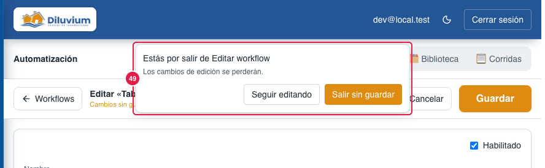
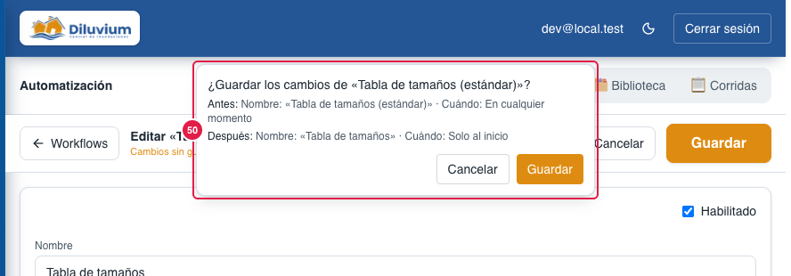
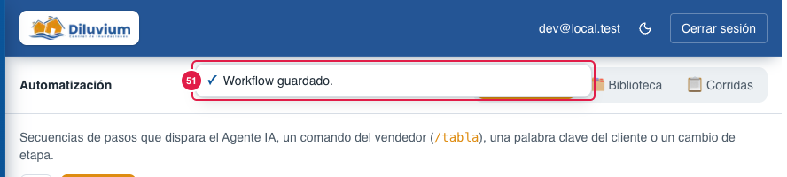
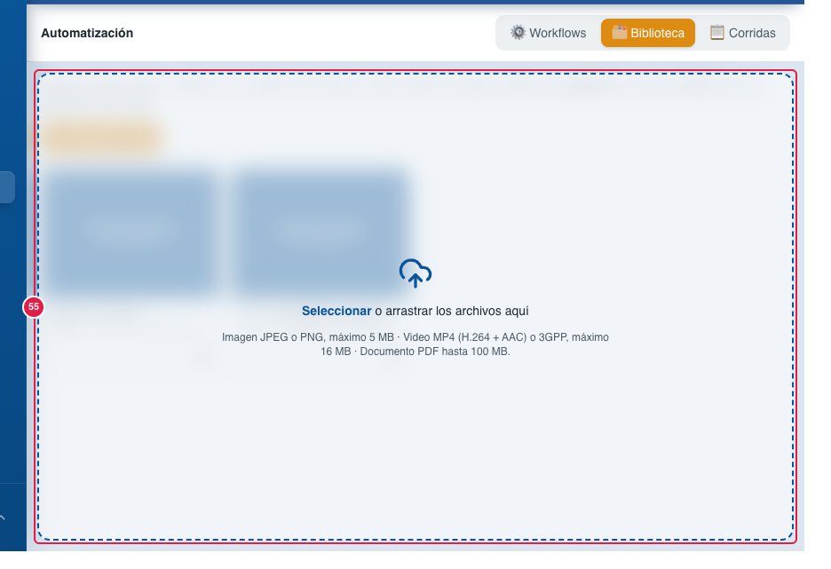
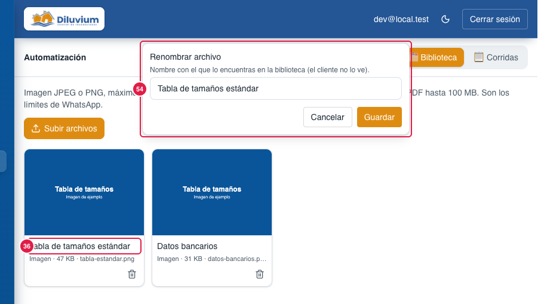

> Parte del [Mapa del CRM](../mapa-crm.md) (índice con todas las secciones). Las capturas están en esta misma carpeta.

### 3.7 Automatización

Los **workflows** (envíos de material), la **Biblioteca** de archivos (sus fotos y videos también se mandan desde el
chat con 📎 › Multimedia) y las **Corridas** (historial).

| # | Nombre oficial | Qué hace | Quién lo ve |
|---|---|---|---|
| 1 | **Workflows · Biblioteca · Corridas** | Pestañas de la sección. | Todos |
| 2 | **Descripción** | Quién puede disparar un workflow. | Todos |
| 4 | **+ Nuevo** | Crea un workflow. | Todos |
| 5 | **Casilla habilitado** | Prende o apaga el workflow. | Todos |
| 6 | **Nombre del workflow** | Tabla de tamaños, Datos bancarios, Video de instalación… | Todos |
| 7 | **🤖 agente** | El agente puede dispararlo solo. | Todos |
| 8 | **Comando** (/tamaños) | Atajo del vendedor en el chat. | Todos |
| 9 | **🔑 Palabras clave** | Palabras del cliente que lo disparan (una sola vez por contacto). | Todos |
| 10 | **⚠ falta archivo** | Le falta su imagen o video; queda apagado hasta que se elija. | Todos |
| 11 | **Resumen de pasos** | ⏱ espera · 📎 archivo · 💬 texto, en orden. | Todos |
| 12 | **Corridas · 7 días** | Cuántas veces salió en la última semana. | Todos |
| 13 | **Subir · Bajar** | Cambia el orden de la lista. | Todos |
| 14 | **▷ Probar** | Lo manda en una conversación que eliges. **Sale de verdad**: úsalo con el número de prueba. | Todos |
| 15 | **✎ Editar** | Abre el editor (17–32 y 47–51). Si solo lo abres para ver cómo está hecho, **← Workflows** (48) te regresa sin preguntar. | Todos |
| 16 | **Tarjeta con borde ámbar** | Workflow apagado porque le falta archivo. | Todos |
| 17 | **Habilitado** | Prende o apaga desde el editor. | Todos |
| 18 | **Nombre** | Nombre del workflow. | Todos |
| 19 | **Cuándo usarlo** | Texto que lee el agente para decidir si lo manda. | Todos |
| 20 | **Disparadores** | Las formas de dispararlo (21–24), cuándo (47), cuántas veces por chat (52) y si es la respuesta (53). | Todos |
| 21 | **El Agente IA puede dispararlo** | Casilla. | Todos |
| 22 | **Comando del vendedor (en el chat)** | p. ej. /tamaños. Letras sin acento (la **ñ** sí: /tamaños), números y guiones; si lleva acento o espacio, no se guarda y lo avisa arriba. | Todos |
| 23 | **Al entrar a la etapa** | Se manda solo cuando el contacto entra a esa etapa. | Todos |
| 24 | **Palabras clave del cliente** | Separadas por coma; palabra completa, sin importar acentos. | Todos |
| 25 | **Pasos (en orden)** | Lo que manda, de arriba a abajo. | Todos |
| 26 | **Variables · contador** | {{nombre}} y {{vendedor}} disponibles; cuántos pasos lleva (máximo 12). | Todos |
| 27 | **Paso ⏱ Esperar** | Segundos antes del siguiente paso. Solo cuando lo manda el agente, una palabra clave o una etapa: con el comando del vendedor (y con **Probar**) se salta y sale de inmediato. | Todos |
| 28 | **Paso 📎 Archivo** | Miniatura y **Cambiar archivo** (elige de la Biblioteca). | Todos |
| 29 | **Texto del archivo** | Pie que va con la imagen o video, en el mismo mensaje. Cuando lo pide el **Agente IA** y es el primer archivo de un workflow sin textos, el pie es lo que escribió el agente (no se repite lo mismo dos veces) y la espera antes de él no corre. | Todos |
| 30 | **Subir · Bajar · Quitar paso** | Ordena o borra un paso. | Todos |
| 31 | **+ 💬 Texto · + 📎 Archivo · + ⏱ Esperar** | Agrega un paso. | Todos |
| 32 | **Guardar** (barra fija de arriba) | Más grande y siempre a la vista, aunque bajes por los pasos. Todos los cambios del editor se hacen libres y se guardan **juntos**: al presionarlo sale **un solo aviso** (50) con lo de antes y lo de después. Apagado mientras no cambies nada. Los predeterminados se pueden editar y apagar, pero no borrar. | Todos |
| 33 | **Límites de WhatsApp** | Imagen JPEG/PNG hasta 5 MB · Video MP4 hasta 16 MB · PDF hasta 100 MB. | Todos |
| 34 | **Subir archivos** | Agrega imágenes, videos o PDF (también se pueden arrastrar, 55). El CRM revisa que el **contenido** coincida con el tipo (un archivo renombrado se rechaza con aviso) y que el nombre no traiga caracteres ocultos; hasta 60 subidas cada 10 minutos. Desde el 30-sep-2026. | Todos |
| 35 | **Tarjeta de imagen** | Vista previa del archivo. | Todos |
| 36 | **Nombre** (clic para renombrar) | Cómo se ve en el editor. Al darle clic sale el aviso de arriba con el nombre para cambiarlo (54). | Todos |
| 37 | **Tipo · peso · archivo** | Datos del archivo. | Todos |
| 38 | **Borrar** (archivo) | Quita el archivo (no se puede si un paso lo usa). Pide confirmar con el aviso de arriba. | Todos |
| 39 | **Tarjeta de video** | Video con reproductor. | Todos |
| 40 | **Actualizar** | Recarga las corridas. | Todos |
| 41 | **Cuándo · Workflow · Contacto · Disparador · Estado** | Columnas de las últimas 100 corridas. | Todos |
| 42 | **Ejecutando** | Se está mandando. | Todos |
| 43 | **Hecho** | Salió completo. | Todos |
| 44 | **Omitido · motivo** | No salió y por qué (p. ej. agente pausado, «ya se envió a este contacto» o «ya no es el inicio» y «ya le salió otra respuesta de inicio» de **Solo al inicio**, 47, o «ya salió el máximo de veces en este chat», 52). | Todos |
| 48 | **← Workflows** (barra fija de arriba, junto al título «Editar «nombre»») | Regresa a la lista de workflows. **Cancelar** hace exactamente lo mismo. Si no cambiaste nada, sales directo; si cambiaste algo, sale el aviso (49). En la barra también dice «Cambios sin guardar» mientras los haya. Si cierras o recargas el navegador con cambios, el navegador también avisa. En el celular la flecha va sola. | Todos |
| 49 | **Aviso «Estás por salir de Editar workflow»** | «Los cambios de edición se perderán.» **Seguir editando** te deja donde estabas con tus cambios; **Salir sin guardar** regresa a la lista y los descarta. Solo sale si hubo cambios. | Todos |
| 50 | **Aviso «¿Guardar los cambios de «nombre»?»** | Muestra **Antes** y **Después** de todo lo que cambiaste (el mismo texto que queda en Agente IA › Historial) y guarda todo junto con **Guardar**. Para uno nuevo dice «¿Crear el workflow…?» con su resumen (encendido o apagado y cuántos pasos). | Todos |
| 51 | **✓ Workflow guardado** | Aviso breve arriba al guardar (o al borrar un workflow). Se quita solo a los 3 segundos o con cualquier clic (Biblioteca, Corridas, ← Workflows…). | Todos |
| 45 | **Falló · código** | Error al mandar, con el motivo en palabras simples. Si WhatsApp pidió esperar, la corrida **no falla**: espera su turno y sigue. Si el worker se reinició y el archivo había quedado fallido, la corrida se detiene y **no** mueve la etapa. | Todos |
| 46 | **⧉ Copiar** (ícono junto a **+ Nuevo**, 4) | Copia **todos** los workflows para pegarlos en una IA y pedir mejoras, igual que las FAQs: cada uno con un guion (sin números), si está encendido o apagado (y si le falta archivo), con qué se dispara (Agente IA, comando, palabras clave, etapa), **Cuándo lo usa el Agente IA** y sus pasos en orden con los textos completos. Al copiar, el ícono cambia a ✓ unos segundos. También dice si es **Solo al inicio** (47), su **Máximo por chat** (52) y si **El workflow es la respuesta** (53). | Todos |
| 47 | **¿Cuándo se dispara por palabra clave o por el Agente IA?** (En cualquier momento · Solo al inicio · Solo al inicio por palabra clave; el Agente IA cuando haga falta) | **En cualquier momento**: como siempre (por palabra clave, una vez por cliente; el agente lo usa cuando quiera). **Solo al inicio por palabra clave; el Agente IA cuando haga falta** (la Tabla): la palabra clave es solo **acción inicial** (misma regla de abajo: antes de que le contesten y una vez por cliente; «Checare medidas» a media conversación ya no la dispara) y después el **Agente IA** la manda cuando el cliente la pide. **Solo al inicio**: regla estricta para respuestas ya definidas de primer contacto (p. ej. «Precio 2»): por palabra clave o por el agente solo sale **antes de que el Agente IA (con su propio texto) o un vendedor le contesten al cliente**, y **una sola vez por cliente**, nunca se repite. Lo que mandan otros workflows no cuenta (tras «Información», un «Precio» sí dispara «Precio 2»); el historial copiado del celular sí cuenta. Si ya no aplica, el mensaje puede disparar otro workflow que coincida y el agente ya no lo tiene a la mano. El **comando del vendedor** sale siempre. En Corridas, lo que no salió queda como Omitido con motivo «ya no es el inicio» o «ya enviado a este contacto». **Una sola respuesta de inicio por cliente** (30-sep-2026): si a un cliente ya le salió un workflow con cualquiera de las dos opciones de «Solo al inicio» («Información», «Precio 2», la Tabla), los demás ya no salen por palabra clave y lo siguiente lo contesta el Agente IA (p. ej. tras la Tabla, «¿qué precio tiene?» ya no repite la foto con «Precio 2»); en Corridas, si alguno llega a quedar en cola, sale como Omitido con «ya le salió otra respuesta de inicio». **Regla fija** (no se ve en el editor): si el primer mensaje trae «precio» y «medidas» (dispararía «Precio 2» y la Tabla a la vez), sale **«Información»**, que trae la explicación, la foto, el precio y la pregunta. | Todos |
| 52 | **Máximo de envíos por chat** (vacío = Sin límite) | Cuántas veces puede salir en un mismo chat por palabra clave o por el Agente IA (la Tabla: 2). Cuenta su archivo **aunque haya salido dentro de otro workflow** (la foto de la tabla en «Precio 2» o «Información» cuenta). Al llegar al máximo, la palabra clave ya no lo dispara, el Agente IA ya no lo tiene a la mano (sabe cuántas veces salió: «1 de 2») y en Corridas queda Omitido con «ya salió el máximo de veces en este chat». El **comando del vendedor** suma, pero sí puede pasarlo. | Todos |
| 53 | **El workflow es la respuesta** (casilla) | Cuando sale por **palabra clave**, el workflow contesta **su tema** y el Agente IA **revisa el mismo mensaje**: si el cliente preguntó algo más («De que cd son y que precio tienen»), contesta solo eso, sin repetir al workflow y **sin hacer preguntas** (sale unos segundos después); si no falta nada, no escribe. Después **espera a que el cliente conteste**, aunque el workflow termine en una imagen (la Tabla). Si el cliente escribió otra cosa antes («¿Cuánto tarda el envío?» + «Precio»), eso también lo contesta el Agente IA. Si el **Agente IA** lo usa por su cuenta, su propio texto no sale: sale el del workflow (una imagen o video con su pie, tras su espera) y después el Agente IA revisa el mismo mensaje como por palabra clave, traiga **textos o archivos** («Dónde medir», la Tabla, «Entrada mayor a 2.5 m»): contesta solo lo que el cliente preguntó aparte («Son 4.2 m. ¿Hacen envíos a Culiacán?» → lo del envío), sin preguntas, o no escribe. Nace marcada en los que terminan en pregunta («Precio 2», «Información», «Tenemos»); si un workflow termina en «?» sin marcarla, abajo sale un aviso naranja. | Todos |
| 54 | **Aviso «Renombrar archivo»** | Sale arriba al darle clic al nombre de un archivo (36), con el nombre adentro ya seleccionado para escribir el nuevo. **Guardar** (o Enter) lo cambia; **Cancelar**, Esc o clic fuera lo cierran sin cambiar. Si el nombre queda vacío, **Guardar** se apaga. El cliente nunca ve este nombre. | Todos |
| 55 | **Capa para soltar** (Biblioteca) | Aparece al arrastrar uno o varios archivos desde la computadora (Escritorio, Finder…) a cualquier parte de la Biblioteca, igual que en el chat; al soltarlos se suben solos, sin presionar **Subir archivos** (34). Mismos tipos y límites (33): lo que no es imagen JPEG/PNG, video MP4/3GPP o PDF se rechaza con aviso y no se sube. **Seleccionar** abre el mismo selector que el botón. Mientras sube, no aparece. Desde el 3-oct-2026. | Todos |

**Lo cambias tú desde la pantalla:** crear, editar, prender, apagar, ordenar y probar workflows; subir (con el botón o arrastrando), renombrar y
borrar archivos. En el editor los cambios son libres y se guardan juntos con un solo aviso (50); borrar un workflow o un
archivo pide confirmar (no se puede deshacer). Crear, editar, prender, apagar y borrar quedan en **Agente IA › Historial**
con quién lo hizo. «Restaurar predeterminados» ya no está en la pantalla (29-sep-2026): los predeterminados se crean
solos al abrir la cuenta y no se pueden borrar.

**Pídeselo a Code:**
- "En Automatización › (31) pasos, agrega un paso «Mover etapa»."
- "En Automatización › (41) corridas, agrega un filtro por contacto."
- "En Automatización › (9) palabras clave, que se puedan mandar más de una vez por contacto."

**Agente IA aquí:** dispara los workflows que tienen 🤖 agente cuando la conversación coincide con **Cuándo usarlo**
(los de **Solo al inicio**, 47, solo mientras nadie le ha contestado al cliente y si aún no le salieron; los que llegaron
a su **Máximo por chat**, 52, ya no); espera a que termine uno por palabra clave con **El workflow es la respuesta** (53);
en Corridas aparecen con disparador "Agente". Mientras manda uno, en el chat se ve "Agente IA enviando…".

Para Code: ruta `/automatizacion`; `app/(app)/automatizacion/_components/` (`automatizacion-panel`, `workflow-editor`, `biblioteca-tab`, `labels`); capa para soltar (55) = `components/ui/file-drop-zone.tsx`, la misma del chat (Chat › 30, vía `chat-drop-zone`); `lib/workflows/` (Copiar, 46 = `as-text.ts`; 52 = `max-per-chat.ts`; regla fija de 47 = `fixed-rules.ts`), `lib/actions/workflows.ts`, `lib/media-library/`; diseño `docs/fase-d-diseno.md` §10.
